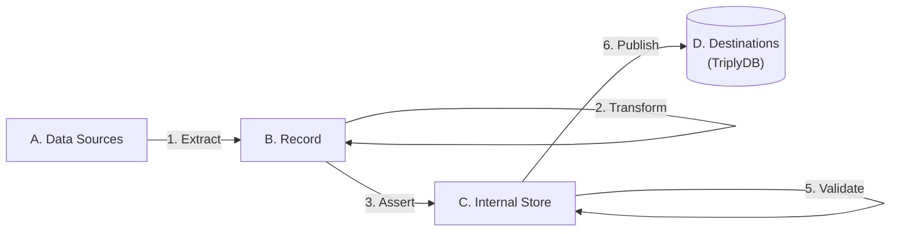

[TOC]

# TriplyETL Overview

TriplyETL allows you to create and maintain production-grade linked data pipelines.

- [**Getting Started**](./generic/getting-started.md) explains how TriplyETL can be used for the first time.
- [**CLI**](./generic/cli.md) explains the commands that are used to install, compile, and run TriplyETL pipelines.
- The [**Changelog**](./generic/changelog.md) documents the changes that are introduced in new TriplyETL version.
- [**Maintenance**](./generic/maintenance.md) explains how TriplyETL can be updated and can be configured to run in automated pipelines.

TriplyETL uses the following unique approach:

This approach consists of the following six steps (see diagram):

- Step 1. [**Extract**](./extract/index.md): extracts a stream of [records](./generic/record.md) from one or more [data sources](./sources/index.md).
- Step 2. [**Transform**](./transform/index.md): cleans, combines, and extends data in the [record](./generic/record.md).
- Step 3. [**Assert**](./assert/index.md): uses data from the [record](./generic/record.md) to make linked data assertions in the [internal store](./generic/internal-store.md).
- Step 4. [**Enrich**](./enrich/index.md): improves and extends linked data in the [internal store](./generic/internal-store.md).
- Step 5. [**Validate**](./validate/index.md) ensures that linked data in the [internal store](./generic/internal-store.md) meets the specified quality criteria.
- Step 6. [**Publish**](./publish/index.md): takes the linked data from the [internal store](./generic/internal-store.md), and publishes it to a destination such as [TriplyDB](../triply-db-getting-started/index.md).

TriplyETL uses the following data storage stages, to connect the six steps in the approach (see diagram):

- Stage A. [**Sources**](./extract/index.md): the data inputs to the pipeline.
- Stage B. [**Record**](./generic/record.md): provides a uniform representation for data from any source system.
- Stage C. [**Internal Store**](./generic/internal-store.md): temporarily holds linked data generated in the pipeline.
- Stage D. [**Destinations**](./publish/index.md): places where output from the pipeline is published to, for example [TriplyDB](../triply-db-getting-started/index.md).

In addition, the following configuration tools are used throughout the six TriplyETL steps:

- [**Declarations**](./generic/declarations.md): introduce constants are reuse throughout the TriplyETL configuration.
- [**Control structures**](./generic/control-structures.md): make parts of the TriplyETL configuration optional or repeating (loops).
- [**Debug functions**](./generic/debug.md): give insights into TriplyETL internals for the purpose of finding issues and performing maintenance.

## Supported standards and formats

TriplyETL follows a multi-paradigm approach. This means that TriplyETL seeks to support a wide variety of data formats, configuration languages, and linked data standards. This allows users to most optimally combine the formats, languages, and standards that they wish to use. Other ETL approaches focus on one format/language/standard, which severely limits what users that use those approaches can do.

## Supported data formats

TriplyETL supports the following data formats through its [extractors](./extract/index.md):

- CSV (Comma-Separated Values)
- JSON (JavaScript Object Notation)
- OAI-PMH (Open Archives Initiative, Protocol for Metadata Harvesting)
- PostgreSQL (Postgres, SQL)
- RDF 1.1 (Resource Description Language)
- TSV (Tab-Separated Values)
- XLSX (Office Open XML Workbook, Microsoft Excel)
- XML 1.1 (Extensible Markup Language)

TriplyETL implements the latest versions of the linked data standards and best practices: RDF 1.1, SHACL Core, SHACL Advanced, XML Schema Datatypes 1.1, IETF RFC3987 (IRIs), IETF RFC5646 (Language Tags), SPARQL 1.1 Query Languahge, SPARQL 1.1 Update, SPARQL 1.1 Federation, N-Triples 1.1, N-Quads 1.1, Turtle 1.1, TriG 1.1, RDF/XML 1.1, JSON-LD 1.1 (TBA), JSON-LD Framing (TBA), and JSON-LD Algorithms (TBA).

## Why TriplyETL?

TriplyETL has the following core features, that set it apart from other data pipeline products:

- **Backend-agnostic**: TriplyETL supports a large number of data source formats and types. Source data is processed in a unified record. This decouples configuration from source format specific. In TriplyETL, changing the source system often only requires changing the extractor.
- **Multi-paradigm**: TriplyETL supports all major paradigms for transforming and asserting linked data: SPARQL, SHACL, RML JSON-LD, and RATT (RDF All The Things). You can also write your own transformations in TypeScript for optimal extensibility.
- **Scalable**: TriplyETL processes data in a stream of self-contained records. This allows TriplyETL pipelines to run in parallel, ensuring a high pipeline throughput.
- **High Quality**: The output of TriplyETL pipelines is automatically validated against the specified data model, and/or against a set of preconfigured 'gold records'.
- **Production-grade**: TriplyETL pipelines run in GitLab CI/CD, and support the four DTAP environments that are often used in production systems: Development, Testing, Acceptance, Production.
