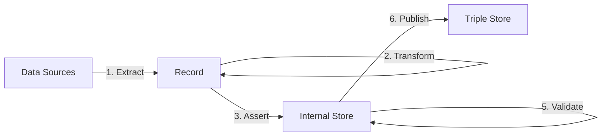

TriplyETL allows you to create linked data knowledge graphs.
It does this by Extracting data connect data sources to a pipelines that 

## Approach

TriplyETL uses the following unique approach to Extract, Transform, and Load (ETL) data:

- Step 1 is [**Extract**](/docs/triply-etl/extract/overview).  It extracts data records from one or more data sources.
- A generic **Record** is loaded from the Source Systems.  The representation of the Record is independent of the source system that is used.
- Step 2 is [**Transform**](/docs/triply-etl/transform/overview).  It cleans, combines, or extends data in the Record representation.
- Step 3 is [**Assert**](/docs/triply-etl/assert/overview).  Data from the Record is used to generate linked data assertions (= factual statements).
- The **Internal Store** is used to hold the linked data that is generated for each Record.
- Step 4 is [**Enrich**](/docs/triply-etl/enrich/overview).  It is used to improve or extend the linked data in the Internal Store.
- Step 5 is [**Validate**](/docs/triply-etl/validate/overview).  It ensures that linked data in the Internal Store is correct.
- Step 6 is [**Publish**](/docs/triply-etl/publish) is used to make linked data available in a Triple Store for others to use.

<!--
## Reference

The following pages document all TriplyETL features and configuration options:

- [**Source Connectors**](/docs/triply-etl/source-connectors) allows your TriplyETL pipeline to connect to a large number of source systems: relational databases, APIs, spreadsheets, etc.
- [**Declarations**](/docs/triply-etl/declarations) allow you to declare and later reuse commonly uses IRI prefixes, graph names, etc.
- Paradigms: TriplyETL supports multiple parasigms for *transforming* source data and *asserting* linked data.
- [**Transformations**](/docs/triply-etl/transformations/overview)
  - [**JSON-LD**](/docs/triply-etl/transformations/jsonld/overview) Transform records with JSON-LD Frames, assert linked data usong JSON-LD Expansion and Deserialization.
  - [**RATT**](/docs/triply-etl/transformations/ratt) RDF All The Things
    - [**Assertions**](/docs/triply-etl/transformations/ratt/assertions)
    - [**Transformations**](/docs/triply-etl/transformations/ratt/transformations)
  - [**SHACL**](/docs/triply-etl/transformations/shacl) Generate additional linked data by applying SHACL Rules.
  - [**SPARQL**](/docs/triply-etl/transformations/sparql) Transform from and to linked data (graph-to-graph) with SPARQL Construct and SPARQL Update.
- [**Publication**](/docs/triply-etl/publication) allow you to store the output of your TriplyETL pipeline in a data catalog.
- [**Validation**](/docs/triply-etl/validation/overview) ensures that data generated by your TriplyETL pipeline conforms to your data model.
  - [**Graph Comparison**](/docs/triply-etl/validation/graph-comparison)
  - [**SHACL Validation**](/docs/triply-etl/validation/shacl)
- [**Control Structures**](/docs/triply-etl/control-structures)
- [**Debugging**](/docs/triply-etl/debugging)
- [**Production Systems**](/docs/triply-etl/production-systems) allows your TriplyETL pipelines to run in the four DTAP environments that are commonly used in production systems: Development, Testing, Acceptance, and Production.

    - [**Frames**](/docs/triply-etl/transformations/jsonld/frames) Transform source data records by applying one or more JSON-LD Frames.
    - [**Expansion**](/docs/triply-etl/transformations/jsonld/expansion) Assert linked data by applying JSON-LD Expansion to source data records.
    - [**Tree-shaped data**](/docs/triply-etl/transformations/ratt/tree-shaped-data)
    - [**Numeric data**](/docs/triply-etl/transformations/ratt/numeric-data)
  - [**RML**](/docs/triply-etl/transformations/rml) Perform transformations and assertions with RML.
-->

## Why TriplyETL?

TriplyETL has the following core features, that set it apart from other data pipeline products:

- **Backend-agnostic**: TriplyETL supports any data source through it large and growing set of source connectors.
- **Multi-paradigm**: TriplyETL supports all major paradigms for transforming and asserting linked data: SPARQL Update, JSON-LD Algorithms (TBA), SHACL Rules, RML (TBA), and RATT.  You can also write your own transformations in TypeScript.
- **Scalable**: TriplyETL processes data in a stream of self-contained records.  This allows TriplyETL pipelines to run in parallel, ensuring a high pipeline throughput.
- **Standards-compliant**: TriplyETL implements the latest versions of the linked data standards and best practices: RDF 1.1, SHACL, XML Schema Datatypes 1.1, IETF RFC3987 (IRIs), IETF RFC5646 (Language Tags).
- **High Quality**: The output of TriplyETL pipelines is automatically validated against the specified data model.
- **Production-grade**: TriplyETL pipelines can run in the four DTAP environments that are common in production systems (Development, Testing, Acceptance, Production).
