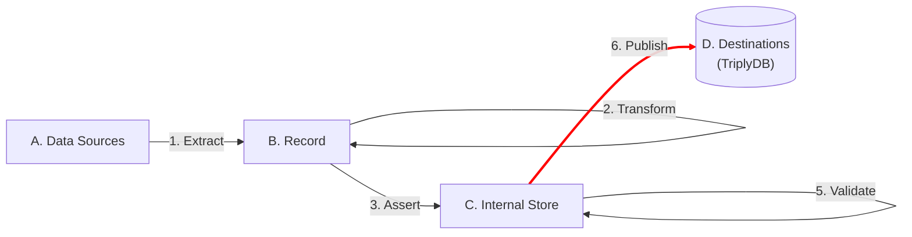

[TOC]

# Publish

The **Publish** step makes the linked data that is produced by the TriplyETL pipeline available in a Triple Store for use by others.




## Destinations

Linked data that is produced by a TriplyETL pipeline can be published to one or more destinations.

### Remote data destinations

Destinations are usually online locations in TriplyDB where the output of your pipeline will be published.

If no account name is given, pipeline output is uploaded under the user account tied to the currently used API Token.
To upload the output to TriplyDB you can use the `toTriplyDb()` function, as the snippet below shows.

```ts
toTriplyDb({dataset: 'my-dataset'})
toTriplyDb({account: 'my-account', dataset: 'my-dataset'})
toTriplyDb({account: 'my-account', dataset: 'my-dataset', opts:{ overwrite: true }})
```
In the previous versions of TriplyETL, this was done with the `toRdf()` function as shown below:

```ts
toRdf(Destination.TriplyDb.rdf('my-account', 'my-dataset', {triplyDb: etl.triplyDb}))
```

It is still possible to upload to TriplyDB using `toRdf()`, but the new `toTriplyDb()` function represents a simplified version of this.

The following options can be specified to configure the destination behavior:

<dl>
  <dt><code>mergeGraphs</code></dt>
  <dd>Whether the results of the new graph should be added to the old graph without overwriting it. The default value is <code>false</code>.</dd>
  <dt><code>overwrite</code></dt>
  <dd>Whether the graphs that are being uploaded by TriplyETL should replace any existing graphs with the same name in the dataset. Graphs appearing in the dataset with a different name than those uploaded by TriplyETL are kept. The default value is <code>false</code>.</dd>
  <dt><code>synchronizeServices</code></dt>
  <dd>Whether or more active services should be automatically synchronized once new data is uploaded. The default value is <code>false</code>. This value can be changed to `true`, to automatically synchronize all services. Alternatively, this value can be set to a string that names a specific services, to automatically synchronize only that specific service.</dd>
  <dt><code>triplyDb</code></dt>
  <dd>A configuration object describing a TriplyDB instance that is different from the one associated with the current API Token. (See the section on <a href="#configuring-multiple-triplydb-instances">configuring multiple TriplyDB instance</a> for more information.)</dd>
  <dt><code>truncateGraphs</code></dt>
  <dd>Whether to delete all graphs in the dataset before uploading any graphs from TriplyETL. Notice that this will also remove graphs that will not be re-uploaded by TriplyETL. The default value is <code>false</code>.</dd>
</dl>

Example:  
The following code snippet publishes linked data to a TriplyDB dataset called 'my-dataset' and synchronizes only the 'acceptance' service for that dataset:

```ts
toRdf(Destination.TriplyDb.rdf('my-dataset', {synchronizeServices: 'acceptance'})),
```

With v.3.0.20 this is reduntant. The following previous implementation:

```ts
const destination1 = { account: get_account(), dataset: get_dataset() }
const destination2 = Destination.TriplyDb.rdf(get_account(), get_dataset())

etl.use(
  ...,
  toTriplyDb(destination1),
)
await etl.copySource(Source.file('my-file.trig'), destination2)
```

has been replaced by:

```ts
const destination = { account: get_account(), dataset: get_dataset() }

etl.use(
  ...,
  toTriplyDb(destination),
)
await etl.copySource(Source.file('my-file.trig'), destination)
```

### Publishing datasets to the NDE Dataset Register 

If you wat to publish a dataset to the NDE Dataset Register, you can do it by adding the `{submitToNDEDatasetRegister: true}` option to `toTriplyDB()` middleware.

```ts
toTriplyDb({dataset: 'nde', opts: {submitToNDEDatasetRegister: true}})
```

## Local data destinations

TriplyETL supports publishing RDF output into a local file. This is not often used, because files lack many of the features that TriplyDB destinations support, such as:

- The ability to browse the data.
- The ability to query the data.
- The ability to configure metadata.
- The ability to configure prefix declarations.

Still, there may be cases in which a local file destination is useful, for example when you do not have an active Internet connection:

```ts
toRdf(Destination.file('my-file.trig')),
```


## Static and Dynamic destinations

Destinations can be defined as static objects meaning that you can define destination beforehand. But it might be the case that you want to have multiple destinations for different records. In this case, you would need a dynamic destination, which should change based on certain information inside your source data.

You can set static and dynamic destinations:

```ts
const etl = new Etl({
  sources: {
    someSource: Source.file('source.trig'),
  },
  destinations: {
    someStaticDestination: Destination.file('static.ttl'),
    someDynamicDestination: context => Destination.file(context.getString('destination')),
  },
})
```


## Configuring multiple TriplyDB instances

It is possible to use multiple TriplyDB instances in one TriplyETL pipeline.

The following example illustrates how the data model is used from the production instance of TriplyDB.

```ts
const etl = new Etl({
  sources: {
    data_model:
      Source.TriplyDb.rdf(
        'my-account',
        'my-dataset',
        {
          triplyDb: {
            token: process.env['PRODUCTION_INSTANCE_TOKEN'],
            url: 'https://api.production.example.com'
          }
        }
      ),
    instance_data:
      Source.TriplyDb.rdf(
        'my-account',
        'my-dataset',
        {
          triplyDb: {
            token: process.env['ACCEPTANCE_INSTANCE_TOKEN'],
            url: 'https://api.acceptance.example.com'
          }
        }
      ),
  },
})
```


## Direct copying from source to destination

TriplyETL supports copying sources directly to destination locations. This function is useful when you already have linked data that is used as a source, but is also needed at the destination. An example would be the information model. This would be available as a source, and with the copy function it can be uploaded to TriplyDB via TriplyETL.

The following example shows the `copy` function:


```ts
await etl.copySource(
  Source.file(`${source_location}`),
  Destination.TriplyDb.rdf(`${destination_name}`)
)
```

The function destination expects that source data is linked data. Copying a source that is not linked data can result in errors.

Please note that the `copySource` function is not considered part of the middleware layer but is a specialized function used for direct source-to-destination copying. As a result, it won't be counted in the middleware runtime.


## Using TriplyDB.js in TriplyETL

All operations that can be performed in a TriplyDB instance can be automated with classes and methods in the [TriplyDB.js](../../triplydb-js/index.md) library. This library is also used by TriplyETL in the background to implement many of the TriplyETL functionalities.

Sometimes it is useful to use classes and methods in TriplyDB.js directly. This is done in the following way:

```ts
// Create the ETL context.
const etl = new Etl()

// Use the context to access the TriplyDB.js connection.
console.log((await etl.triplyDb.getInfo()).name)
```

The above example prints the name of the TriplyDB instance. But any other [TriplyDB.js](../../triplydb-js/index.md) operations can be performed. For example, the user of the current API Token can change their avatar image in TriplyDB:


```ts
const user = await etl.triplyDb.getUser()
await user.setAvatar('my-avatar.png')
```


## Upload prefix declarations

At the end of a TriplyETL script, it is common to upload the [prefix declarations](../generic/declarations.md#prefix-declarations) that are configured for that pipeline.

This is often done directly before or after graphs are uploaded (function [toTriplyDb()](#remote-data-destinations)):

```ts
import { toTriplyDb, uploadPrefixes } from '@triplyetl/etl/generic'

const prefix = {
  // Your prefix declarations.
}

export default async function(): Promise<Etl> {
  const etl = new Etl({ prefixes: prefix })
  etl.run(
    // You ETL pipeline.
    toTriplyDb({ account: 'my-account', dataset: 'my-dataset' }),
    uploadPrefixes({ account: 'my-account', dataset: 'my-dataset' }),
  )
  return etl
}
```
