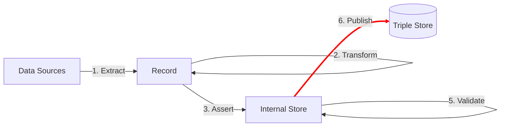

The **Publish** step makes the linked data that is produced by the TriplyETL pipeline available in a Triple Store for use by others.



## Remote data destinations

Destinations are usually online locations in TriplyDB where the output of your pipeline will be published.

If no account name is given, pipeline output is uploaded under the user account tied to the currently used API Token.

```ts
Destination.TriplyDb.rdf('my-dataset')
Destination.TriplyDb.rdf('my-account', 'my-dataset')
Destination.TriplyDb.rdf('my-account', 'my-dataset', { overwrite: true })
```

The following options can be specified to configure the destination behavior:

<dl>
  <dt><code>overwrite</code></dt>
  <dd>Whether the graphs that are being uploaded by TriplyETL should replace any existing graphs with the same name in the dataset. Graphs appearing in the dataset with a different name than those uploaded by TriplyETL are kept. The default value is <code>false</code>.</dd>
  <dt><code>synchronizeServices</code></dt>
  <dd>Whether active services should be automatically synchronized once new data is uploaded.  The default value is <code>false</code>.</dd>
  <dt><code>triplyDb</code></dt>
  <dd>A configuration object describing a TriplyDB instance that is different from the one associated with the current API Token.  (See the section on <a href="#configuring-multiple-triplydb-instances">configuring multiple TriplyDB instance</a> for more information.)</dd>
  <dt><code>truncateGraphs</code></dt>
  <dd>Whether to delete all graphs in the dataset before uploading any graphs from TriplyETL.  Notice that this will also remove graphs that will not be re-uploaded by TriplyETL.  The default value is <code>false</code>.</dd>
</dl>


## Local data destinations

TriplyETL supports publishing RDF output into a local file.  This is not often used, because files lack many of the features that TriplyDB destinations support, such as:

- The ability to browse the data.
- The ability to query the data.
- The ability to configure metadata.
- The ability to configure prefix declarations.

Still, there may be cases in which a local file destination is useful, for example when you do not have an active Internet connection:

```ts
Destination.file('my-file.trig'),
```


## Static and Dynamic destinations

Destinations can be defined as static objects meaning that you can define destination beforehand. But it might be the case that you want to have multiple destinations for different records. In this case, you would need a dynamic destination, which should change based on certain information inside your source data.

You can set static and dynamic destinations:

```ts
const etl = new Etl({
  sources: {
    someSource: Source.file('source.trig'),
  },
  destinations: {
    someStaticDestination: Destination.file('static.ttl'),
    someDynamicDestination: context => Destination.file(context.getString('destination')),
  },
})
```


## Configuring multiple TriplyDB instances

It is possible to use multiple TriplyDB instances in one TriplyETL pipeline.

The following example illustrates how the data model is used from the production instance of TriplyDB.

```ts
const etl = new Etl({
  sources: {
    data_model:
      Source.TriplyDb.rdf(
        'my-account',
        'my-dataset',
        {
          triplyDb: {
            token: process.env['PRODUCTION_INSTANCE_TOKEN'],
            url: 'https://api.production.example.com'
          }
        }
      ),
    instance_data:
      Source.TriplyDb.rdf(
        'my-account',
        'my-dataset',
        {
          triplyDb: {
            token: process.env['ACCEPTANCE_INSTANCE_TOKEN'],
            url: 'https://api.acceptance.example.com'
          }
        }
      ),
  },
})
```


## Direct copying of source data to destination

TriplyETL supports copying sources directly to destination locations. This function is useful when you already have linked data that is used as a source, but is also needed at the destination. An example would be the information model. This would be available as a source, and with the copy function it can be uploaded to TriplyDB via TriplyETL.

The following example shows the `copy` function:


```ts
etl.copySource(
  Source.file(`${source_location}`),
  Destination.TriplyDb.rdf(`${destination_name}`)
),
```

The function destination expects that source data is linked data. Copying a source that is not linked data can result in errors.


## Using TriplyDB.js in TriplyETL

All operations that can be performed in a TriplyDB instance can be automated with classes and methods in the [TriplyDB.js](triplydb-js) library.  This library is also used by TriplyETL in the background to implement many of the TriplyETL functionalities.

Sometimes it is useful to use classes and methods in TriplyDB.js directly.  This is done in the following way:

```ts
// Create the ETL context.
const etl = new Etl()

// Use the context to access the TriplyDB.js connection.
console.log((await etl.triplyDb.getInfo()).name)
```

The above example prints the name of the TriplyDB instance.  But any other [TriplyDB.js](triplydb-js) operations can be performed.  For example, the user of the current API Token can change their avatar image in TriplyDB:


```ts
const user = await etl.triplyDb.getUser()
await user.setAvatar('my-avatar.png')
```


## Setting up acceptance/production runs

When working on a pipeline it is best to at least run it in the following two modes:

<dl>
  <dt>Acceptance mode</dt>
  <dd>Upload the result of the pipeline to the user account for which the API Token was created.</dd>
  <dt>Production mode</dt>
  <dd>Upload the result of the pipeline to the organization where the production version of the data is published.</dd>
</dl>

Having multiple modes ensures that the production version of a dataset is not accidentally overwritten during development.

```ts
destination remote = process.env['TARGET']=='Production'
  ? Destination.TriplyDb.rdf(account, dataset, {overwrite: true}),
  : Destination.TriplyDb.rdf(account+'-'+dataset, {overwrite: true})
const etl = new Etl()
etl.use(
  ...
  toRdf(destination),
)
```

If you want to run the pipeline in production mode, set the following environment variable:

```ts
export TARGET=Production
```


## Upload prefixes

After loading the graphs, we can also upload other important elements in Linked data, such as the prefixes. This can be done by combining TriplyETL functionality (```app.after```, ```app.prefix```) with TriplyDbjs functionality (```app.triplyDb.getOrganization```, ```app.triplyDb.getUser()``` etc.).

1. You have to set the prefixes:

```ts
const prefix_def = declarePrefix('http://example.com/def/')
const prefix_id = declarePrefix('http://example.com/id/')
const prefix = {
  def: prefix_def,
  graph: prefix_id,
}
```

2. Then you have to include the prefixes in the ETL:

```ts
export default async function(): Promise<Etl> {
  const etl = new Etl({
    prefixes: prefix,
    sources: {
      // Etc
    },
    destinations: {
      // Etc
    },
  })
  // Etc
}
```

3. After finishing with the main body of the ETL and closing `etl.use()`, you can use the below snippet to upload the prefixes under a specific organization, inside `etl.after`.

```ts
etl.after(
  async () => {
    const dataset0 =await (await app.triplyDb.getOrganization(organization)).getDataset(dataset)
    await dataset0.addPrefixes(mapValues(app.prefix, prefix => prefix('').value))
  }
)
```

You can upload the prefixes similarly under your account, using the relevant TriplyDbjs function. Also, note that ```mapValues``` is a function of *lodash*. For this reason, you will need to import it in the beginning of your script.

```ts
import { mapValues } from 'lodash-es'
```
