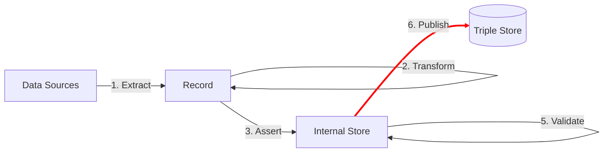

This page documents how you can publish linked data from an ETL pipeline.



## Destinations

TODO

## Upload data

TODO

## Upload prefixes

After loading the graphs, we can also upload other important elements in Linked data, such as the prefixes. This can be done by combining RATT functionality (```app.after```, ```app.prefix```) with TriplyDbjs functionality (```app.triplyDb.getOrganization```, ```app.triplyDb.getUser()``` etc.).
1. You have to set the prefixes:
```ts
const prefix_def = Ratt.prefixer('http://example.com/def/')
const prefix_id = Ratt.prefixer('http://example.com/id/')
const prefix = {
  def: prefix_def,
  graph: prefix_id,
}
```

2. Then you have to include the prefixes in the RATT app:
```ts
export default async function(): Promise<Ratt> {
const app = new Ratt({
  prefixes: prefix,
  sources: {
  ..
  },

  destinations: {
    ..
  },
})
..
}
```

3. After finishing with the main body of the ETL and closing ```app.use()```, you can use the below snippet to upload the prefixes under a specific organization, inside ```app.after```.
```ts
app.after(
      async () => {
        const dataset0 =await (await app.triplyDb.getOrganization(organization)).getDataset(dataset)
        await dataset0.addPrefixes(mapValues(app.prefix, prefix => prefix('').value))
      })
```
You can upload the prefixes similarly under your account, using the relevant TriplyDbjs function. Also, note that ```mapValues``` is a function of *lodash*. For this reason, you will need to import it in the beginning of your script.

```ts
import { mapValues } from 'lodash'
```

## Upload graphs

In some cases, it is useful to upload graphs on TriplyDB that are already in a linked data format file. See [copying source data](/docs/ratt-working-with-ratt#direct-copying-of-source-data-to-destination).
