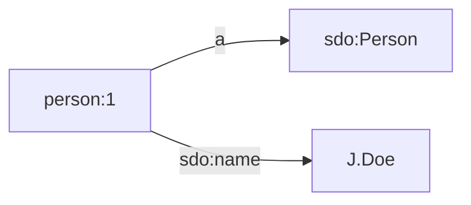
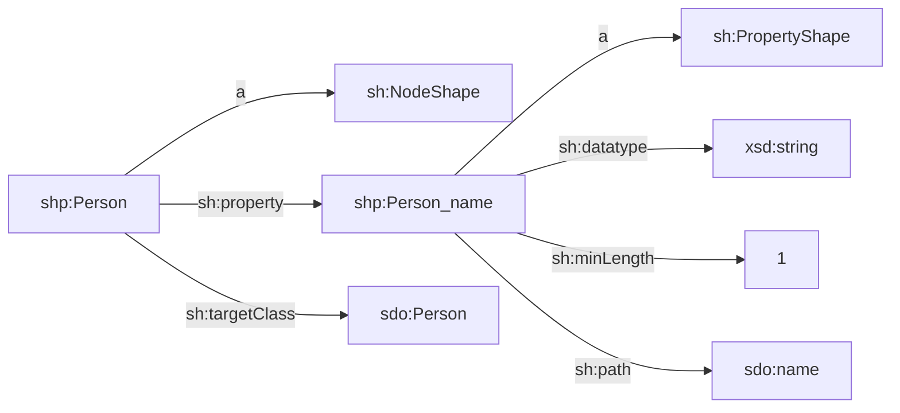

TriplyETL Source Connectors allow one or more backend systems to be connected to your TriplyETL pipeline.

## Getting Started

The following code snippet uses the [`fromJson`](#fromJson) connector with two inline example records:

```ts
import { fromJson, logRecord, Ratt as Etl } from '@triplydb/ratt'
export default async function (): Promise<Etl> {
  const etl = new Etl()
  etl.use(
    fromJson([
      { id: '123', name: 'John' },
      { id: '456', name: 'Jane' },
    ]),
    logRecord(),
  )
  return etl
}
```

Function `logRecord()` prints the current record to standard output.  When this pipeline is run, the two records are printed as follows:

```json
{
  "id": "123",
  "name": "John",
  "$recordId": 1,
  "$environment": "Development"
}
{
  "id": "456",
  "name": "Jane",
  "$recordId": 2,
  "$environment": "Development"
}
```

Notice that TriplyETL adds two keys to both records: `$recordId` and `$environment` (see [Special Key](#special-keys)).


### Change the source format

Now suppose that we change the source system.  We no longer use in-line JSON, but will instead use an XML file.  The contents of the XML file are as follows:

```xml
<?xml version="1.0"?>
<persons>
  <person>
    <id>123</id>
    <name>John</name>
  </person>
  <person>
    <id>456</id>
    <name>Jane</name>
  </person>
</persons>
```

Let us change the TriplyETL script to use the XML source connector:

```ts
import { fromXml, logRecord, Ratt as Etl } from '@triplydb/ratt'
export default async function (): Promise<Etl> {
  const etl = new Etl()
  etl.use(
    fromXml(Etl.Source.file('example.xml')),
    logRecord(),
  )
  return etl
}
```

This new script logs the following two records:

```json
{
  "id": "123",
  "name": "John",
  "$recordId": 1,
  "$environment": "Development"
}
{
  "id": "456",
  "name": "Jane",
  "$recordId": 2,
  "$environment": "Development"
}
```

Notice that the two records that are logged from an XML source are completely identical to the two records that were previously logged from a JSON source.  This is an essential property of TriplyETL: it treats data from any source system in the same way, using the same intermediary record format.  This makes it easy to write pipelines that process data from a large number of different data sources.  This also makes replacing a data source in one format with a data source in another format a relatively cheap operation.  More often than not, only the source connector needs to be changed, and all transformations and assertions remain as they were.


## Sources

TriplyETL has support for specifying the following kinds of data sources:

- [Inline JSON](#inline-json)
- [Strings](#strings)
- [Local files](#local-files)
- [Online files or APIs](#online)
- [TriplyDB assets](#triplydb-assets)
- [TriplyDB datasets](#triplydb-datasets)
- [TriplyDB queries](#triplydb-queries)


### Inline JSON

In the "Getting Started" section we saw that JSON source data was specified in-line:

```ts
fromJson([
  { id: '123', name: 'John' },
  { id: '456', name: 'Jane' },
]),
```

This works because TriplyETL configurations are implemented in TypeScript, and JSON object can be specified inside TypeScript.  This makes JSON the only source format that can be specified in such a native way inside TriplyETL.

In documentation, we often use in-line JSON sources since it makes code snippets self-contained without having to rely on external data sources such as files.  In production systems such in-line JSON sources are almost never used.


### Strings

String sources are similar to inline JSON, since they can be specified as part of the TriplyETL configuration.  String sources are currently supported by the `fromJson()` source connector, the `loadRdf()` function, and the `validateShacl()` function (see [Validation](/docs/triply-etl/validation)).

The following snippet loads triples into the internal RDF store of TriplyETL:

```ts
loadRdf(Etl.Source.string(`
prefix person: <https://example.com/id/person/>
prefix sdo:    <https://schema.org/>

person:1
  a sdo:Person;
  sdo:name 'J. Doe'.`)),
```

This loads the following triples:



The following example makes RDF source data available to the `validateShacl()` function:

```ts
validateShacl(Etl.Source.string(`
prefix sh:  <http://www.w3.org/ns/shacl#>
prefix shp: <https://example.com/model/shp/>
prefix sdo: <https://schema.org/>

shp:Person
  a sh:NodeShape;
  sh:property shp:Person_name;
  sh:targetClass sdo:Person.

shp:Person_name
  a sh:PropertyShape;
  sh:datatype xsd:string;
  sh:minLength 1;
  sh:path sdo:name.`))
```

This makes the following linked data SHACL specification available:



The following example makes a string source available to the `fromJson()` source connector:

```ts
fromJson(Ratt.Source.string(`
[
  { id: '123', name: 'John' },
  { id: '456', name: 'Jane' }
]`)),
```

Notice that the [inline JSON](#inline-json) source is often a more intuitive specification format for the `fromJson()` source connector than its corresponding string source.


### Local files

While [inline JSON](#inline-json) and [string sources](#strings) are mostly used for small examples, local files are somewhat more widely used.

The following snippet uses a JSON source that is stored in a local file:

```ts
fromJson(Etl.Source.file('./static/example.json')),
```

It is possible to specify an arbitrary number of local files by using array notation:

```ts
fromJson(Etl.Source.file([
  './static/data-001.json',
  './static/data-002.json',
  ...,
  './static/data-999.json',
])),
```

Notice that local files typically not used in production systems, since it is difficult to guarantee that all project partners have exactly the same local files on their computer.  The use of local files that are outdated or only present on the laptop of a colleague that is on holiday are often a good reason to use other source kinds instead.

### Online files or APIs {#online}

The following snippet connects to a JSON source that is stored in a publicly accessible location (URL) on the Internet:

```ts
fromJson(Etl.Source.url('https://somewhere.com/example.json')),
```

If needed, you can configure details about how the HTTP request should be made made.  You can the options that are supported by the [node-fetch library](https://github.com/node-fetch/node-fetch#options) for this.

For example, the following requests private data that uses basic authentication with username/password access:

```ts
fromJson(Etl.Source.url(
  'https://somewhere.com/example.json',
  {
    request: {
      headers: {
        Authorization: `Basic ${username}:${password}`
      }
    }
  }
)),
```

Notice that these HTTP configuring details make it possible to use online APIs as well.  For example, an online API may require specifying a token or other input values in the request body or in specific headers.  Also things like a page number and/or page size may be specified in this way.  However, if you connect to a popular online API, it is often better to use a dedicated connector (e.g. [OAI-PMH](#oai-pmh)).

Online files are typically not used in production pipelines, because the availability of such Internet resources is often outside of the control of the project partners.  Internet resources that are not maintained by the project partners may also be subject to content-wise changes over time, which may affect the production pipeline.

If the project controls the Internet resource, then these risks are smaller.  But at that point it is even better to upload the online files as [TriplyDB asset](#triplydb-assets) for additional benefits such as access controls.

#### Raw SPARQL endpoints

A specific kind of online API is a raw SPARQL endpoint.  Unfortunately, raw SPARQL endpoints lack several features that are essential for use in production systems:
- secure access control
- pagination
- reliable retrieval of large resultsets
- API variables
- versioning

These features are all supported by [TriplyDB queries](#triplydb-queries).  It is therefore simpler and safer to use TriplyDB queries.  Still, when used outside of production systems, raw SPARQL endpoints can still be used as regular web APIs.

The following code snippet issues a raw SPARQL query against a public SPARQL endpoint.
Since we specified CSV as the result set format (Media Type `text/csv`), the resultset can be accessed as any other CSV source:

```typescript
fromCsv(
  Etl.Source.url(
    'https://dbpedia.org/sparql',
    {
      request: {
        headers: {
          accept: 'text/csv',
          'content-type': 'application/query-string',
        },
        body: 'select * { ?s ?p ?o. } limit 1',
        method: 'POST',
      },
    }
  )
)
```

### TriplyDB assets {#triplydb-assets}

Assets are a core feature of TriplyDB.  Assets allow arbitrary files to be stored in the context of a linked dataset.  A typical use case for assets is to upload (new versions of) source files.  The TriplyETL pipeline can pick the latest versions of these source files and publish the resulting linked data in the the same dataset.

The following snippet uses a JSON source that is stored in a TriplyDB asset:

```ts
fromJson(
  Etl.Source.TriplyDb.asset(
    'some-account',
    'some-dataset',
    { name: 'example.json' }
  )
),
```

As with other TriplyDB sources, the account name is optional.  When omitted, the user account that is associated with the current API Token is used:

```ts
loadRdf(Etl.Source.TriplyDb.rdf('my-dataset', { name: 'example.json' })),
```

As with other TriplyDB sources, multiple assets can be specified:

```ts
fromCsv([
  Etl.Source.TriplyDb.asset('my-dataset', { name: 'table1.csv' }),
  Etl.Source.TriplyDb.asset('my-dataset', { name: 'table2.csv' }),
]),
```

#### Filtering

If the asset name is omitted, *all* assets are returned.  This is often unpractical, since only some assets must be processed.  For example, if a dataset has PDF and JSON assets, only the latter should be processed by the `fromJson()` source connector.

For such use cases the `filter` option can be used instead of the `name` option.  The `filter` option takes a TypeScript function that maps assets names onto Boolean values (true or false).  Only the assets for which the function returns truth are included.

The following snippet processes all and only assets whose name ends in `.json`:

```ts
fromJson(
  Etl.Source.TriplyDb.asset(
    'my-dataset',
    { filter: name => name.endsWith('json') }
  )
),
```

#### Versioning

It is possible to upload new versions of an existing TriplyDB asset.  When no specific version is specified, a TriplyETL pipeline will use the latest version automatically.  In order to use a specific version, the `version` option can be set to a version number.

The following snippet uses a specific version of an asset:

```ts
fromJson(
  Etl.Source.TriplyDb.asset(
    'some-account',
    'some-dataset',
    { name: 'example.json', assetVersion: 2 }
  )
),
```

#### Access

Since TriplyDB assets are part of a TriplyDB dataset:
- they are accessible under the same access level as the rest of the dataset, and
- they are accessible with the same API Token that allows linked data to be published in that dataset.

Notice that this makes it *easier* and *safer* to deal with source data that is not public.  When private data is retrieved from [online files or APIs](#online), authorization information must be configured at the HTTP level.  This is possible but cumbersome.  And, depending on the authentication approach, it is required to create a new API Token and securely configure that in addition to the TriplyDB API Token.

Notice that access also is more *transparent* when TriplyDB assets are used.  All and only collaborators that have access to the TriplyDB dataset also have access to the source data.  It is clear for all collaborators which source files should be used, and which versions are available.  This is more transparent than having to share (multiple versions of) source files over email or by other indirect means.

#### TriplyDB instance {#triplyDb-option}

By default, assets are loaded from the TriplyDB instance that is associated with the currently used API Token.  In some situations it is useful to connect to a linked dataset from a different TriplyDB instance.  This can be configured with the `triplyDb` option.

The following snippet loads the OWL vocabulary from TriplyDB.com.  Notice that the URL of the API must be specified; this is different from the URL of the web-based GUI.

```ts
loadRdf(
  Etl.Source.TriplyDb.rdf(
    'w3c',
    'owl',
    { triplyDb: { url: 'https://triplydb.com' } }
  )
),
```

If an asset is part of a non-public dataset, specifying the URL is insufficient.  In such cases an API Token from this other TriplyDB instance must be created and configured using the `token` option in combination with the `url` option.

### TriplyDB datasets

Datasets in TriplyDB store linked data in one or more graphs.  Such datasets can be loaded as a TriplyETL source.  The following snippet loads a dataset from TriplyDB into the internal RDF store of TriplyETL:

```ts
loadRdf(Etl.Source.TriplyDb.rdf('my-account', 'my-dataset')),
```

As with other TriplyDB sources, the account name is optional.  When omitted, a dataset from the user account that is associated with the current API Token is used:

```ts
loadRdf(Etl.Source.TriplyDb.rdf('my-dataset')),
```

#### Graphs option

By default, all graphs from a linked dataset are loaded.  It is possible to specify a only those graphs that should be loaded.  The following snippet only loads the data model, but not the instance data:

```ts
loadRdf(
  Etl.Source.TriplyDb.rdf(
    'my-account',
    'my-dataset',
    { graphs: ['https://example.com/id/graph/model'] }
  )
),
```

#### TriplyDB instance

The `triplyDb` option can be used to specify that a linked dataset from a different TriplyDB instance should be used.  This option works in the same way as for TriplyDB assets: [link](#triplydb-option)

### TriplyDB queries

Saved SPARQL queries in TriplyDB can be used as data sources.  SPARQL queries are very powerful data sources, since they allow complex filters to be expressed.  There are 4 SPARQL query forms, with different source connectors that can process their results:

| Query form         | Source connector          |
| ------------------ | ------------------------- |
| SPARQL `ask`       | [`fromJson()`](#fromJson), [`fromXml()`](#fromXml) |
| SPARQL `construct` | [`loadRdf()`](#loadRdf) |
| SPARQL `describe`  | [`loadRdf()`](#loadRdf) |
| SPARQL `select`    | [`fromCsv()`](#fromCsv), [`fromJson()`](#fromJson), [`fromTsv()`](@fromTsv), [`fromXml()`](#fromXml) |

SPARQL `ask` queries expose JSON or XML.  The following snippet connects to the XML results of an `ask` query in TriplyDB:

```ts
fromXml(Source.TriplyDb.query('my-account', 'my-ask-query')),
```

SPARQL `construct` and `describe` queries both emit linked data (RDF).  This allows them to be used with the `loadRdf()` function.  The following snippet loads the results of a SPARQL query into the internal RDF store of TriplyETL:

```ts
loadRdf(Etl.Source.TriplyDb.query('my-account', 'my-construct-query')),
```

SPARQL `select` queries expose CSV, JSON, TSV, and XML.  This allows them to be used with these four corresponding source connectors.  For example, the following snippet connects to the table returned by a TriplyDB `select` query:

```ts
fromCsv(Etl.Source.TriplyDb.query('my-account', 'my-select-query')),
```

As with other TriplyDB sources, the account name is optional.  When omitted, the user account that is associated with the current API Token is used:

```ts
loadRdf(Etl.Source.TriplyDb.query('my-construct-query')),
```

#### Versioning

In production systems, applications must be able to choose whether they want to use the latest version of a query (acceptance mode), or whether they want to use a specific recent version (production mode), or whether they want to use a specific older version (legacy mode).

Versioning is supported by TriplyDB saved queries.  When no specific version is specified, a TriplyETL pipeline will use the latest version of a query automatically.  In order to use a specific version, the `version` option can be set to a version number.

The following snippet uses a specific version of a query:

```ts
fromJson(Etl.Source.TriplyDb.query('my-query', { version: 2 })),
```

Not specifying the `version` option automatically uses the latest version.

#### API variables

In production systems, applications often need to request distinct information based on a limited set of input variables.  This is supported in TriplyDB saved queries which API variables.  API variables ensure that the query string is parameterized correctly, while adhering to the RDF and SPARQL standards.

The following example binds the `?country` variable inside the query string to literal `'Holland'`.  This allows the results for Holland to be returned:

```ts
fromCsv(
  Etl.Source.TriplyDb.query(
    'information-about-countries',
    {
      variables: {
        country: 'Holland'
      }
    }
  )
),
```

<!--
#### Dynamic API variables

In [the previous section](#api-variables) the value `'Holland'` for the API variable `country` was known at the time of writing the TriplyETL configuration.  But what do we do if the requested country is not known at the time of writing, but depends on data that is read/transformed during the execution of the TriplyETL pipeline?

In such cases we can use the following [custom middleware](/docs/triply-etl/custom-middlewares) to run the SPARQL query:

```ts
etl.use(
  async (context, next) => {
    const api_variables = {
      country: context.getString('COUNTRY')
    }
    const myQuery = await account.getQuery('my-query')
    for await (const statement of myQuery.results(api_variables).statements()) {
      statement.graph = graph('enrichment')
      context.store.addQuad(statement)
    }
    return next()
  }),
```

In the above example, different countries are specified by data values that are read dynamically from the `COUNTRY` key.  This key can be a column in a table, or an element in XML, or some other dynamic data location, depending on the RATT source that is used.

The following line is used to configure the graph where the results from the queries are stored:

```typescript
statement.graph = graph('enrichment')
```
-->

#### Pagination

When a bare SPARQL endpoint is queried as an [online API](#online), there are sometimes issues with retrieving the full resultset for larger queries.  With TriplyDB saved queries, the process of obtaining all results is abstracted away from the user, with the TriplyETL source performing multiple requests in the background as needed.

#### Result graph

It is often useful to store the results of SPARQL `construct` and `describe` queries in a specific graph.  For example, when internal data is enriched with external sources, it is often useful to store the external enrichments in a separate graph.  Another example is the use of a query that applies RDF(S) and/or OWL reasoning.  In such cases the results of the reasoner may be stored in a specific graph.

The following snippet stores the results of the specified `construct` query in a special enrichment graph:

```typescript
loadRdf(
  Etl.Source.TriplyDb.query('my-query', { toGraph: graph.enrichment })
)
```

This snippet assumes that the graph names have been declared (see [Delcarations](/docs/triply-etl/declarations#graphs)).

#### TriplyDB instance

The `triplyDb` option can be used to specify that a query from a different TriplyDB instance should be used.  This option works in the same way as for TriplyDB assets: [link](#triplydb-option)


## Source Connectors {#source-connectors}

TriplyETL has the following Source Connectors:

| Source Connector           | Format                            | Standard |
| -------------------------- | --------------------------------- | -------- |
| [`fromCsv()`](#csv)        | Comma-Separated Values (CSV)      | [IETF RFC 4180](https://www.ietf.org/rfc/rfc4180.html) |
| [`fromJson()`](#json)      | JavaScript Object Notation (JSON) | [IETF RFC 8259](https://www.rfc-editor.org/rfc/rfc8259) |
| [`fromOai()`](#oai-pmh)    | Open Archives Initiative Protocol for Metadata Harvesting (OAI-PMH) | [OAI](https://www.openarchives.org/pmh/) |
| [`fromShapefile()`](#esri) | ESRI Shapefiles                   | |
| [`fromTsv()`](#tsv)        | Tab-Separated Values (TSV)        | [IANA](https://www.iana.org/assignments/media-types/text/tab-separated-values) |
| [`fromXlsx()`](#xlsx)      | Microsoft Excel (XLSX)            | |
| [`fromXml()`](#xml)        | XML Markup Language (XML)         | [W3C](https://www.w3.org/TR/xml/)  |


### Comma-Separated Values (CSV) {#csv}

Comma Separated Values (file name extension `.csv`) is a popular formats for storing tabular source data.  TriplyETL has a dedicated `fromCsv()` connector for such sources.

The following code snippet connects to a local CSV source file:

```ts
fromCsv(Etl.Source.file('data.csv')),
```

The following code snippet connects to an online CSV source file:

```ts
fromCsv(Etl.Source.url('https://somewhere.com/data.csv')),
```

The following code snippet shows connects to a [TriplyDB Asset](#triplydb-asset):

```ts
fromCsv(
  Etl.Source.TriplyDb.asset(
    'some-account',
    'some-dataset',
    { name: 'example.csv' }
  )
),
```

By default, the `fromCsv()` connector implements the official CSV standard: [IETF RFC 4180](https://www.ietf.org/rfc/rfc4180.html).  It is possible to change this default behavior by specifying numerous options to the `fromCsv()` connector.  See the [CSV Parse for Node.js](https://csv.js.org/parse/options/) documentation for all available options.

#### Configure the encoding

The CSV format is allowed to use any encoding.  Since the CSV does not allow the used encoding to be stored as metadata, a non-standard encoding must be explicitly configured.  By default, TriplyETL assumes that CSV sources use UTF-8 encoding.  If any other encoding is used, this must be explicitly specified in the source connected.

The following snippet configures that the CSV source uses ISO Latin-1 encoding:

```ts
fromCsv(
  Etl.Source.TriplyDb.asset('my-dataset', { name: 'example.csv' }),
  { encoding: 'latin1' }
),
```

The following encodings are currently supported.  Let us know at <mailto:support@triply.cc> if your encoding is not yet supported.

| Value       | Encoding | Standard | Alternative values | 
| ----------- | -------- | -------- | ------------------ |
| `'ascii'`   | US-ASCII | ANSI     | |
| `'latin1'`  | Latin-1 | ISO-8859-1 | `binary` |
| `'utf8'`    | UTF-8 | Unicode | |
| `'utf16le'` | UTF-16 Little Endian | Unicode | `'ucs2'`, `'ucs-2'`, `'utf16-le'` |

You can read the [CSV Parse for Node.js](https://csv.js.org/parse/options/encoding/) documentation for more information.

#### Configure the separator

Some CSV files only deviate in their use of a different separator character.  For example, some CSV files use the semi-colon (`;`) or the at-sign (`@`) for this.  The following snippet connects to a CSV source that uses the semi-colon as a separator:

```ts
fromCsv(Etl.Source.file('example.csv'), { separator: ';' }),
```

#### CSV with tab separators is not TSV

Notice that the popular Tab-Separate Values (TSV) format is not the same as the standardized CSV format with a tab character as the field separator.  If you want to process standards-conforming TSV source data, use the [`fromTsv()` connector](#tsv) instead.

#### Record representation

TriplyETL treats every row in a CSV source as one record.  The columns are emitted as keys and the cells are emitted as values.  All values are of type `string`.  Cells that contain the empty string are treated as denoting an empty value and are excluded from the record. Any trailing whitespace that appears in headers or cells is removed from the keys or values in the record.

For example, the following table:

| ID | Name      | Age |
| -- | --------- | --- |
|  1 | Doe, John |  32 |
|  2 | D., Jane  |     |

can be expressed by the following CSV snippet:

```txt
ID,Name,Age
1,"Doe, John",32
2,"D., Jane ",
```

which is emitted as the following two TriplyETL records:

```json
{
  "ID": "1",
  "Name": "Doe, John",
  "Age": "32"
}
{
  "ID": "2",
  "Name": "D., Jane"
}
```

Notice that:
- All values have type `string`, including `"ID"` and `"Age"`.  The value for field `"Age"` should probably be considered numeric, but the CSV format cannot express this.  A TriplyETL [transformation](/docs/triply-etl/transformations) can be used to cast string values to numeric values.
- The trailing space in `"D., Jane "` is omitted from the second record, since training whitespace is removed from all keys and values.
- The `"Age"` key is missing from the second record, since the corresponding CSV cell contains the empty string, which is considered to denote an empty value.


### JavaScript Object Notation (JSON) {#json}

JSON (JavaScript Object Notation) is a popular open standard for interchanging tree-shaped data.  TriplyETL has a dedicated `fromJson()` connector for this format.

The following code snippet connects to a JSON source that is stored as a [TriplyDB asset](#triplydb-asset):

```ts
fromJson(
  Etl.Source.TriplyDb.asset(
    'account',
    'dataset',
    { name: 'example.json.gz' }
  )
),
```

The following example uses an in-line specified JSON source:

```ts
fromJson([{ a: "a", b: "b", c: "c" }]),
```

### Protocol for Metadata Harvesting (OAI-PMH) {#oai-pmh}

In the GLAM domain (Galleries, Libraries, Archives, Museums) the Open Archives Initiative Protocol for Metadata Harvesting (OAI-PMH) is a popular mechanism for publishing data collections.  TriplyETL includes the `fromOai()` connector to tap into these data collections.

The `fromOai()` connector ensures a continuous stream of data records.  Under the hood, this connector uses resumption tokens to iterate over large collections.

An OAI-PMH endpoint can be configured by specifying its URL (parameter `url`).  Since one OAI-PMH endpoint typically publishes multiple datasets, it is also common to specify the `set` parameter.

The following code snippet connects to an example dataset that is published in an example OAI-PMH endpoint:

```ts
fromOai({
  url: 'https://somewhere.com/webapioai/oai.ashx',
  set: 'some-dataset',
}),
```


### Tab-Separated Values (TSV) {#tsv}

Tab-Separated Values (file name extension `.tsv`) is a popular format for tabular source data.  TriplyETL has a `fromTsv()` connector to support this format.

The following code snippet shows how a [TriplyDB Asset](#triplydb-asset) is used to process records from a TSV source:

```ts
fromTsv(
  Etl.Source.TriplyDb.asset('some-account', 'some-dataset', { name: 'example.tsv.gz' })
),
```

TriplyETL enforces the [IANA](https://www.iana.org/assignments/media-types/text/tab-separated-values) standard definition of the TSV format.

#### Record representation

TriplyETL treats every row in a TSV source as one record.  The columns are emitted as keys and the cells are emitted as values.  All values are of type `string`.  Cells that contain the empty string are treated as denoting an empty value and are excluded from the record. Any trailing whitespace that appears in headers or cells is removed from the keys or values in the record.

For example, the following table:

| ID | Name      | Age |
| -- | --------- | --- |
|  1 | Doe, John |  32 |
|  2 | D., Jane  |     |

can be expressed by the following TSV snippet:

```txt
ID	Name	Age
1	Doe, John	32
2	D., Jane 	
```

which is emitted as the following two TriplyETL records:

```json
{
  "ID": "1",
  "Name": "Doe, John",
  "Age": "32"
}
{
  "ID": "2",
  "Name": "D., Jane"
}
```

Notice that:
- All values have type `string`, including `"ID"` and `"Age"`.  The value for field `"Age"` should probably be considered numeric, but the TSV format cannot express this.  A TriplyETL [transformation](#transformations) can be used to cast string values to numeric values.
- The trailing space in `"D., Jane "` is omitted from the second record, since training whitespace is removed from all keys and values.
- The `"Age"` key is missing from the second record, since the corresponding TSV cell contains the empty string, which is considered to denote an empty value.

### Microsoft Excel (XLSX) {#xlsx}

Microsoft Excel (file name extension `.xlsx`) is a popular format for storing tabular source data.  TriplyETL has a dedicated `fromXlsx()` connector for such sources.

The following code snippet shows how a [TriplyDB assets](#triplydb-asset) is used to process records from an Excel source:

```ts
fromXlsx(
  Etl.Source.TriplyDb.asset(
    'some-account',
    'some-dataset',
    { name: 'example.xlsx' }
  )
),
```

The `fromXlsx()` connector emits one record per row in the source file.

#### Sheets

It is common for Excel files to have multiple sheets.  By default the `fromXlsx()` connector enumerate all rows from all sheets as records.  If only some sheets should be used, this can be specified as a configuration option.

The following code snippet only emits rows from the `'people'` and `'projects'` sheets in the Excel source file `'example.xlsx'`.  Rows from other sheets in the same Excel file are not emitted:

```ts
fromXlsx(
  Etl.Source.file('example.xlsx'),
  { sheetNames: ['people', 'projects'] }
)
```

#### Record representation

TriplyETL treats every row in Excel sheet as one record.  The columns are emitted as keys and the cells are emitted as values.  Unlike other tabular formats like [CSV](#csv) and [TSV](#tsv), values in Excel can have different types.

For example, the following table:

| ID | Name      | Age |
| -- | --------- | --- |
|  1 | Doe, John |  32 |
|  2 | D., Jane  |     |

can be emitted as the following two TriplyETL records:

```json
{
  "$recordId": 1,
  "$environment": "Development",
  "$sheetName": "Sheet1",
  "$fileName": "static/Untitled 1.xlsx",
  "ID": "1",
  "Name": "Doe, John",
  "Age": 32
}
{
  "$recordId": 2,
  "$environment": "Development",
  "$sheetName": "Sheet1",
  "$fileName": "static/Untitled 1.xlsx",
  "ID": "2",
  "Name": "D., Jane",
}
```

Notice the following:
- The value for the `"Age"` key is a number.
- The special keys `$recordId`, `$environment`, and `$fileName` are documented in the section on [Special Keys](#special key).
- The special key `$sheetName` is unique to the `fromXslx()` source connector and is documented in the next subsection.

#### Special key `$sheetName`

For every record emitted by the `fromXlsx()` source connector. the `$sheetName` special key contains the name of the Excel sheet from which that record originates.  The presence of the sheet name allows the TriplyETL configuration to be adjusted for different sheet.

For example, an Excel spreadsheet may contain a `"companies"` sheet and a `"persons"` sheet.  The name of the sheet may be used to determine which class should be asserted.  The following snippet uses the [`translateAll()`](#translateAll) transformation to map sheet names to class IRIs:

```ts
fromXlsx(Etl.Source.file('example.xlsx')),
translateAll({
  content: '$sheetName',
  table: {
    'companies': sdo.Organization,
    'persons': sdo.Person,
  },
  key: '_class',
}),
triple(iri(prefix.id, '$recordId'), a, '_class'),
```


### Extensible Markup Language (XML) {#xml}

Extensible Markup Language (XML) is a popular tree-shaped source data format.

The following snippets connects to an XML file that is made available as a [TriplyDB asset](#triplydb-asset):

```ts
fromXml(
  Etl.Source.TriplyDb.asset('my-dataset', {name: 'my-data.xml'}),
  { selectors: 'first-element' }
),
```

Notice that the `fromXml()` source connector requires a `selectors` option.  This specifies the subtrees in the XML that should be treated as individual records.  In the above snippet the records are the subtrees that occur between the `<first-element>` opening tag and the `</first-element>` closing tag.

If a deeper path must be specified, sequential tags in the path must be separated by a dot:

```ts
fromXml(
  Etl.Source.TriplyDb.asset('my-dataset', {name: 'my-data.xml'}),
  { selectors: 'first-element.second-element.third-element' }
),
```

Sometimes there are multiple paths that point to different kinds of records, all within the same large XML source.  In such cases the multiple paths can be specified in an array:

```ts
fromXml(
  Etl.Source.TriplyDb.asset('my-dataset', {name: 'my-data.xml'}),
  {
    selectors: [
      'first-element.second-element.third-element',
      'first-element.second-element.alt-element',
      'first-element.second-element.other-element',
    ]
  }
),
```

## Compression

Source data is often text-based.  This means that such source data can often be compressed to minimize storage space and/or Internet bandwidth.

TriplyETL provides automatic support for the GNU zip (file name extension `*.gz`) compression format.

The following snippet uses a TriplyDB assets that was compressed with GNU zip (file extension `*.gz`):

```ts
fromCsv(
  Etl.Source.TriplyDb.asset(
    'my-dataset',
    { name: 'example.csv.gz' }
  )
),
```

## Special Keys

The source connectors in TriplyETL add several special keys to your records.  These special keys start with a dollar sign character (`$`) and can be used in your pipeline configuration.  We now discuss these special keys in details.

### `$environment`

The special key `$environment` denotes the DTAP environment in which the TriplyETL pipeline is running.  This allows special actions to be performed based on whether the pipeline runs in `"Debug"`, `"Test"`, `"Acceptance"`, or `"Production"` mode.

See the [DTAP documentation](/docs/triply-etl/dtap) for more information.

### `$recordId`

The special key `$recordId` assigns a unique number to every record that is processed in one single run of a TriplyETL pipeline.

If the source data does not change, multiple runs of the TriplyETL pipeline will always generate the same record IDs.  However, if source data changes, multiple runs of the TriplyETL pipeline may generate different record IDs for the same record.

#### Use case: Unique identifiers

The first main use case of the `$recordId` key is to create IRIs that are unique within one single run of a TriplyETL pipeline.

Suppose the following table is our source data:

| First name | Last name |
| ---------- | --------- |
| John       | Doe       |
| Jane       | Doe       |
| John       | Doe       |

We need to create an IRI for every person in this table.  Notice that the table contains no unique properties: there are two different persons with the same first and last name.  This means that we cannot use the keys "First name" and "Last name" in our record in order to create our IRIs.  Luckily, the source connector adds the `$recordId` for us:

```json
{
  "First name": "John",
  "Last name": "Doe",
  "$recordId": 1
}
{
  "First name": "Jane",
  "Last name": "Doe",
  "$recordId": 2
}
{
  "First name": "John",
  "Last name": "Doe",
  "$recordId": 3
}
```

This allows us to make the following assertion:

```ts
pairs(iri(prefix.id, '$recordId'),
  [a, sdo.Person],
  [sdo.givenName, 'First name'],
  [sdo.familyName, 'Last name'],
),
```

Which results in the following linked data:

```turtle
id:1
  a sdo:Person;
  sdo:givenName 'John';
  sdo:familyName 'Doe'.

id:2
  a sdo:Person;
  sdo:givenName 'Jane';
  sdo:familyName 'Doe'.

id:3
  a sdo:Person;
  sdo:givenName 'John';
  sdo:familyName 'Doe'.
```

Notice that the use of the `$recordId` results in a correct single run of the TriplyETL pipeline.  But if the source data changes, the IRIs may change as well.  For example, if the first and second row in the source table are swapped, the IRI that denotes "Jane Doe" will change from `id:2` to `id:1`.

#### Use case: Debugging

When you are debugging the configuration of a TriplyETL pipeline, it is sometimes useful to perform a specific actions for a specific record.  Assuming the stream of records is stable during the debugging effort, the `$recordId` key can be used to perform such a debugging action; for example:

```ts
whenEqual('$recordId', 908, logRecord()),
```

Do note that it is generally better to run the TriplyETL for a specific record using the `--from-record-id 908 --head 1` command line flags (see [CLI](/docs/triply-etl/cli)).


## Next steps

Source Connectors generate a stream of unified records.  This decouples pipeline configuration from heterogeneous source system structure.

See the [Transformations](transformations) and [Assertions](assertions) sections for how to work with the unified records that stream from one or more source connections.
