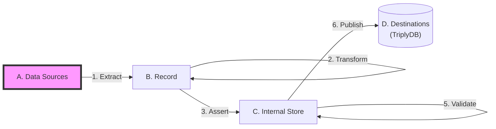

[TOC]

# Sources

TriplyETL **Sources** are locations that hold data that can be extracted with one or more [TriplyETL extractors](../extract/index.md).

The following kinds of sources are supported:

- [APIs](./apis.md)
- [Inline JSON](./inline-json.md)
- [Inline strings](./inline-strings.md)
- [Local files](./local-files.md)
- [Online files](./online-files.md)
- [TriplyDB Assets](./triplydb-assets.md)
- [TriplyDB Datasets](./triplydb-datasets.md)
- [TriplyDB Queries](./triplydb-queries.md)
