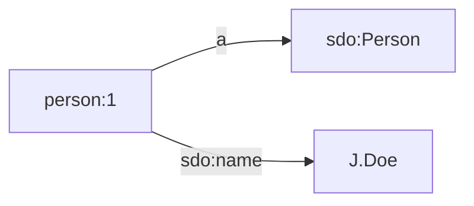
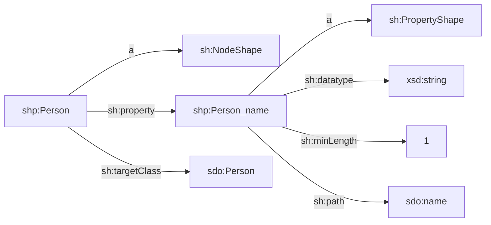

[TOC]

# Inline strings

Data in the JSON or RDF formats can be specified with inline strings.

The following code snippet loads triples into the Internal Store:

```ts
loadRdf(
  Source.string(`
prefix person: <https://example.com/id/person/>
prefix sdo: <https://schema.org/>

person:1 a sdo:Person;
         sdo:name 'J. Doe'.`),
  { contentType: 'text/turtle' }
),
```

This loads the following triples:



Notice that we must specify the RDF serialization format that we use. This is necessary because `loadRdf()` supports a large number of formats, some of which are difficult to autodetect. The following formats are supported:

| Format    | `contentType` value       |
| --------- | ------------------------- |
| HTML      | `'text/html'`             |
| JSON-LD   | `'application/ld+json'`   |
| JSON      | `'application/json'`      |
| N-Quads   | `'application/n-quads'`   |
| N-Triples | `'application/n-triples'` |
| N3        | `'text/n3'`               |
| RDF/XML   | `'application/rdf+xml'`   |
| SVG       | `'image/svg+xml'`         |
| TriG      | `'application/trig'`      |
| Turtle    | `'text/turtle'`           |
| XHTML     | `'application/xhtml+xml'` |
| XML       | `'application/xml'`       |

The following example makes RDF source data available to the SHACL [validate()](../validate/shacl.md) function:

```ts
import { Source } from '@triplyetl/etl/generic'
import { validate } from '@triplyetl/etl/shacl'

validate(Source.string(`
prefix sh: <http://www.w3.org/ns/shacl#>
prefix shp: <https://example.com/model/shp/>
prefix sdo: <https://schema.org/>

shp:Person
  a sh:NodeShape;
  sh:property shp:Person_name;
  sh:targetClass sdo:Person.

shp:Person_name
  a sh:PropertyShape;
  sh:datatype xsd:string;
  sh:minLength 1;
  sh:path sdo:name.`))
```

This makes the following linked data SHACL specification available:



Notice that `validate()` does not require us to set the content-type, since it only supports N-Quads, N-Triples, TriG and Turtle (and these formats can be detected automatically).

The following example makes a string source available to the `fromJson()` source extractor:

```ts
fromJson(Source.string(`
[
  { id: '123', name: 'John' },
  { id: '456', name: 'Jane' }
]`)),
```

Notice that the [inline JSON](#inline-json) source is often a more intuitive specification format for the `fromJson()` source extractor than its corresponding string source.

While [inline JSON](#inline-json) and [string sources](#strings) are mostly used for small examples, local files are somewhat more widely used.
