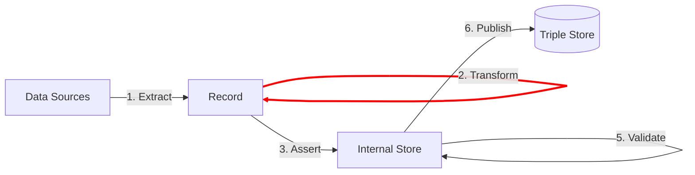

The **Transform** step makes changes to the Record:

If you do not have a stream of records yet, read the documentation for the [**Extract** step](/docs/triply-etl/extract) first.

Once you have a stream of records, the following transformations are typically made:
- Clean up the source data.
- Combining different values from the source data into one new value.
- Splitting a single value from the source data into multiple new values.

TriplyETL supports the following transformation approaches:

- 2A. [**RATT**](/docs/triply-etl/transform/ratt) transformations are a set of commonly used transformation functions that are developed and maintained by Triply.
- 2B. [**TypeScript**](/docs/triply-etl/transform/typescript) can be used to write new customer transformations.

## Next steps

The Transform step results in a cleaned and enriched record.  The following link documents how you can use the record to make linked data assertions:

-  [3. **Assert**](/docs/triply-etl/assert) uses data from the Record to generate linked data in the Internal Store.
