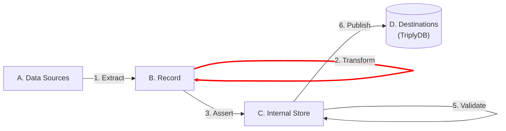

[TOC]

# Transform

The transform step makes changes to the [record](../generic/record.md):

If you do not have a stream of records yet, read the documentation for the [**Extract** step](../extract/index.md) first.

Once you have a stream of records, the following transformations are typically needed:
- Values need to be mapped onto a prepared list of IRIs or literals (e.g. from country names to country-denoting IRIs).
- Values need to be translated into standards-compliant formats (e.g., from country name to ISO 3166 country codes).
- Multiple existing values need to be combined into one new value (e.g., street name and house number may be combined into an address).
- A single value needs to be split into multiple values (e.g., from `'apple, orange'` to `'apple'` and `'orange'`).
- Values need to be cleaned because they are dirty in the source (e.g., from `'001 '` to `1`).

TriplyETL supports the following four transformation approaches:

- [**RATT**](./ratt.md) transformations are a set of commonly used transformation functions that are developed and maintained by Triply.
- [**RML**](./rml.md) can be used to convert non-RDF data into RDF triples.
- [**TypeScript**](./typescript.md) can be used to write new customer transformations.
- [**XSLT**](./xslt.md) used to transform XML data through the definition of transformation rules in XSLT stylesheets.

## Next steps

The Transform step results in a cleaned and enriched record. The following link documents how you can use the record to make linked data assertions:

- Step 3. [**Assert**](../assert/index.md): uses data from the record to make linked data assertions in the internal store.
