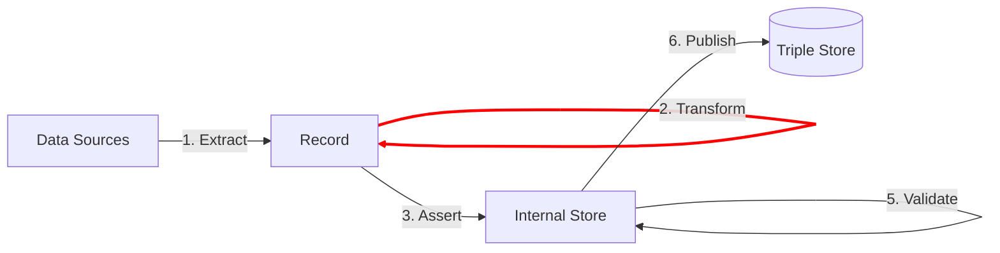

Transform is the step that makes changes to the record.

Changes typically include:
- cleanups of the source data
- combining multiple values into one new value
- splitting a single value into multiple new values

TriplyETL supports the following transformation approaches:

- [JSON-LD frames](/docs/triply-etl/transform/json-ld) can be applied to the record to restructure its content.
- [RATT transformations](/docs/triply-etl/transform/ratt) are a set of commonly used transformation functions that are developed and maintained by Triply.
- [TypeScript transformations](/docs/triply-etl/transform/typescript) allow new transformations to be programmed.

Here are some examples of typical transformations:

- Values may need to be mapped onto a prepared list of IRIs or literals (e.g. from country names to country-denoting IRIs).
- Values may need to be translated into standards-compliant formats (e.g., from country name to ISO 3166 country codes).
- Multiple values may need to be combined into one value (e.g., street name and house number may be concatenated into an address).
- A simple value with a separator may need to be split into multiple values (e.g., from `'apple, orange'` to `'apple'` and `'orange'`).
- Values may need to be cleaned because they are dirty in the source (e.g., from `'001 '` to `1`).

## Next steps

The Transform step results in a cleaned and enriched record.  The following link documents how you can use the record to make linked data assertions:

- [3. Assert](/docs/triply-etl/assert/overview) use data from the Record to generate linked data in the Internal Store.
