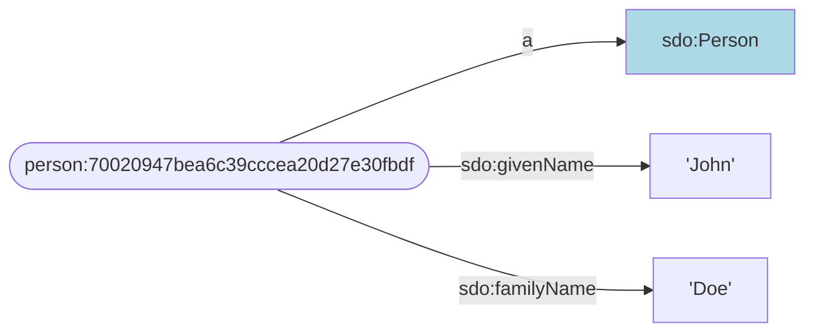
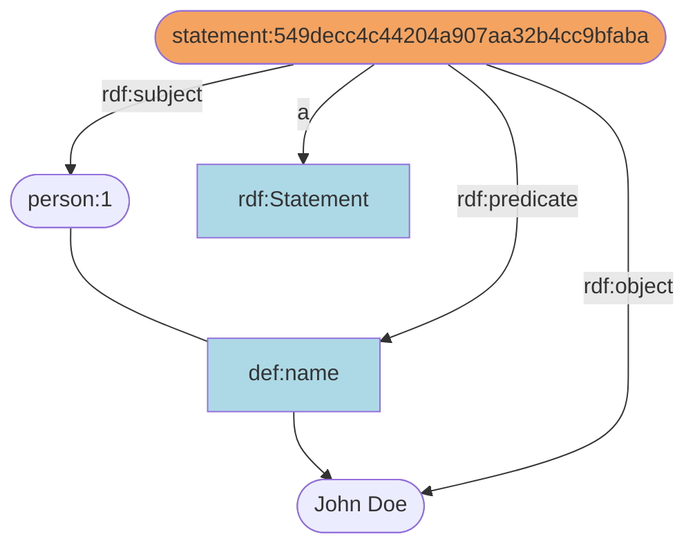
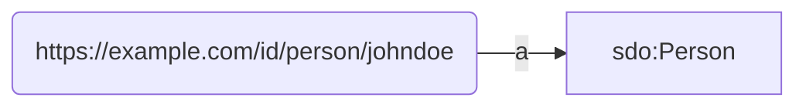
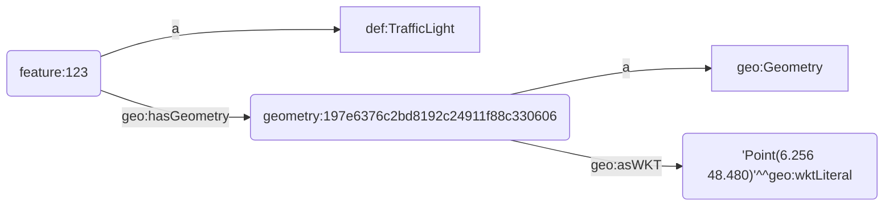

RATT transformations are a core set of functions that are commonly used to change the content of the TriplyETL record.

RATT transformations started out as TypeScript transformations that turned out to be useful in a wide variety of TriplyETL pipelines.  Triply maintains this core set of transformation functions to allow new ETLs to make use of off-the-shelf functionality that have proven useful in the past.

The following transformation functions are available:

| Function | Description |
| --- | --- |
| [`addHashedIri`](#addhashediri) | Create a new IRI with a content-based local name. |
| [`addIri`](#addIri) | Create a new IRI based on a prefix and a local name. |
| [`addLiteral`](#addLiteral) | Create a new literal based on a lexical for and a datatype IRI or language tag. |
| [`addRandomIri`](#addrandomiri) | Create a new IRI with a random local name. |
| [`addSkolemIri`](#addskolemiri) | Create a new IRI with a random local name, which advertises that it may be consistently replaced with blank nodes. |
| [`addTag`](#addtag) | Create a language tag. |
| [`addValue`](#addvalue) | Create a TypeScript value. |
| [`capitalize`](#capitalize) | Transforms a string value to its capitalized variant. |
| [`concat`](#concat) | |
| [`copy`](#copy) | |
| [`decodeHtml`](#decodehtml) | |
| [`geojsonToWkt`](#geojsontowkt) | |
| [`lowercase`](#lowercase) | |
| [`padEnd`](#padend) | |
| [`padStart`](#padstart) | |
| [`replace`](#replace) | |
| [`split`](#split) | |
| [`substring`](#substring) | |
| [`translateAll`](#translateall) | |
| [`translateSome`](#translatesome) | |
| [`tryLiteral`](#tryliteral) | |
| [`uppercase`](#uppercase) | |
| [`wkt.addPoint`](#wktaddpoint) | |
| [`wkt.project`](#wktproject) | |


## `addHashedIri()`

#### Description

Creates an IRI based on the specified IRI prefix and the hash calculated over the input content string(s).

#### Keys

- `prefix` An IRI, or a key that contains an IRI value.
- `content` A key that contains a string value, or a string value specified with [`str()`](#str).
- `key` A new key where the created hashed IRI is stored.

#### Use cases

This function is used under the following circumstances:
1. You want to identify something with an IRI.
2. The thing that you want to identify does not have a readily available identifier.
3. The thing that you want to identify has one or more properties that together allow the thing to be uniquely identified.

A benefit of `addHashedIri()` is that the created IRIs are the same across different ETL runs over the same source data.

A downside of `addHashedIri()` is that it can take a lot of time to figure out which set of properties make every IRI unique.  (In database theory this process is known as 'composite key detection'.)  Furthermore, having to adjust the hashed content later may pose a maintenance burden.

#### Example: Lazy identifiers

Some source data does not include good identifiers for all data items.

The following source table does not include a good identifier.  What is more, none of the columns contains values that are unique for each row:

| First name | Last name |
| ---------- | --------- |
| Jane       | Doe       |
| Jane       | Smith     |
| John       | Doe       |

In such cases it may be an option to take a combination of columns, and use that combined sequence of columns for identification.  This is called a 'composite key' in database theory.

The following snippet uses the combination of the first name and last name fields (in that order) to create a locally unique hash, that can be used to create a globally IRI.  (This does assume that every person in the dataset has a unique first/last name combination!)

```ts
fromXlsx(Etl.Source.file('data.xlsx')),
addHashedIri({
  prefix: prefix.person,
  content: ['First name', 'Last name'],
  key: '_person',
}),
pairs('_person',
  [a, sdo.Person],
  [sdo.givenName, 'First name'],
  [sdo.familyName, 'Last name'],
),
```

This results in the following linked data assertions:

```turtle
person:70020947bea6c39cccea20d27e30fbdf
  a sdo:Person;
  sdo:givenName 'John';
  familyName 'Doe'.
```

Or diagrammatically:



#### Example: Statement Reification

The RDF standard allows individual statements to be indentified.  This approach is called 'Statement Reification' and is often used for asserting metadata about statements or to represent modalities such as probability or belief.

The following snippet uses `addHashedIri` to create a unique identifier for every reified statement:

```ts
fromJson([{ id: '1', name: 'John Doe' }]),

// We first create the subject term, predicate term, and object.
addIri({
  prefix: prefix.person,
  content: 'id',
  key: 'subject',
}),
addIri({
  prefix: prefix.def,
  content: str('name'),
  key: 'predicate',
}),
addLiteral({
  content: 'name',
  key: 'object',
}),

// We then create the triple statement.
triple('subject', 'predicate', 'object'),

// We can now create the reified statement.
addHashedIri({
  prefix: prefix.statement,
  content: ['subject', 'predicate', 'object'],
  key: 'statement',
}),
pairs('statement',
  [a, rdf.Statement],
  [rdf.subject, 'subject'],
  [rdf.predicate, 'predicate'],
  [rdf.object, 'object'],
),
```

This results in the following linked data assertions:

```turtle
person:1 def:name 'John Doe'.
statement:549decc4c44204a907aa32b4cc9bfaba
  a rdf:Statement;
  rdf:subject person:1;
  rdf:predicate def:name;
  rdf:object 'John Doe'.
```

Or diagrammatically:




## `addIri()`

#### Description

Creates an IRI based on the specified parameters.

This transformation can be used in the following two ways:
1. By using an IRI prefix and a local name.
2. By using a full absolute IRI.

#### Parameters

- `prefix` Optionally, an IRI or a key that contains an IRI.  If specified, this is the IRI prefix that will appear before the local name that is specified by the `content` argument.  If this parameter is absent, `content` is assumed to contain a full absolute IRI.
- `content` A string, or a key that contains a string. If the `prefix` parameter is specified, `content` specifies the IRI local name that appears after the IRI prefix.  If the `prefix` argument is not specified, `content` is assumed to encode a full absolute IRI.
- `key` A new key where the created IRI is stored.

#### See also

If the created IRI is used exactly once, it is often better to use the inline term assertion [`iri()`](/docs/triply-etl/assertions#iri) instead.

#### Example: Prefix delcaration and local name

The following snippet creates an IRI based on the specified IRI prefix and local name:

```ts
addIri({
  prefix: prefix.person,
  content: 'username',
  key: '_person',
}),
triple('_person', a, sdo.Person),
```

This results in the following linked data assertions:

```turtle
person:johndoe a sdo:Person.
```

Or diagrammatically:


The following snippet makes the same assertion, but uses term assertion [`iri()`]() instead of transformation `addIri()`:

```ts
triple(iri(prefix.person, 'username'), a, sdo.Person),
```

### Example: Absolute IRI

The following snippet creates the same IRI, but does not use a predefined prefix IRI:

```ts
addIri({
  content: 'https://example.com/id/person/johndoe',
  key: '_person',
}),
triple('_person', a, sdo.Person),
```

Or diagrammatically:



The following snippet uses term assertion [`iri()`]() instead of transformation `addIri()`:

```ts
triple(iri('https://example.com/id/person/johndoe'), a, sdo.Person),
```


## `addLiteral()`

Creates an new literal and adds it to the RATT Record under the specified key.

This transformation can be used in the following 3 ways:

1. If a datatype (key: `datatype`) is given, a typed literal is created.
2. If a language tag (key: `languageTag`) is given, a language-tagged string (datatype `rdf:langString`) is created.
3. If neither a datatype not a language tag is given, a literal with datatype `xsd:string` is created.

#### When to use

This transformation is typically used when:

- The same literal occurs in two or more statement assertions (i.e. [`triple()`](/docs/triply-etl/assertions#triple) or [`quad()`](/docs/triply-etl/assertions#quad)).  This avoids having to specify the same literal multiple times using the term assertion [`literal()`](/docs/triply-etl/assertions#literal).
- The datatype or language tag is derived from the source data record.

#### Parameters

- `content` A key that contains a string value, or a string specified with [`str()`]().
- `datatype` Optionally, an IRI or a key that stores an IRI.
- `languageTag` Optionally, a language tag from the [`lang`]() object, or a key that stores such a language tag.
- `key` A new key where the created literal is stored.

#### See also

If the created literal is used exactly once, it is often better to use the inline term assertion [`literal()`](/docs/triply-etl/assertions#literal) instead.

### Example: Typed literal

The following snippet asserts a triple with a typed literal with datatype IRI `xsd:date`:

```ts
fromJson([{ id: '123', date: '2022-01-30' }]),
addLiteral({
  content: 'date',
  datatype: xsd.date,
  key: '_dateCreated',
}),
triple(iri(prefix.book, 'id'), sdo.dateCreated, '_dateCreated'),
```

This makes the following linked data assertion:

```ttl
book:123 sdo:dateCreated '2022-30-01'^^xsd:date.
```

Notice that the same linked data could have been asserted with the following use the the [literal} assertion middleware:

```ts
fromJson([{ id: '123', date: '2022-01-30' }]),
triple(iri(prefix.book, 'id'), sdo.dateCreated, literal('date', xsd.date)),
```

### Example: String literal

The following snippet asserts a triple with a string literal in the object position:

```ts
fromJson([{name: 'London'}]),
addLiteral({
  content: 'name',
  key: '_name',
}),
triple(iri(prefix.city, '_name'), skos.prefLabel, '_name')
```

This makes the following assertion:

```turtle
city:London sdo:name 'London'.
```

The literal 'London' has type `xsd:string`.  This is the standard datatype IRI for typed literals in RATT, and in many other linked data languages such as Turtle, TriG, and SPARQL.

Notice that the same linked data could have been asserted with the following snippet, where the string value `'London'` is automatically cast into a string literal:

```ts
fromJson([{ name: 'London' }]),
triple(iri(prefix.city, 'name'), skos.prefLabel, 'name'),
```

### Example: Language-tagged string

The following snippet asserts a triple with a language-tagged string in the object position:

```ts
fromJson([{ name: 'London' }]),
addLiteral({
  content: 'name',
  languageTag: lang['en-gb'],
  key: '_name',
}),
triple(iri(prefix.city, 'name'), skos.prefLabel, '_name'),
```

This results in the following linked data assertion:

```turtle
city:London skos:prefLabel 'London'@en-gb.
```

Notice that the same linked data could have been asserted with the following use the the [literal} assertion middleware:

```ts
fromJson([{ name: 'London' }]),
triple(iri(prefix.city, 'name'), skos.prefLabel, literal('name', lang['en-gb'])),
```

#### Example: Language tag from source data (TODO)

```ts
fromJson([
  { label: }
]),
```


## `addRandomIri()`

Creates an IRI based on the specified IRI prefix and a universally unique random identifier.

#### When to use?

This middleware is used under the following circumstances:

1. You want to identify something with an IRI.
2. The thing that you want to identify does not have a readily available identifier.  If an identifier is available, use [`addIri()`](#addiri) instead.
3. The thing that you want to identify does not have unique properties in the source data, or it is too difficult or too expensive to specify these properties.  If unique properties are available, use [`addHashedIri()`](#addhashediri) instead.

This middleware has the advantage that, unlike [`addHashedIri`](#addhashediri), no identifying criteria need to be specified.

This middleware has the disadvantage that, unlike [`addHashedIri()`](#addhashediri), running the same ETL twice over the same source data results in different IRIs.

#### Parameters

- `prefix` An IRI or a key that contains an IRI.
- `key` A new key where the created IRI is stored.

#### Example

The following snippet creates a triple with a subject that that is a random IRI:

```ts
addRandomIri({
  prefix: prefix.id,
  key: 'subject',
}),
triple('subject', sdo.dateCreated, literal('date', xsd.date)),
```

This makes the following assertion in linked data:

```turtle
id:acb3ea010fe748bfa73a2ee2b65bef65 sdo:dateCreated '2000-12-30'^^xsd:date.
```

#### See also

- Use [`addIri()`]() instead, if a unique identifier can be readily
specified.
- Use [`addHashedIri`]() instead, if one or more properties that
together uniquely identify a thing can be specified.
- Use [addSkolemIri} instead, if you want to communicate that the IRI can be replaced with a blank node.


## `addSkolemIri()`

Creates a globally unique IRI that is intended to be used as a blank node identifier.

Blank nodes are nodes without identification.  It relatively difficult to work which such nodes in graph data, since they cannot be identified or dereferenced online.  For this reason RATT uses Skolem IRIs to denote blank nodes.  This allows blank nodes to be identified and dereferenced.  This Skolemization approach is part of the RDF standard.

Skolem IRIs are [addRandomIri | random IRIs} whose root path starts with `.well-known/genid/`.  This makes it easy to distinguish them from other random IRIs that are not used to denote blank nodes.

- `prefix` A IRI or a key that contains an IRI whose path starts with `.well-known/genid/`.
- `key` A new key where the created IRI is stored.

#### See also

| [Skolemization section](https://www.w3.org/TR/rdf11-concepts/#section-skolemization) in the RDF standard.

#### Example

The following snippet uses a [addHashedIri | hashed IRI} to create a predictable identifier for a geospatial feature, and a Skolem IRI to create an unpredictable identifier for the geometry.

The snippet includes the prefix declarations to illustrate that the path of the Skolem IRI must start with `.well-known/genid.`.

```ts
const prefix_base = 'https://example.com/'
const prefix = {
  feature: Ratt.prefixer(prefix_base('id/feature/')),
  skolem: Ratt.prefixer(prefix_base('.well-known/genid/'),
}

...

fromJson([{ point: 'Point(1.1 2.2)' }]),
addHashedIri({
  prefix: prefix.feature,
  content: 'point',
  key: '_feature',
}),
addSkolemIri({
  prefix: prefix.skolem,
  key: '_geometry',
}),
triple('_feature', geo.hasGeometry, '_geometry'),
triple('_geometry', geo.asWKT, literal('point', geo.wktLiteral)),
```

This results in the following linked data assertions:

```turtle
feature:22238008e490f725979118f8f2dd9b5a geo:hasGeometry skolem:0cf4b63252a0476a8afc20735aa03da6.
skolem:0cf4b63252a0476a8afc20735aa03da6 geo:asWKT 'Point(1.1 2.2)'^^geo:wktLiteral.
```

Notice that the feature IRI will be the same across ELT runs if the source
data stays the same, but the Skolem will always be different.

Since the Skolem IRIs can be identified by the start of their path
(`.well-known/genid/`), the same linked data assertions can be displayed as
follows:

```turtle
feature:22238008e490f725979118f8f2dd9b5a geo:hasGeometry
  [ geo:asWKT 'Point(1.1 2.2)'^^geo:wktLiteral ].
```


## `addTag()`

This middleware creates a language tag based on a given string value.

#### Parameters

- `content` A string value that encodes a language tag according to the IANA language subtag registry.
- `key` A new key where the language tag will be stored.

#### Throws

An error is emitted if the given string value does not follow the language tag
format, or denotes a language tag that is not currently registered.

#### See also

- The language tag format is defined in the [IETF BCP 47 standard (RFC 5646)](https://www.rfc-editor.org/rfc/rfc5646.html).
- Language tags are registered in the [IANA language subtag registry](https://www.iana.org/assignments/language-subtag-registry/language-subtag-registry).

#### Example

The following snippet created a language tag for the Dutch language as spoken in The Netherlands, and uses it to assert a language-tagged string:

```ts
fromJson([{ label: 'Amsterdam' }]),
addTag({
  content: 'nl-nl',
  key: 'lang',
}),
triple(iri(prefix.city, 'label'), rdfs.label, literal('label', 'lang')),
```


## `addValue()`

This middleware allows any value to be added to the RATT Record.

#### Description

This middleware is useful for data that is not present in the source data record, but must be used in one or more assertions.

#### Parameters

- `content` Any value that can be represented in TypeScript.
- `key` A new key where the value is stored.

#### Example

The following snippet starts out with an empty source record (`{}`), and adds a new `data` key to it.  The added value is an array that contains a string and a number (in that order).

This new value is used in the triple assertion, where `'data[0]'` extracts the string element and `'data[1]'` extracts the number elements.

```ts
fromJson([{}]),
addValue({
  content: ['johndoe', 22],
  key: 'data',
}),
triple(iri(prefix.person, 'data[0]'), foaf.age, 'data[1]'),
```

This results in the following linked data assertion:

```ttl
person:johndoe foaf:age 22.
```

#### Example

The following snippet adds a key called `_startDate` that either contains the start date as specified in the data source record, or the value `'unknown'`:

```ts
fromJson([
  { id: '123', start: '2022-02-12' },
  { id: '456' },
]),
ifElse({
  if: 'start',
  then: addLiteral({
    content: 'start',
    datatype: xsd.date,
    key: '_start',
  }),
}, {
  else: addValue({
    content: 'unknown',
    key: '_start',
  }),
}),
triple(iri(prefix.event, 'id'), sdo.startDate, '_start'),
```

This results in the following linked data assertions:

```ttl
event:123 sdo:startDate '2022-02-12'^^xsd:date.
event:456 sdo:startDate 'unknown'.
```


## `capitalize()`

Transforms a string value to its capitalized variant.

If the first character of a string has an uppercase variant, then that variant is used.  If the first character does not have an uppercase variant -- because the character is already uppercase or is a punctuation character --  then the string remains unchanged.

This transformation can uppercase the first character in any language; the Unicode Default Case Conversion algorithm is used.

#### Keys

- `content` A key that contains a string value.
- `key` A new key where the capitalized result is stored.

#### Example: Class IRIs

According to convention, classes in linked data are denoted by IRIs whose local name starts with a capital letter.

The following source data contains nice values for the `type` key, but they do not start with a capital letter yet.

The following snippet capitalizes the values of the `type` keys, and uses them to create class IRIs.

```ts
fromJson([
  { id: '1', type: 'location' },
  { id: '2', type: 'person' },
]),
capitalize({
  content: 'type',
  key: '_type',
}),
triple(iri(prefix.id, 'id'), a, iri(prefix.def, '_type')),
```

This results in the following linked data assertions:

```turtle
id:1 a def:Location.
id:2 a def:Person.
```


## `concat()`

#### Description

Concatenates an array of strings into one new string.

An optionally specified separator is placed in between every two consecutive string values.

#### Parameters

- `content` An array of key that contain a string and/or strings specified with [`str()`]().
- `separator` Optionally, the string that is places between every two consecutive string values.
- `key` A new key where the concatenated string is stored.

#### Example

The following snippet concatenates the first and last name of a person (in that order), using a space separator.

```ts
fromJson([{ id: '1', first: 'John', last: 'Doe' }]),
concat({
  content: ['first', 'last'],
  separator: ' ',
  key: '_name',
}),
triple(iri(prefix.person, 'id'), foaf.name, '_name'),
```

This results in the following linked data assertion:

```turtle
person:1 foaf:name 'John Doe'.
```


## `copy()`

Makes a plain copy from the value stored in the given key to a new key.

#### Parameters

- `content` A value of any type, or a key that contains a value of any type.
- `type` Optionally, the name of the TypeScript type of the value.  The default value is `'string'`.
- `key` A new key where the plain copy is stored.

#### Example

Plain copies can be used to abbreviate long keys, especially in tree-shaped data like JSON or XML.  In the following example, values stored in a long nested key are copies into a short and descriptive key.  This is even more useful if the key is used many times in the script.

```ts
copy({
  content: 'record[0].family[0].children.child[0].id.$text',
  key: 'childId',
}),
```

#### Example

Since plain copies introduce a new name for an existing value, the new name can be used to store extra information about the value.  The following example stores an English name, if available; or a Dutch name, if available; or no name at all.  This is a relatively complex example that can only be accomplished by copying the names for the encountered languages under descriptive key names.

```ts
fromJson([
  {
    id: '1',
    names: [
      { language: 'en', value: 'London' },
      { language: 'fr', value: 'Londres' },
      { language: 'nl', value: 'Londen' },
    ],
  },
  {
    id: '2',
    names: [
      { language: 'fr', value: 'Paris' },
      { language: 'nl', value: 'Parijs' },
    ],
  },
]),
forEach('names', [
  _switch('language',
    // Plain copy of the English label, if available.
    ['en', copy({ content: 'value', key: '$parent.en' })],
    // Plain copy of the Dutch label, if available.
    ['nl', copy({ content: 'value', key: '$parent.nl' })],
  ),
]),
ifElse({
  // Prefer an English label over a Dutch label.
  if: 'en',
  then: copy({ content: 'en', key: '_preferredName' }),
}, {
  // If there is no English label, a Dutch label is a second-best option.
  if: 'nl',
  then: copy({ content: 'nl', key: '_preferredName' }),
}),
// If there is either an English or a Dutch label, assert it.
when('_preferredName', [
  triple(iri(prefix.city, 'id'), rdfs.label, '_preferredName'),
]),
```

This results in the following linked data assertions:

```turtle
city:1 rdfs:label 'London'.
city:2 rdfs:label 'Parijs'.
```


## `encodeHtml()`

#### Description

This transformation decodes any HTML entities that appear in a given key.

The following HTML entities are common in source data:

| HTML entity | Decoded |
|------------ | --------|
| `&amp;`     | `&`     |
| `&gt;`      | `>`     |
| `&lt;`      | `<`     |

You do *not* need to use this transformation if you want to assert literals with datatype IRI `rdf:HTML`.  HTML entities are meaningful in HTML, so there they should be preserved.

#### Parameters

- `content` A key in the RATT Record that contains string values
with HTML entities.
- `key` A new key where the decoded content is stored.

#### Example

The following snippet takes HTML texts from the source data and asserts them as regular text literals.  Since HTML entities are meaningless in regular text, `decodeHtml` is used to denote these entities.

```ts
fromJson([
  { id: '1', label: 'A&amp;B' },
  { id: '2', label: '1 &lt; 2' },
]),
decodeHtml({
  content: 'label',
  key: '_label',
}),
triple(iri(prefix.id, 'id'), rdfs.label, '_label'),
```

This results in the following linked data assertions:

```turtle
id:1 rdfs:label 'A&B'.
id:2 rdfs:label '1 < 2'.
```


## `geojsonToWkt()`

Transforms GeoJSON objects to their corresponding Well-Known Text (WKT) serialization strings.

#### Parameters

- `content` A key that stores a GeoJSON object.
- `crs` Optionally, an IRI that denotes a Coordinate Reference System (CRS).  You can use IRIs from the [`epsg`]() object.  If absent, uses [https://epsg.io/4326](EPSG:4326/WGS84} as the CRS.
- `key` A new key where the WKT serialization string is stored

#### GeoJSON and Well-Known Text (WKT)

According to the [https://www.rfc-editor.org/rfc/rfc7946](GeoJSON standard), the only Coordinate Reference System (CRS) that is allowed to be used is EPSG:4326/WGS84.  In practice, source data sometimes (incorrectly) stores GeoJSON formatted data in other CRSes.  An example of this is the [https://ec.europa.eu/eurostat/web/gisco/geodata](GISCO) dataset of the European Union, which uses the [https://epsg.io/3857](EPSG:3857) CRS.  For cases like these, the optional `crs` parameter comes in handy.

#### See also

- The GeoJSON format is standardized in [RFC 7946](https://www.rfc-editor.org/rfc/rfc7946).
- The [Well-Known Text (WKT)](https://en.wikipedia.org/wiki/Well-known_text_representation_of_geometry) serialization format is standardized as part of [ISO/IEC 13249-3:2016 standard](https://www.iso.org/standard/60343.html).

#### Example

The following snippet converts GeoJSON objects that denote traffic light
locations to their GeoSPARQL representation.

```ts
fromJson([
  {
    id: '123',
    geometry: {
      type: 'Point',
      coordinates: [6.256, 48.480],
    },
  },
]),
addIri({
  prefix: prefix.feature,
  content: 'id',
  key: '_feature',
}),
geojsonToWkt({
  content: 'geometry',
  crs: epsg[3857],
  key: '_wkt',
}),
addHashedIri({
  prefix: prefix.geometry,
  content: '_wkt',
  key: '_geometry'
}),
pairs('_feature',
  [a, def.TrafficLight],
  [geo.hasGeometry, '_geometry'],
),
pairs('_geometry',
  [a, geo.Geometry],
  [geo.asWKT, literal('_wkt', geo.wktLiteral)],
),
```

This results in the following linked data assertions:

```turtle
feature:123
  a def:TrafficLight;
  geo:hasGeometry geometry:197e6376c2bd8192c24911f88c330606.
geometry:197e6376c2bd8192c24911f88c330606
  a geo:Geometry;
  geo:asWKT 'Point(6.256 48.480)'^^geo:wktLiteral.
```

Or diagrammatically:




## `lowercase()`

#### Description

Translates a string value to its lowercase variant.

This middleware can lowercase strings in any language; the Unicode Default Case Conversion algorithm is used.

#### Use cases

Older data formats sometimes use uppercase letters for header names or codes.  The `lowercase` transformation middleware may be used to change such string values to lowercase.

#### Parameters

- `content` A key that contains a string value.
- `key` A new key where the lowercase variant is stored.

#### Example

The following snppet starts out with header values that use uppercase characters exclusively.  The `lowerCase` transformation is used to create lowercase names that can be used to create property IRIs.

```ts
fromJson([
  { from: '1', rel: 'PARENT', to: '2' },
  { from: '2', rel: 'CHILD', to: '1' },
]),
lowercase({
  content: 'rel',
  key: '_relationship',
}),
triple(
  iri(prefix.id, 'from'),
  iri(prefix.def, '_relationship'),
  iri(prefix.id, 'to'),
),
```

This results in the following linked data assertions:

```turtle
id:1 def:parent id:2.
id:2 def:child id:1.
```


## `padEnd()`

#### Description

Adds a given padding string zero or more times to the end of a string value, until the resulting string value is exactly a given number of characters long.

#### Use cases

This transformation is useful for identifiers that must have fixed length
and that may be suffixed by zero's.

#### Parameters

- `content` A key that contains a string value.  If the key contains a numeric value, that value is first cast to string.
- `padString` The string that is added to the end of the string value in key `content`, until the result string has exactly `targetLength` characters. Can be a static string or a key.
- `targetLength` The exact number of characters that the resulting string should have.  The string value is copied over as-is when `targetLength` is smaller than or equal to the length of the string value in key `content`.  This includes cases where `targetLength` is negative or zero.
- `key` A new key where the padded string is stored.

#### Example

The following snippet processes identifiers of varying length, and ensures that they have the same length after suffixing `'0'` characters.

```ts
fromJson([
  { id: '16784' },
  { id: '129' },
]),
padEnd({
  content: 'id',
  padString: '0',
  targetLength: 6,
  key: '_id',
}),
```

This results in the following two RATT Records:

```json
[
  {
    "id": "16784",
    "_id": "167840"
  },
  {
    "id": "129",
    "_id": "129000"
  }
]
```


## `padStart()`

#### Description

Adds a given padding string zero or more times in front of a string value, until the resulting string value is exactly a given number of characters long.

#### Use cases

This transformation is useful for identifiers that must have fixed length and that may be prepended by zero's.

If key `content` contains a numeric value, then that value is first cast to
string.

- `content` A key that contains a string value.
- `padString` The string that is added in front of the string value in key `content`, until the result string has exactly `targetLength` characters.
- `targetLength` The exact number of characters that the resulting string should have.  The string value is copied over as-is when `targetLength` is smaller than or equal to the length of the string value in key `content`.  This includes cases where `targetLength` is negative or zero.
- `key` A new key where the lowercased string is stored.

#### Example: Fixed-length identifiers

The following snippet processes identifiers of varying length, and ensures that they have the same length after prefixing `'0'` characters.

```ts
fromJson([
  { id: '16784' },
  { id: '129' },
]),
padStart({
  content: 'id',
  padString: '0',
  targetLength: 6,
  key: '_id',
}),
```

This results in the following two records:

```json
[
  {
    "id": "16784",
    "_id": "016784"
  },
  {
    "id": "129",
    "_id": "000129"
  }
]
```

#### Example: Create year literals

In order to create standards-conforming temporal literal, we need to pad the year component to be at least 4 decimal digits long.  (This requirement is defined in the [XML Schema Datatypes 1.1: Part 2 Datatypes](https://www.w3.org/TR/xmlschema11-2/#rf-lexicalMappings-datetime) standard.)

Suppose that the source data looks as follows:

| Artifact | Year |
| -------- | ---- |
| 0001     |  612 |
| 0002     | 1702 |

We can ensure that all years have at least 4 decimal digits by calling the following function:

```ts
padStart({
  content: 'Year',
  padString: '0',
  targetLength: 4,
  key: '_lexicalForm',
}),
triple(
  iri(prefix.id, 'Artifact'),
  dct.created,
  literal('_lexicalForm', xsd.gYear),
),
```

This makes the following linked data assertions:

```turtle
id:0001 dct:created '0612'^^xsd:gYear.
id:0002 dct:created '1702'^^xsd:gYear.
```


## `replace()`

#### Description

Performs a regular expression replacement to the given input string, and stores the result in a new key.

#### Parameters

- `content` A key that contains a string value, or a static string specified with notation `str('...')`.
- `from` A [JavaScript Regular Expression](https://developer.mozilla.org/en-US/docs/Web/JavaScript/Guide/Regular_Expressions).
- `to` Optionally, a string that replaces potential matches of
the Regular Expression (`from`).  Use `$1`, `$2`, etc. to insert matches.  If absent, the empty string is used.
- `key` A new key where the result of the replacement is stored.

#### Example

Suppose the source data contains date/time strings, but only the date component is needed:

```json
{
  "created": "2020-01-02T00:00:00.0Z"
}
```

It is possible to extract only the date part (everything up to the `T`) in the following way:

```ts
replace({
  content: 'created',
  from: /^([^T]*).*$/,
  to: '$1',
  key: '_created',
}),
triple('_creativeWork', dct.created, literal('_created', xsd.date)),
```

This results in the following RATT Record:

```json
{
  "created": "2020-01-02T00:00:00.0Z",
  "_created": "2020-01-02"
}
```


## `split()`

#### Description

Splits a string into an array of strings, and stores that array in a new key.

#### Whitespace handling

This transformation removes any trailing whitespace that remains after the strings are split.  This ensures that irregular use of whitespace in the source data is taken care of automatically.

#### Use cases

The transformation is used when:
- Tablular source data encodes multiple values inside singular cells.  (Such concatenated storage inside cells is a data quality issue, because the table format cannot guarantee that the separator character does not (accidentally) occur inside individual values inside a cell.  Tree-shaped source formats are able to store multiple values for the same key reliably, e.g. JSON and XML.)
- Source data contains complex string values that can be decomposed into stand-alone components with distinct meaning.

#### Parameters

- `content` A key that stores a string, or a string specified with [`str()`]().
- `separator` A string or a regular expression that is used to separate the content.
- `key` A new key where the array of splitted strings is stored.

#### Example: Multiple values in singular table cells

Tabular formats are unable to store more than one value in a cell.  Because of this limitation, tabular data sources sometimes encode multiple values in cells by encoding them into one string.  A separator character is typically used to distinguish between these multiple values.

Suppose that the source data looks as follows:

| Parent | Child         |
| ------ | ------------- |
| John   | Jane, Jake ,  |
| Kate   | ,,            |

The following transformation splits the cells that encode zero or more children for each parent:

```ts
split({
  content: 'Child',
  separator: ',',
  key: 'Children',
}),
```

This results in the following transformed records:

```json
{
  "Parent": "John",
  "Child": "Jane, Jake , ",
  "Children": [ "Jane", "Jake" ]
}
{
  "Parent": "Kate",
  "Child": ",, ",
  "Children": []
}
```

Notice that trailing whitespace and empty values are dealt with automatically.

Since the `split()` transformation always results in an array of strings, we can use the term assertion `iris()` afterwards:

```ts
split({
  content: 'children',
  separator: ',',
  key: '_children',
}),
triple(
  iri(prefix.person, 'parent'),
  sdo.children,
  iris(prefix.person, '_children')
),
```

This results in the following linked data assertions:

```turtle
person:johndoe
  sdo:children
    person:janedoe,
    person:jakedoe.
```

#### Example: Split a complex string into components

The following snippet uses a regular expression to split a KIX code.  (A [KIX code](https://en.wikipedia.org/wiki/RM4SCC) is a standardized format for representing postal addresses in The Netherlands.)

```ts
fromJson([{ id: '1', KIX: '1231FZ13Xhs' }]),
split({
  content: 'KIX',
  separator: /^(\d{4}[A-Z]{2})(\d{1,5})(?:X(.{1,6}))/,
  key: 'KIX_components',
}),
triple(iri(prefix.id, 'id'), sdo.postalCode, 'KIX_components[1]'),
```

This results in the following record:

```json
{
  "id": "1",
  "KIX": "1231FZ13Xhs",
  "KIX_components": ["", "1231FZ", "13", "hs", ""]
}
```

And in the following linked data assertion:

```turtle
id:1 sdo:postalCode '1231FZ'.
```


## `substring()`

#### Description

This middleware takes a substring from the input string and stores the
result in a new key.

#### Parameters

- `content` A key that stores a string value, or a string specified with [`str()`]().
- `start` The index of the first character that is included in the substring.  The first character has index 0.
- `end` Optionally, the index of the first character that is excluded from the substring.  If absent, the substring ends at the end of the source string.
- `key` The new key in which the substring is stored.

#### Example

The Library of Congress MARC format stores the type of record in the sixth character that appears in the leader key.  We use `substring()` to extract this characters and then use [`translateAll()`](#translateall) to map it to a corresponding class IRI:

```ts
substring({
  content: 'metadata.marc:record.marc:leader.$text',
  start: 6,
  end: 7,
  key: '_typeOfRecord',
}),
translateAll({
  content: '_typeOfRecord',
  table: {
    a: dcm.Text,
    k: dcm.StillImage,
  },
  key: '_class',
}),
triple('_iri', a, '_class'),
```


## `translateAll()`

#### Description

Translates all dynamic strings from a specific key to new values of an arbitrary type `To`, according to a specified translation table.

Since this function translates *all* values, the mapped values can have any type `T`; they do not need to be strings.  For example, this allows strings to be translated to IRIs or to literals.

#### When to use?

This approach is used when:

- The set of source data values is small.
- The set of source data values is known ahead of time.
- The corresponding linked data terms are known ahead of time.
- The appearance of a new value is considered to be an error in the source data.

#### Parameters

- `content` A key that contains a string value.
- `table` A translation table from strings to values of some arbitrary type `T`.
- `nulls` Optionally, a list of string values that are considered denote NULL values in the source data.  When a NULL value is encountered, the special value `undefined` is added for the target `key`.
- `default` Optionally, a default value or a default value-determining function that is used for string values that are neither in the translation table (`table`) nor in the NULL values list (`nulls`).  The function must return a value of type `T`.  Use of a default value `value` is equivalent to using the following value-determining function: `_ => value`.
- `key` A new key where the results of the translation are stored.

#### Example: Map source data to IRI values

Suppose that source data contains country names.  In linked data we want to use IRIs to denote countries, so that we can link additional information.  Since the list of countries that appears in the source data is not that long, we can specify a translation table from names to IRIs by hand:

```ts
change.translateAll({
  content: 'country',
  table: {
    'Belgium': country.be,
    'Germany': country.de,
    'England': country.gb,
    ...,
  },
  nulls: ['Unknown'],
  key: '_country',
}),
when('country', [
  triple('_country', a, sdo.Country),
]),
```

#### Example: Map source data to IRI properties

When we relate a creative work to its creator, we sometimes know whether the creator was the actor, architect, author, etc. of the creative work.  But in other cases we only know that there is a generic creator relationship.  The [Library of Congress Relators vocabulary](https://triplydb.com/loc/relators) allows us to express specific and generic predicates of this kind.

```ts
transform.translateAll({
  table: {
    'actor': rel.act,
    'architect': rel.arc,
    'author': rel.aut,
    ...,
  },
  default: rel.oth, // generic relator
  key: '_relator',
}),
triple('_creativeWork', '_relator', '_creator'),
```


## `translateSome()`

#### Description

Translates some strings, according to the specified translation table, to other strings.  Strings that are not translated according to the translation table are copied over as-is.

#### Parameters

- `content` A key that contains a string value.
- `table` A translation table that specifies translations from strings to strings.
- `key` A new key where the translated strings are stored.

#### Use cases

Source data often contains some strings that are correct and some that are incorrect.  For example, if source data contains a key with city names, some of the names may be misspelled.  In such cases, `translateSome()` can be used to translate the incorrect strings into correct ones.

A `translateSome()` transformation is often performed directly before a `translateAll()` transformation.  The former ensures that all string values are correct (e.g. fixing typo's in city names); the latter ensures that all strings are mapped onto IRIs (e.g. city names mapped onto city-denoting IRIs).

#### Example

The following example fixes an encoding issue that occurs in the source data:

```ts
transform.translateSome({
  content: 'name',
  table: {
    'Frysl��n': 'Fryslân',
    // Other entries for typographic fixes go here.
    ...,
  },
  key: '_name',
}),
```


## `tryLiteral()`

#### Description

This transformation is used when string values must be mapped onto literals with varying datatype IRIs.

The datatype IRIs that could apply are specified in a list.  The specified datatype IRIs are tried out from left to right.  The first datatype IRI that results in a valid literal is chosen.

- `content` A key that contains a string value, or a string value specified with [`str()`]().
- `datatypes` An array of two or more datatype IRIs.
- `key` A new key where the created literal is stored.

#### Throws

An exception is emitted if a string value does not belong to the lexical space of any of the specified datatype IRIs.

#### See also

You do *not* need to use this transformation if the datatype IRI of the
literal is stable.  Use the [`literal()`]() assertion instead.

#### Example

A literal is valid if the given string value appears in the lexical space of a specific datatype IRI.  This is best explained with an example:

```ts
tryLiteral({
  content: 'date',
  datatypes: [xsd.date, xsd.gYearMonth, xsd.gYear],
  key: '_publicationDate',
}),
```

| Source data in key `'date'` | Result in key `'_date'` |
| --------------------------- | ----------------------- |
| '1900-01-02'                | '1900-01-02'^^xsd:date  |
| '1900'                      | '1900'^^xsd:gYear       |
| '02-01-1900'                | ERROR                   |

If we do not want to emit errors for string values that cannot be satisfy any of the specified datatype IRIs, we may choose to include `xsd.string` as the last datatype IRI in the list.  Do notice however that this will result in dates that cannot be compared on a timeline, since they were not transformed to an XSD date/time datatype.


## `uppercase()`

#### Description

Translates a string value to its uppercase variant.

This middleware can uppercase strings in any language; the Unicode Default Case Conversion algorithm is used for this.

#### Parameters

- `content` A key that contains a string value.
- `key` A new key where the uppercase variant is stored.

#### Example

We do not have a good example for this transformation middleware yet.  Let us know in case you have a good example!


## Custom transformations

### `add()`

Adds a new entry based one more than one other entries.

#### Description

Sometimes a new entry must be added to the record.  If this entry is based on exactly one existing entry then function [`copy`](#copy) is used.  But if the newly added entry depends on more than one entry, then function `add` must be used.

Notice that it is bad practice to use `add` to add a new entry that is based on exactly one existing entry.  In such cases, the use of `copy` is better because it does not require access to the full RATT context.

#### Function signature

The `add` function has the following signature:

```ts
app.use(
  add({
    key: 'NEW_KEY',
    value: context => FUNCTION_BODY}),
)
```

The function can be configured in the following ways:
- `NEW_KEY` must be the name of a new entry in the RATT record.
- `FUNCTION_BODY` the body of a function, taking the RATT context as its input parameter (`context)` and ending with a `return` statement returning the newly added value.

#### Error conditions

This function emits an error if `NEW_KEY` already exists in the current RATT record.

#### Use cases

A common use case for `add` is to create a new column that combines values from two or more entries.

For example, a RATT Record may contain a column for the first name and a column for the last name of persons:

| First name | Last name |
| ---------- | --------- |
| John       | Doe       |
| Jane       | Doe       |

The following example code uses `add` to concatenate these two value into a new value called `Full name`:

```ts
app.use(
  add({
    key: 'Full name',
    value: context =>
      context.getString('First name') +
      ' ' +
      context.getString('Last name')}),
)
```

After this `add` transformation, the RATT Record looks as follows:

| First name | Last name | Full name |
| ---------- | --------- | --------- |
| John       | Doe       | John Doe  |
| Jane       | Doe       | Jane Doe  |


### `change()`

Changes an existing entry in-place.

#### Description

The `change` function allows the value of an existing entry to be modified in-place.  This is typically done to clean a value or to map string values into IRIs.

#### Function signature

This function has the following signature:

```ts
app.use(
  change({
    key: 'KEY_NAME',
    type: 'VALUE_TYPE',
    change: value => FUNCTION_BODY}),
)
```

The function can be configured in the following ways:
- `ENTRY_NAME` must be the name of an entry in the RATT record.
- `VALUE_TYPE` must be one of the following type-denoting strings:
  - `'array'` an array whose elements have type `any`.
  - `'boolean'` a Boolean value (`true` or `false`).
  - `'iri'` a universal identifier / IRI term.
  - `'literal'` an RDF literal term.
  - `'number'` a natural number or floating-point number.
  - `'string'` a sequence of characters.
  - `'unknown'` an unknown type.
- `FUNCTION_BODY` a function body that returns the new value.

#### Use case: Changing variants

A *variant* is a value that does not always have the same type.  Variants appear in dirty source data, where a value is sometimes given in one way and sometimes in another way.

If variants are very common then it may be a good idea to look for better source data.  But if that is not feasible, the `change` value can be used to change such variants into uniform values.

Notice that this use case only works for values that have a known set of potential types.  If the source data contains values whose types can vary arbitrarily, then there is no point in using the data.  This means that the source data inherently has no structure, and that traditional transformations cannot be applied.

##### When to use?

This use case can be applied if the following conditions are met:

- The type of a value differs between records.
- The different types that the value can have are known ahead of time.
- The different types that the value can have can be determined unambiguously.

##### Implementation

In such cases we must set the `type` to `'unknown'`.  This allows us to cast the value to a variant.  A variant is represented with the pipe character `|` in TypeScript:

```ts
app.use(
  change({
    key: 'KEY',
    type: 'unknown',
    change: value => {
      const tmp = value as TYPE_1 | ... | TYPE_N
      if (typeof tmp === TYPE_1) {
        FUNCTION_BODY_1
      ...
      } else if (typeof tmp === TYPE_N) {
        FUNCTION_BODY_N
      }}}),
)
```

Notice that a temporary object (`tmp`) is used to store the variant that is the result of casting the current `value`.

For each of the types (`TYPE_1` through `TYPE_N`) in the variant there is a dedicated function body (`FUNCTION_BODY_1` through `FUNCTION_BODY_N`).  There areN* `if`-clauses that check for the type of the current `value`.

##### Example: String or object

In the following example the `name` of a person is sometimes given as a plain string and sometimes as an object with a `fistName` and a `lastName` key:

Record 1:
- name: 'John Doe'

Record 2:
- name:
  - firstName: 'Jane'
  - lastName: 'Doe'

The following function transforms this variant to a uniform string type:

```ts
app.use(
  change({
    key: 'name',
    type: 'unknown',
    change: value => {
      const tmp = value as {firstName: string, lastName: string} | string
      if (typeof tmp === 'string') {
        return tmp
      } else {
        return tmp.firstName+' '+tmp.lastName
      }}}),
)
```

This results in a uniform (i.e., non-variant) RATT record:

| name       |
| ---------- |
| 'John Doe' |
| 'Jane Doe' |


### `copy()`

Copies an existing entry over to a new entry.

#### Description

Copying is the act of creating a new thing that is based on a specific existing thing.

#### Function signature

The `copy` function has the following signature:

```ts
app.use(
  copy({
    fromKey: 'FROM_KEY',
    toKey: 'TO_KEY',
    type: 'VALUE_TYPE',
    change: value => FUNCTION_BODY}),
)
```

This function copies the value from ‘foo’ to ‘bar’.  The `type` key ensures that the value in ‘foo’ is cast to the specified type prior to being copied.

The optional `change` key allows the cast value to be transformed prior to storing it in ‘bar’.  Leaving the `change` key out results in a direct copy in which the value is not modified.

This function emits an error if `fromKey` and `toKey` are the same.  If you want to change a value in-place you should use [`change`](#change) instead.

This function emits an error if `toKey` already exists.  If you want to replace the value in an existing entry then you should use [`replace`](#replace) instead.

The `change` function only takes the `value` argument and does not take the `context` argument.  If you need the `context` argument then they must use [`add`](#add) instead.


### `replace()`

Replaces an existing entry based on one other entry.

#### Function signature

The `replace` function has the following signature:

```ts
app.use(
  replace({
    fromKey: 'FROM_KEY',
    toKey: 'FROM_TYPE',
    type: 'VALUE_TYPE',
    change?: value => FUNCTION_BODY}),
)
```

- `FROM_KEY` is the name of the entry whose value is going to be used to replace the old value with.
- `FROM_TYPE` is the name of the type that the value in `FROM_KEY` is cast to prior to calling the `change` function on it.
- `TO_KEY` is the name of the entry whose value is going to be replaced.
- The `change` key optionally specifies a function that takes the cast `value` of `FROM_KEY` and that returns the value that will be stored in `TO_KEY`.  If the `change` function is not specified, it is identical to `value => value`.

#### Error conditions

This function emits an error under the following conditions:
- If `FROM_KEY` does not exist in the current RATT record.
- If `TO_KEY` does not exist in the current RATT record.
- If `FROM_KEY` and `TO_KEY` are the same.  Use [`change`](#chage) if you want to change a value in-place.
