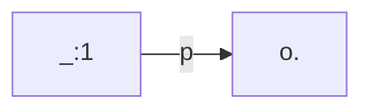
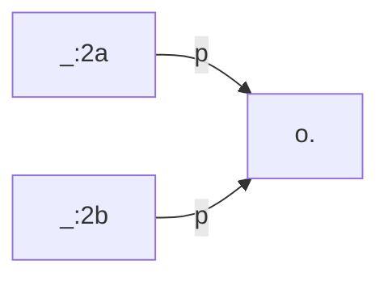

[TOC]

# Graph Comparison

Graph comparison is an approach for validating that the data produced by TriplyETL is identical to one or more manually specified graphs.


## Graph comparison failure

The following full TriplyETL script shows how graph comparison failure is detected in TriplyETL:

```ts
import { compareGraphs, Etl, loadRdf, Source } from '@triplyetl/etl/generic'

export default async function (): Promise<Etl> {
  const etl = new Etl()
  etl.use(
    loadRdf(Source.string(`[]<p><o>.`)),
    compareGraphs(Source.string(`[]<p><o>. []<p><o>.`)),
  )
  return etl
}
```

Function `loadRdf()` loads the following linked data into the Internal Store:



Function `compareGraphs()` compares the contents of the Internal Store to the following linked data:



Notice that these two graphs are not isomorphic: It is possible to map `_:2a` and `_:2b` onto `_:1`, but it is not possible to map `_:1` onto both `_:2a` and `_:2b`. As a result, graph comparison will fail and the ETL will be halted.


## Graph comparison success

The following full TriplyETL script shows how graph comparison success is detected in TriplyETL:

```ts
import { compareGraphs, Etl, loadRdf, Source } from '@triplyetl/etl/generic'

export default async function (): Promise<Etl> {
  const etl = new Etl()
  etl.use(
    loadRdf(Source.string(`<s><p><o>.`)),
    compareGraphs(Source.string(`<s><p><o>. <s><p><o>.`)),
  )
  return etl
}
```

This example is similar to the previous example, but uses names for the subject terms (`<s>`). Because of this, graph comparison now succeeds.


## Graph comparison for validation

The two examples that were given before illustrate how graph comparison works. But they do not show how graph comparison can be used as a validation approach in TriplyETL pipelines. In order to do so, the following steps must be followed:

1. **Identify representative records.** Select a limited number of records from your data sources that together are representative for the full data source systems. This often includes typical records, where all/most expected data items are included, as well as atypical records that are uncommon but valid. There must be reasonable confidence that an ETL that produces the correct results for these selected records, will also produce correct results for all other records.
2. **Create target linked data.** For the representative records identified in step 1, manually create the linked data that the ETL should generate for them. The manually created linked data must be included in the ETL repository, for example by including various TriG files.
3. **Implement the ETL.** The ETL configuration must be implemented in a generic way that works for all records. Any of the supported ETL configuration languages can be used for this: JSON-LD, RATT, RML, SHACL, SPARQL, or XSLT.
4. **Call the graph comparison function.** After the ETL has been performed for a specific record, call the graph comparison function to validate whether the linked data in the Internal Store is isomorphic to the linked data that was manually specified.

### Step 1: Identify representative records

To keep our example simple, we use a data source with three simple JSON records:

```ts
fromJson([
  { id: '1', price: 15 },
  { id: '2', price: 12 },
  { color: 'red', id: '3', price: 16 },
]),
```

We choose records 1 and 3 as the representative ones. Together these two records use all properties that occur in the source data. These records also allow us to test whether the optional color property is handled correctly.

### Step 2: Manually create linked data

For each record selected in Step 1, we create the linked data that must be generated by TriplyETL:

```turtle
prefix sdo: <https://schema.org/>
[] sdo:value 15.
```

and:

```turtle
prefix sdo: <https://schema.org/>
[] sdo:color 'red';
   sdo:value 16.
```

### Step 3: Implement the ETL

We use RATT to implement the assertions:

```ts
addSkolemIri({ key: '_product' }),
triple('_product', sdo.price, 'price'),
when('width', triple('_product', sdo.color, 'color')),
```

### Step 4. Call the graph comparison function

Since comparison graphs must be created by hand, only a small number of records will have a corresponding comparison graph. The graph comparison call must therefore only be performed for some records. We use the switch control structure to determine whether a record is eligible for graph comparison.

### Full script

By completing the 4 steps, we end up with the following full TriplyETL script that applies graph comparison to a limited number of representative records:

```ts
import { _switch, compareGraphs, Etl, fromJson, Source, when } from '@triplyetl/etl/generic'
import { addSkolemIri, triple } from '@triplyetl/etl/ratt'
import { sdo } from '@triplyetl/vocabularies'

export default async function (): Promise<Etl> {
  const etl = new Etl()
  etl.use(
    fromJson([
      { id: '1', price: 15 },
      { id: '2', price: 12 },
      { color: 'red', id: '3', price: 16 },
    ]),
    addSkolemIri({ key: '_product' }),
    triple('_product', sdo.price, 'price'),
    when('width', triple('_product', sdo.color, 'color')),
    _switch('id',
      ['1', compareGraphs(Source.string(`
              prefix sdo: <https://schema.org/>
              [] sdo:value 15.`))],
      ['3', compareGraphs(Source.string(`
              prefix sdo: <https://schema.org/>
              [] sdo:color 'red';
                 sdo:value 16.`))],
    ),
  )
  return etl
}
```

This script succeeds, since the linked data generated by the ETL is isomorphic to the manually specified data.

## Options

- `contentType` specifies the RDF format in which the comparison graphs are serialized. The following values are supported:

  - `"application/json"`
  - `"application/ld+json"`
  - `"application/n-quads"`
  - `"application/n-triples"`
  - `"application/rdf+xml"`
  - `"application/trig"`
  - `"text/html"`
  - `"text/n3";`
  - `"text/turtle"`

- `defaultGraph` specifies the named graph in which the comparison graph must be loaded. This is only useful if the chosen RDF serialization format cannot express named graphs.

- `key` unknown

## See also

Graph comparison makes use of graph isomorphism, which is part of the RDF 1.1 Semantics standard ([external link](https://www.w3.org/TR/rdf11-mt/)).

<!--
## A complete example

We use the following full TriplyETL script to explain the validation feature.  Do not be afraid by the length of the script; we will go through each part step-by-step.

```ts
import { compareGraphs, declarePrefix, Etl, fromJson,
         Source } from '@triplyetl/etl/generic'
import { iri, pairs } from '@triplyetl/etl/ratt'
import { qudt, rdf, unit } from '@triplyetl/vocabularies'

const base = declarePrefix('https://example.com/')
const prefix = {
  graph: declarePrefix(base('id/graph/')),
  skolem: declarePrefix(base('.well-known/genid/')),
}

export default async function (): Promise<Etl> {
  const etl = new Etl({ defaultGraph: prefix.graph('instances') })
  etl.use(
    fromJson([{ id: '1', height: 15 }]),
    pairs(iri(prefix.skolem, 'id'),
      [qudt.unit, unit.CentiM],
      [rdf.value, 'height'],
    ),
    compareGraphs(Source.file('product-1.trig')),
  )
  return etl
}
```

### Step 1: Identify representative records

Select a limited number of records from your data sources that together are representative for the full data source systems.

This often includes typical records where the expected data items are included, as well as atypical records that are 'outliers'.

There must be reasonable confidence that a TriplyETL pipeline that produces the correct results for these selected records is likely to produce correct results for all records.


### Step 2: Manually create linked data

Create an RDF file for every representative record.  The file must contain the linked data that should be generated for that specific record.  It is probably best to use the TriG format for this, but all RDF formats are supported.

For our example, we create a file called `product-1.trig` with the following content:

```turtle
prefix graph: <https://example.com/id/graph/>
prefix qudt: <http://qudt.org/schema/qudt/>
prefix rdf: <http://www.w3.org/1999/02/22-rdf-syntax-ns#>
prefix unit: <http://qudt.org/vocab/unit/>

graph:instances {
  []
    qudt:unit unit:CentiM;
    rdf:value 15.
}
```


### Step 3: Create the ETL

Write the TriplyETL configuration.  In our example we start with the prefix declarations:

```ts
const base = declarePrefix('https://example.com/')
const prefix = {
  graph: declarePrefix(base('id/graph/')),
  skolem: declarePrefix(base('.well-known/genid/')),
}
```

We use the following extractor:

```ts
fromJson([{ id: '1', height: 15 }]),
```

And we use the following assertions:

```ts
pairs(iri(prefix.skolem, 'id'),
  [qudt.unit, unit.CentiM],
  [rdf.value, 'height'],
),
```

### Step 4. Perform graph comparison

In our example, we only generate linked data for one record, so we can trivially compare the results for that one record with the manually created RDF that is stored in the local file:

```ts
compareGraphs(Source.file('product-1.trig')),
```

In more complex pipleines you may need to determine the local file based on the data.  For example, check whether the value for key `id` in the record corresponds to a local file called `product-ID.trig`.

If the generated graph differs in any meaningful way from the RDF stored in the local file, and error is emitted and the TriplyETL pipeline is interrupted.
-->
