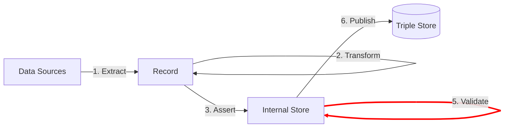

[TOC]

The **Validate** step ensures that the linked data a pipeline produces conforms to the requirements specified in the data model.

Triply believes that *every* ETL should include the Validate step to ensure that only valid data is published in knowlede graphs.

## Two approaches

TriplyETL supports two approaches for validating linked data:

- 5A. [**Graph Comparison**](/triply-etl/validate/graph-comparison) uses one or more manually created 'gold records'.  Graph comparison ensures that these records are transformed in the intended way by the ETL pipeline.
- 5B. [**SHACL Validation**](/triply-etl/validate/shacl) uses a generic data model.  SHACL Validation ensures that each individual record is processed in accordance with the generic data model.

Notice that it is possible to combine these two approaches in the same ETL pipeline: you can use graph comparison to test for specific conformities, and use SHACL to test for generic conformities.
