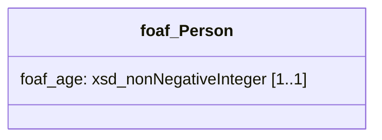

TriplyETL is able to automatically validate the linked data that is created in your pipeline against a specified SHACL information model.  In fact, Triply believes that *every* ETL should include such a validation step to ensure that only valid data is published in knowlede graphs.

## A complete example

We will use the following full TriplyETL script to explain the validation feature.  Do not be afraid by the length of this script; we will go through it step-by-step.

```ts
import { a, fromJson, iri, pairs, Ratt as Etl, toRdf, validateShacl } from '@triplydb/ratt'
import { foaf } from '@triplydb/ratt/lib/vocab'

const prefix = {
  id: Etl.prefixer('https://triplydb.com/Triply/example/id/'),
}

export default async function (): Promise<Etl> {
  const etl = new Etl()
  etl.use(
    fromJson([{ age: 'twelve', id: '1' }]),
    pairs(iri(prefix.id, 'id'),
      [a, foaf.Person],
      [foaf.age, 'age'],
    ),
    validateShacl(Etl.Source.string(`
      prefix foaf: <http://xmlns.com/foaf/0.1/>
      prefix rdf:  <http://www.w3.org/1999/02/22-rdf-syntax-ns#>
      prefix sh:   <http://www.w3.org/ns/shacl#>
      prefix shp:  <https://triplydb.com/Triply/example/model/shp/>
      prefix xsd:  <http://www.w3.org/2001/XMLSchema#>

      shp:Person
        a sh:NodeShape;
        sh:closed true;
        sh:ignoredProperties ( rdf:type );
        sh:property shp:Person_age;
        sh:targetClass foaf:Person.

      shp:Person_age
        a sh:PropertyShape;
        sh:datatype xsd:nonNegativeInteger;
        sh:maxCount 1;
        sh:minCount 1;
        sh:path foaf:age.`
    )),
  )
  return etl
}
```

## Step 1: Source data

In our example we are using the following source data that records the age of a person:

```json
[
  {
    "age": "twelve",
    "id":  "id"
  },
  ...
]
```

In our example the data source is in-line JSON:

```ts
fromJson([{ age: 'twelve', id: '1' }]),
```

## Step 2: Target data (informal)

Based on the source data in Step 1, we want to publish the following linked data:

```turtle
id:123
  a foaf:Person;
  foaf:age 'twelve'.
```

## Step 3: Information Model (informal)

Our intended target data in Step 2 looks ok at first glance.  But we want to specify the requirements for our data in generic terms.  Such a specification is called an *Information Model*.

> An *Information Model* is a generic specification of the requirements for our data.

It is common to illustrate an Information Model with a picture:



This Information Model specifies that instances of class `foaf:Person` must have exactly one value for the `foaf:age` property.  Values for this property must have datatype `xsd:nonNegativeInteger`.

## Step 4: Transformation

We now have source data (Step 1), and a fair intuition about our target data (Step 2) and Information Model (Step 3).  We can automate the mapping from source to target data with an [Assertion](assertions):

```ts
etl.use(
  fromJson([{ age: 'twelve', id: '1' }]),
  pairs(iri(prefix.id, 'id'),
    [a, foaf.Person],
    [foaf.age, 'age'],
  ),
)
```

That looks about right: we create instances of class `foaf:Person` and triples that assert a `foaf:age` property for each such person.

However, a linked data expert may notice that the value `'twelve'` from the source data will not be transformed into a non-negative integer (`xsd:nonNegativeInteger`).  Indeed, our `'age'` assertion will create a literal with datatype `xsd:string`.

How can we automate such checks?  The above example is relatively simple, so a linked data expert may notice the error and fix it.  But what happens when the ETL automation is hundreds of lines long and is spread across multiple files?  What happens when there is a large number of classes, and each class has a large number of properties?  What if some of the properties are required, while others are optional?  Obviously, any real-world ETL will quickly become too complex to validate by hand.  For this reason, TriplyETL provides automated validation.

Triply considers having an automated validation step best practice for any ETL.  This is the case even for small and simple ETLs, since they tend to grow into complex ones some day.

## Step 5: Information Model (formal)

The linked data ecosystem has the SHACL standard for encoding Information Models.  SHACL allows us to formally express the pictorial model from Step 3.  As is always the case in linked data, the model is itself expressed in linked data:

```turtle
prefix foaf: <http://xmlns.com/foaf/0.1/>
prefix rdf:  <http://www.w3.org/1999/02/22-rdf-syntax-ns#>
prefix sh:   <http://www.w3.org/ns/shacl#>
prefix shp:  <https://triplydb.com/Triply/example/model/shp/>
prefix xsd:  <http://www.w3.org/2001/XMLSchema#>

shp:Person
  a sh:NodeShape;
  sh:closed true;
  sh:ignoredProperties ( rdf:type );
  sh:property shp:Person_age;
  sh:targetClass foaf:Person.

shp:Person_age
  a sh:PropertyShape;
  sh:datatype xsd:nonNegativeInteger;
  sh:maxCount 1;
  sh:minCount 1;
  sh:path foaf:age.
```

Notice the following details:
- We enforce a Closed World Semantics (CWA) in our Information Models with the `sh:closed` property.  If a property is not explicitly specified in our Information Model, it is not allowed to be used with instance data.
- We create IRIs in the dedicated `shp:` namespace for nodes in the Information Model.
- Elements in our Information Model are always in a one-to-one correspondence with elements in our Knowledge Model:
  - Node shape `shp:Person` relates to class `foaf:Person`.
  - Property shape `shp:Person_age` relates to property `foaf:age`.

## Step 6: Use the `validateShacl()` function

TriplyETL has a dedicated function that can be used to automatically enforce Information Models such as the one given in Step 5.

Since the Information Model is relatively small, it can be specified in-line using a [String Source](source-connectors#string-source):

```ts
validateShacl(Etl.Source.string(`
  prefix foaf: <http://xmlns.com/foaf/0.1/>
  prefix rdf:  <http://www.w3.org/1999/02/22-rdf-syntax-ns#>
  prefix sh:   <http://www.w3.org/ns/shacl#>
  prefix shp:  <https://triplydb.com/Triply/example/model/shp/>
  prefix xsd:  <http://www.w3.org/2001/XMLSchema#>

  shp:Person
    a sh:NodeShape;
    sh:closed true;
    sh:ignoredProperties ( rdf:type );
    sh:property shp:Person_age;
    sh:targetClass foaf:Person.

  shp:Person_age
    a sh:PropertyShape;
    sh:datatype xsd:nonNegativeInteger;
    sh:maxCount 1;
    sh:minCount 1;
    sh:path foaf:age.`
)),
```

When we run the above function at the end of our ETL script, we will receive the following error:

```
ERROR (Record #1) SHACL Violation on node id:1 for path
                  foaf:age, source shape shp:Person_age:
                    1. Value does not have datatype xsd:nonNegativeInteger
```

Oops!  The value for the `foaf:age` property has the incorrect datatype.

The requirement that was violated is `shp:Person_age`, so if we want to learn more we can look up this specific node in our Information Model.

If we want to take a look at a concrete example in our instance data, we can also look at node `id:1` in our instance data.

All this information is expressed in a concise and easy to interpret error message.

## Step 7: Fix the validation error

Now that we receive the automated validation error in Step 6, we can look for ways to fix our ETL.  Let us take one more look at our current Assertion:

```ts
etl.run(
  fromJson([{ age: 'twelve', id: '1' }]),
  pairs(iri(prefix.id, 'id'),
    [a, foaf.Person],
    [foaf.age, 'age'],
  ),
)
```

We could change the term assertion for the value of `foaf:age` to explicitly make use of the `xsd:nonNegativeInteger` datatype:

```ts
literal('age', xsd.nonNegativeInteger)
```

But that would not work in TriplyETL: the Triply software (luckily!) does not allow us to create incorrect linked data.  Since the following literal would be incorrect, TriplyETL does not even allow us to assert it:

```turtle
'twelve'^^xsd:nonNegativeInteger
```

Well, it is nice that TriplyETL does not allow us to create incorrect data.  But how can we fix the issue at hand?  How can we create linked data that follows our Information Model.

As in any ETL error, there are 3 possible solutions:

1. Change the data in the source system.
2. Change the ETL transformations and/or assertions.
3. Change the Information Model.

### Change the source data

In this case, changing the data in the source system (Option 1) seem the most logical.  After all, there may be multiple ways in which the age of a person can be described using one or more English words.  Expressing ages numerically is a good idea in general, since it will make the source data easier to interpret.

### Change the transformation and/or assertions

Alternatively, it is possible to transform English words that denote numbers to their corresponding numeric values (Option 2).  Since people can get up to one hundred years old, or even older, writing the transformation for this feels a bit cumbersome:

```ts
translateAll({
  content: 'age',
  table: {
    'one': 1,
    ...
    'twelve': 12,
    ...,
    'one hundred': 100,
    ...,
  },
  key: '_age',
}),
pairs(iri(prefix.id, 'id'),
  [a, foaf.Person],
  [foaf.age, literal('_age', xsd.nonNegativeInteger)],
),
```

The same number may be expressed in multiple ways in natural language, so the mapping will never be truly complete an reliable.  This seems to be the worst of the three options in this case.

### Change the Information Model

Finally, we could loosen the Information Model (Option 3).  For example, we could change the datatype to check for strings:

```turtle
shp:Person_age sh:datatype xsd:string.
```

But that would invalidate ETLs that generative numeric ages for persons, even though that seems perfectly fine, if not better than strings.  Also, this would allow literals like `'abc'` to pass validation as a legal value for `foaf:age`.

Alternatively, we can remove the `sh:datatype` requirement from our Information Model entirely.  That would allow either string-based ages or numeric ages to be specified.  But now even weirder values for age, e.g. `'2023-01-01'^^xsd:date`, would be considered valid values for age.

## End notes

Notice that TriplyETL does not tell you which of the 3 options you should follow in order to fix issues in your ETL.  After all, creating an ETL requires domain knowledge based on which you weight the pros and const of different options.  However, TriplyETL does give you the tools to discover issues that prompt you to come up with such solution.  And once you have decided on a specific solution, TriplyETL provides you with the tools to implement it.
