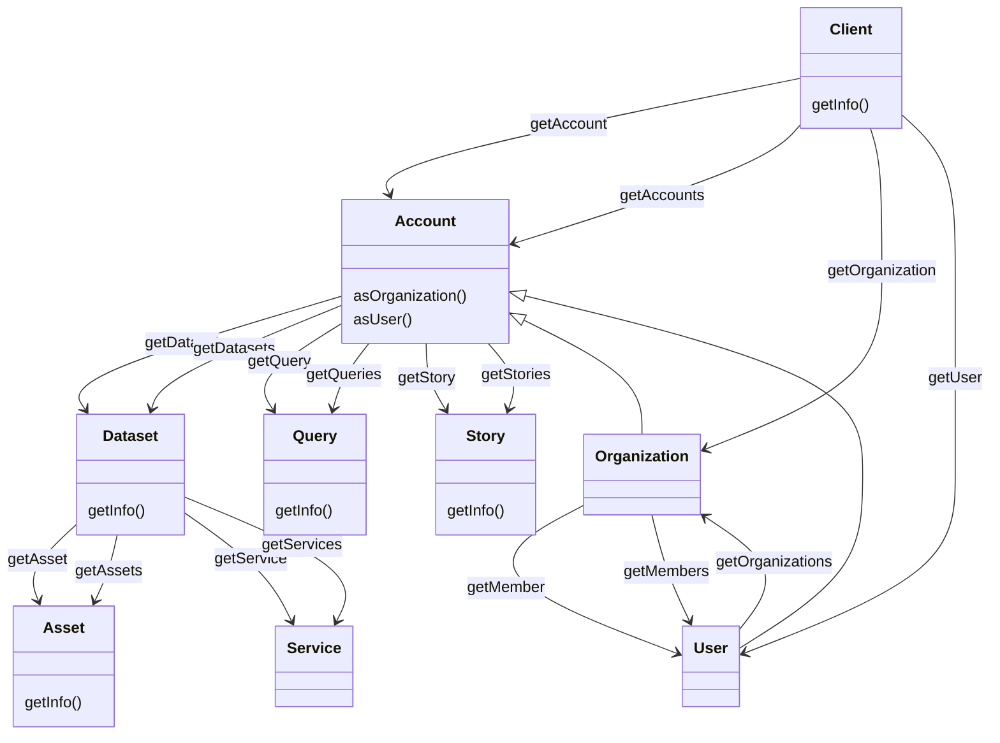

**TriplyDB.js** is the official programming library for interacting with [TriplyDB](https://triply.cc/docs/triply-db-getting-started). TriplyDB.js allows you to automate operations that would otherwise be performed in the TriplyDB GUI.

TriplyDB.js is implemented in [TypeScript](https://www.typescriptlang.org). TypeScript is a type-safe language that transpiles to [JavaScript](https://en.wikipedia.org/wiki/JavaScript). This allows you to use TriplyDB.js in web browsers as well as on servers (using [Node.js](https://nodejs.org)). The source code is available on [GitHub](https://github.com/TriplyDB/TriplyDB-JS).

Please contact [support@triply.cc](mailto:support@triply.cc) for questions and suggestions.

## Getting started

This section gets you up and running with TriplyDB.js. These scripts will use TriplyDB.js to interact with one or more TriplyDB instances. Some of the documented steps are generic for setting up a modern TypeScript project, while others are specific for interacting with TriplyDB instances. The examples in the documentation expect that you've set up your project according to the guidelines specified below.

### Setting up a read-only project

In this section we set up a read-only project. This allows us to focus on setting up the TypeScript/JavaScript aspects of the project correctly, while using public data from the TriplyDB instance located at <https://triplydb.com>. With a read-only project you can only retrieve information from TriplyDB and not modify any information on triplyDB. This is useful for projects where you do not want to modify any data and only retrieve information, for example use a saved query API.

1. Install [Node.js](https://nodejs.org) and [Yarn](https://yarnpkg.com) on your system.  See [common steps to install Node.js and Yarn](common-steps-to-install) for more information.


2. Create a directory for your project:

   ```sh
   mkdir my_project
   cd my_project
   ```

3. Inside your newly created directory, initialize a standard [Yarn project](https://classic.yarnpkg.com/en/docs/creating-a-project/):

   ```sh
   yarn init -y
   ```

   This creates a `package.json` file. You can optionally edit this file to enter metadata for your project.

4. Add TypeScript and TriplyDB.js as dependencies to your project:

   ```sh
   yarn add typescript @triply/triplydb
   ```

5. Initialize a default TypeScript project:

   ```sh
   ./node_modules/.bin/tsc --init
   ```

   This creates a [tsconfig.json](https://www.typescriptlang.org/docs/handbook/tsconfig-json.html) file. You can optionally edit this file to tweak how TypeScript code is transpiled into JavaScript code.

6. Create a file called `main.ts` in a text editor. Add the following content in this file:

   ```ts
   import Client from "@triply/triplydb";
   const client = Client.get({ url: "https://api.triplydb.com" });
   async function run() {
     console.log((await client.getInfo()).branding.name);
   }
   run().catch((e) => {
     console.error(e);
     process.exit(1);
   });
   ```

   Notice the following details:

   - Line 1 (`import`) loads the TriplyDB.js library.
   - Line 2 creates a handle (`client`) to the TriplyDB instance <https://triplydb.com>. Every TriplyDB instance has a specific API URL. In this case the API URL is <https://api.triplydb.com>.
   - Line 3 defines the main function (`run()`).
   - Line 4 writes the name of the TriplyDB instance that you connected to in line 2.
   - Lines 6-9 runs the main function (`run()`) and performs basic error handling.

7. Transpile the TypeScript file (`main.ts`) into a JavaScript file (`main.js`):

   ```sh
   ./node_modules/.bin/tsc
   ```

8. Run the JavaScript file (`main.js`):

   ```sh
   node main.js
   ```

   This should print the name of the TriplyDB instance at <https://triplydb.com>.

You can extend this script with TriplyDB.js functions that read public (meta)data. There is a lot of public (meta)data out there in TriplyDB instances on the Internet. The TriplyDB instance at <https://triplydb.com> alone already contains hundreds of open datasets.

It is also possible to read non-public data to which you have access. This is done by using an API Token. The next section explains how such tokens are created and configured.

### Setting up a read/write project

In the [previous section](#setting-up-a-read-only-project) we set up a read-only project that uses TriplyDB.js and accesses public data at <https://triplydb.com>.

In this section we extend the project to configure read/write permissions that are tied to your user account in a TriplyDB instance. This allows you to read non-public data to which you have access, and it allows you to write data in datasets and organizations to which you have access.

1. Following the steps on [this page](api-token) to create and configure a TriplyDB API Token with write permissions.

   Write permissions are needed in order to publish data from a RATT pipeline.

   After following these steps an environment variable called `TRIPLYDB_TOKEN` will be available.

2. Change the contents of `main.ts` to the following:

   ```ts
   import Client from "@triply/triplydb";
   const client = Client.get({ token: process.env.TRIPLYDB_TOKEN });
   async function run() {
     console.log((await (await client.getUser()).getInfo()).accountName);
   }
   run().catch((e) => {
     console.error(e);
     process.exit(1);
   });
   ```

   Notice the following changes:

   - Line 2 reads the API token from the environment.
   - Line 4 prints the name of the user who created the API token that was configured in line 2.
   - Other lines are identical to the [read-only script](#setting-up-a-read-only-project).

3. Transpile and run:

   ```sh
   ./node_modules/.bin/tsc
   node main.js
   ```

   This should print the name of the user account for which the API token was created.

You can extend this script with TriplyDB.js functions that read/write (meta)data accessible through the API token.

### Next steps for your project

The previous two sections have resulted in a minimal TriplyDB.js script that is able to interact with a TriplyDB instance.

You can extend this script with other functions that are supported by TriplyDB.js, and by TypeScript that you add for your custom application. See [the next section](#reference) for the full reference of classes and methods supported by TriplyDB.js.

#### Editor support

See [this page](editor) for information about how to configure a text editor that supports editing TriplyDB.js scripts.

#### Improved error handling

In the previous sections we made use of minimal error handling (see below). This section explains how error handling can be extended and improved.

```ts
run().catch((e) => {
  console.error(e);
  process.exit(1);
});
```

##### Better error lines

By default, error messages emitted by Node.js refer to code lines that appear in the transpiled JavaScript files. Since we write our code in TypeScript, it is better to see the corresponding code lines for the TypeScript files. This is achieved by adding the following line at the beginning of the main script (`main.ts` in the above example):

```ts
require("source-map-support/register");
```

##### Better error messages

The following code can be added to the end of your application file (`main.ts` in the above examples) to use more advanced error handling:

```ts
process.on("uncaughtException", function (err) {
  console.error("Uncaught exception", err);
  process.exit(1);
});
process.on("unhandledRejection", (reason, p) => {
  console.error("Unhandled Rejection at: Promise", p, "reason:", reason);
  process.exit(1);
});
```

## Reference

This section documents all classes and methods that are available in TriplyDB.js. Methods are grouped together for the class to which they apply.

Every method in this reference section comes with at least one code example. These code examples can be run by inserting them into the following snippet. See the [Getting started](#getting-started) section on how to get this script up and running on your system.

```ts
require("source-map-support/register");
import Client from "@triply/triplydb";
const client = Client.get({ token: process.env.TRIPLYDB_TOKEN });
async function run() {
  // This is where the code examples in this reference section should be placed.
}
run().catch((e) => {
  console.error(e);
  process.exit(1);
});
process.on("uncaughtException", function (err) {
  console.error("Uncaught exception", err);
  process.exit(1);
});
process.on("unhandledRejection", (reason, p) => {
  console.error("Unhandled Rejection at: Promise", p, "reason:", reason);
  process.exit(1);
});
```

The following sections document the various TriplyDB.js classes. Each class comes with its own methods. Classes are related through methods that connect them. For example, calling the `getAccount` method on a `Client` object returns an `Account` object.



### Client

Instances of the `Client` class are specific client connections that are set-up with a TriplyDB instance.

Client connections can be created with and without setting an API token. When no API token is set, the `Client` object can be used to perform read-only operations over public data. When an API token is set, the `Client` object can be used to perform read/write operations over public/private data the token grants access to.

The following snippet creates a `Client` object with read-only access to the TriplyDB instance at <https://triplydb.com>:

```ts
import Client from "@triply/triplydb";
const client = Client.get({ url: "https://api.triplydb.com" });
```

Notice that the URL must point to the API of the TriplyDB instance that the `Client` object connects to. The API URL is typically created by adding the `api.` subdomain in front of the instance's host name.

For example, if [1] is the web-based GUI for the TriplyDB instance, then [2] is the corresponding API for that instance.

```
[1] https://triplydb.com
[2] https://api.triplydb.com
```

When an API token is specified, the operations that can be performed through the `Client` object are determined by:

1. the access level of the token, and
2. the credentials of the user account for which the API token is created.

The allowed operations many include:

1. Read operations over internal or private data
2. Write operations over public, internal or private data
3. Management operations such as creating organizations, adding/removing members to/from organizations.

The following creates a `Client` object with an API token that is made available through an environment variable (see section [Setting up a secure read/write project](#setting-up-a-secure-read-write-project)):

```ts
import Client from "@triply/triplydb";
const client = Client.get({ token: process.env.TRIPLYDB_TOKEN });
```

It is typical for one TriplyDB.js script to have exactly one `Client` object.

#### Client.getAccount(name?: string)

Returns the TriplyDB account with the given `name`.

If `name` is omitted, the TriplyDB account that is associated with the current API token is returned.

##### Examples

- The following snippet returns the account called `"Triply"`.

  ```ts
  const account = await client.getAccount("Triply");
  ```

- The following snippet returns the current account. This is the account for which the currently configured API token was created.

  ```ts
  const account = await client.getAccount();
  ```

##### See also

This method returns an account object. See section [`Account`](#account) for an overview of the methods that can be called on such objects.

Class [`Account`](#account) has two specializations: class [`Organization`](#organization) and class [`User`](#user). In line with these class specializations, there are also two method specializations:

- Method [`Client.getOrganization(name: string)`](#clientgetorganizationname-string) returns an organization object.

- Method [`Client.getUser(name?: string)`](#clientgetusername-string) returns a user object.

#### Client.getAccounts()

Returns an [async iterator](#async-iterator) over all accounts in the TriplyDB instance.

##### Example

- The following snippet prints the display names for all accounts in the TriplyDB instance at <https://triplydb.com>:

  ```ts
  const client = Client.get({ url: "https://api.triplydb.com" });
  for await (const account of client.getAccounts()) {
    console.log((await account.getInfo()).name);
  }
  ```

- The following snippet returns an array that contains all account objects:

  ```ts
  console.log(await client.getAccounts().toArray());
  ```

See section [`Account`](#account) for an overview of the methods that
can be used with account objects.

#### Client.getInfo()

Returns information about the TriplyDB instance that the [`Client`](#client) is connected to.

Information is returned in a dictionary object. Individual keys can be accessed for specific information values.

##### Examples

- The following snippet prints the contact email for the TriplyDB instance to which `client` is currently connected.

```ts
console.log((await client.getInfo()).contactEmail);
```

- The following snippet returns an object describing the used TriplyDB instance:

```ts
console.log(await client.getInfo());
```

#### Client.getOrganization(name: string)

Returns the TriplyDB organization with the given `name`.

This method is similar to [`Client.getAccount(name?: string)`](#clientgetaccountname-string), but differs in the following ways:

- This method only works for accounts that represent TriplyDB organizations.

- This method returns an organization object. Class [`Organization`](#organization) is a specialization of class [`Account`](#account).

##### Examples

The following snippet returns the organization called `"Triply"`:

```ts
const organization = await client.getOrganization("Triply");
```

See section [`Organization`](#organization) for an overview of the
methods that can be used with organization objects.

##### Alternatives

This method is a shorthand for calling the following two methods:

- Call method [`Client.getAccount(name?: string)`](#clientgetaccountname-string) to retrieve an account object.

- Then call method [`Account.asOrganization()`](#accountasorganization) to cast the account object into an organization object.

The following snippet returns the same result as the previous example, but uses two methods instead of one:

```ts
const account = await client.getAccount("Triply");
const organization = account.asOrganization();
```

##### See also

This method returns an organization object. See section [`Organization`](#organization) for an overview of the methods that can be called on such objects.

#### Client.getUser(name?: string)

Returns the TriplyDB user with the given `name`.

If `name` is omitted, the TriplyDB user that is associated with the current API token is returned. This only works if an API token is configured for the current [`Client`](#client) object.

##### Examples

The following snippet returns the user with name `"somebody"`:

```ts
const user = await client.getUser("somebody");
```

The following snippet returns the user for which the API token was created. This only works if an API token was configured when creating the [`Client`](#client) object `client`:

```ts
const me = await client.getUser();
```

##### Alternatives

This method is a shorthand for the following two methods:

1. Call method [`Client.getAccount()`](#clientgetaccountname-string) to retrieve an account object.

2. Then call method [`Account.asUser()`](#accountasuser) to cast the account object into a user object.

The following snippet returns the same result as the previous examples, but uses two methods instead of one:

```ts
const account = await client.getAccount("somebody");
const user = account.asUser();
```

##### See also

This method returns a user object. See section [`User`](#user) for an overview of the methods that can be called on such objects.

#### Client.isCompatibleWith(minimumVersion: string)

Succeeds if and only if the currently connected to TriplyDB instance has a version that is identical to or higher than the given minimum version.

##### Arguments

- Argument `minimumVersion` must be a string that uses Semantic Versioning. For example `"1.2.3"`.

##### See also

To inspect the current version of the connected-to TriplyDB instance, use [`Client.getInfo()`](#clientgetinfo).

### Account

Instances of the `Account` class denote TriplyDB accounts. Accounts can be either organizations ([`Organization`](#organization)) or users ([`User`](#user)).

Account objects are obtained by calling the following method:

- [`Client.getAccount(name?: string)`](#clientgetaccountname-string)

#### Account.addDataset(name: string, metadata?: object)

Adds a new TriplyDB dataset with the given `name` to the current account.

The optional `metadata` argument is used to specify the metadata for the dataset.

##### Access restrictions

Creating a new dataset only succeeds if an API token is configured that provides write access to the current account.

The default access level for a newly created dataset is `private`. If you want to publish a dataset with a different access level, you must specify the `accessLevel` key in the `metadata` argument.

##### Arguments

The `name` argument specifies the URL-friendly name of the new dataset. The name must only contain alphanumeric characters and hyphens (`[A-Za-z0-9\-]`).

The full URL of the newly created dataset has the following structure:

```
https://{host}/{account}/{dataset}
```

The `metadata` argument optionally specifies the access level and other important metadata:

<dl>
  <dt><code>accessLevel</code></dt>
  <dd>
    <p>The access level of the dataset. The following values are supported:</p>
    <dl>
      <dt><code>"private"</code> (default)</dt>
      <dd>The dataset can only be accessed by organization members.</dd>
      <dt><code>"internal"</code> </dt>
      <dd>The dataset can only be accessed by users that are logged into the TriplyDB instance.</dd>
      <dt><code>"public"</code></dt>
      <dd>The dataset can be accessed by everybody.</dd>
    </dl>
    <p>When no access level is specified, the most restrictive access level (<code>private</code>) is used.</p>
  </dd>

  <dt><code>description</code></dt>
  <dd>The human-readable description of the dataset.  This description can make use of Markdown (see the <a href='/docs/triply-db-getting-started/#markdown-support'>Markdown reference</a>) for details.</dd>

  <dt><code>displayName</code></dt>
  <dd>The human-readable name of the dataset.  This name may contain spaces and other characters that are not allowed in the URL-friendly name.</dd>

  <dt><code>license</code></dt>
  <dd>
    <p>The license of the dataset.  The following license strings are currently supported:</p>
    <ul>
      <li><code>"CC-BY-SA"</code></li>
      <li><code>"CC0 1.0"</code></li>
      <li><code>"GFDL"</code></li>
      <li><code>"ODC-By"</code></li>
      <li><code>"ODC-ODbL"</code></li>
      <li><code>"PDDL"</code></li>
      <li><code>"None"</code> (default)</li>
    </ul>
  </dd>

  <dt><code>prefixes</code></dt>
  <dd>The IRI prefix declarations that are configured for the dataset.  This is specified as a dictionary object whose keys are aliases and whose values are IRI prefixes.</dd>
</dl>

##### Examples

The following snippet creates a new dataset called `"iris"` under the account called `"Triply"`:

- The dataset has private access, because the access level is not specified explicitly.
- The dataset has a description.
- The dataset has a display name.
- The dataset has the PDDL license.

```ts
const account = await client.getAccount("Triply");
const dataset = await account.addDataset("iris", {
  description:
    "A multivariate dataset that quantifies morphologic variation of Iris flowers.",
  displayName: "Iris",
  license: "PDDL",
  name: "iris",
  prefixes: {
    def: "https://triplydb.com/Triply/iris/def/",
    id: "https://triplydb.com/Triply/iris/id/",
  },
});
```

##### See also

This method returns a dataset object. See the [Dataset](#dataset) section for an overview of the methods that can be called on such objects.

#### Account.addQuery(name: string, metadata: object)

Adds a new SPARQL query to the account.

##### Arguments

**Required:**

<dl>
  <dt><code>name: string</code> </dt>
  <dd>The URL-friendly name of the new query.  The name must only contain alphanumeric characters and hyphens (<code>[A-Za-z0-9\-]</code>).</dd>

  <dt><code>queryString: string</code> </dt>
  <dd>The SPARQL query string (e.g., <code>"select * { ?s ?p ?o }"</code>).</dd>

  <dt><code>dataset: Dataset</code> </dt>
  <dd>An instance of class <a href='#dataset'><code>Dataset</code></a> that the current API token gives access to.</dd>
or
  <dt><code>service: Service</code> </dt>
  <dd>An instance of class <a href='#service'><code>Service</code></a> that the current API token gives access to and that you want to be associated with this query. The Service given will be used as a preferred service for this query.</code></dd>
</dl>

**Optional:**

The `metadata` argument specifies the required Dataset or Service and access level. Other important metadata can be set optionally:

<dl>
  <dt><code>accessLevel</code> </dt>
  <dd> The access level of the query. If none is set it defaults to <code>"private"</code>. The following values are supported:
    <dl>
      <dt><code>"private"</code></dt>
      <dd>The query can only be accessed by the <a href='#account'><code>Account</code></a> object for which it is created.</dd>
      <dt><code>"internal"</code></dt>
      <dd>The query can only be accessed by people who are logged into the TriplyDB instance (denoted by the value of environment variable <code>TRIPLYDB_URL</code>).</dd>
      <dt><code>"public"</code></dt>
      <dd>The query can be accessed by everybody.</dd>
    </dl>
  </dd>

  <dt><code>description: string</code> </dt>
  <dd>A human-readable description of the query.</dd>

  <dt><code>displayName: string</code></dt>
  <dd>The human-readable name of the query.  This name may include spaces and other characters that are not allowed in the URL-friendly <code>name</code>.</dd>

  <dt><code>output: string</code></dt>
  <dd>The visualization plugin that is used to display the result set of the query. If none is set it defaults to <code>"table"</code>.
    <dl>
      <dt><code>"boolean"</code></dt>
      <dd>The [boolean](https://triply.cc/docs/yasgui#table) view is a special view for ask queries. The value is either "true" or "false", and is visualized as  <code>`X`</code>(False) or <code>`V`</code>(True).</dd>
      <dt><code>"gallery"</code></dt>
      <dd>The [gallery](https://triply.cc/docs/yasgui#gallery) view allows SPARQL results to be displayed in an HTML gallery.</dd>
      <dt><code>"gchart"</code></dt>
      <dd>The [gchart](https://triply.cc/docs/yasgui#charts) renders geographical, temporal and numerical data in interactive charts such as bar-, line- and pie charts.</dd>
      <dt><code>"geo"</code></dt>
      <dd>The [geo](https://triply.cc/docs/yasgui#geo) allows SPARQL results that contain GeoSPARQL semantics to be automatically interpreted and displayed on a 2D map.</dd>
      <dt><code>"geoEvents"</code></dt>
      <dd>The [geoEvents](https://triply.cc/docs/yasgui#geoEvents) plugin renders geographical events as a story map.</dd>
      <dt><code>"geo3d"</code></dt>
      <dd>The [geo3d](https://triply.cc/docs/yasgui#geo3d) allows SPARQL results that contain GeoSPARQL semantics to be automatically interpreted and displayed on a 3D globe.</dd>
      <dt><code>"markup"</code></dt>
      <dd>The [markup](https://triply.cc/docs/yasgui#markup) can be used to render a variety of markup languages. This requires the use of the `?markup` variable to identify which variable to render.</dd>
      <dt><code>"network"</code></dt>
      <dd>The [network](https://triply.cc/docs/yasgui#network) renders SPARQL Construct results in a graph representation. The maximum amount of results that can be visualized is 1.000 due to performance.</dd>
      <dt><code>"pivot"</code></dt>
      <dd>The [pivot](https://triply.cc/docs/yasgui#pivot) view renders SPARQL results in an interactive pivot table where you are able to aggregate the results by dragging your binding variables to columns or rows.</dd>
      <dt><code>"response"</code></dt>
      <dd>The [response](https://triply.cc/docs/yasgui#response) view shows the body of the response and offers a easy way to download the result as a file.</dd>
      <dt><code>"table"</code></dt>
      <dd>The [table](https://triply.cc/docs/yasgui#table) view allows SPARQL results to be displayed in a table. Each
      column in the table corresponds to a variable that belongs to the
      outer projection.</dd>
      <dt><code>"timeline"</code></dt>
      <dd>The [timeline](https://triply.cc/docs/yasgui#timeline) timeline renders the SPARQL results on a Timeline. </dd>
    </dl>
  </dd>

  <dt><code>variables: Variable[]</code></dt>
  <dd>
    A list of objects with the following keys:
    <dl>
      <dt>IRI variable</dt>
      <dd>An object of the form <code>Variable</code> (see below)</dd>
  </dd>
</dl>

Instances of `Variable` are objects that can have the following keys:

**Required:**

<dl>
  <dt><code>name: string</code> </dt>
  <dd>A SPARQL variable name.  The variable name must appear in the query string.  The question mark (<code>?</code>) or dollar sign (<code>$</code>) is not included.</dd>

  <dt><code>termType: "Literal"|"NamedNode"</code> </dt>
  <dd>The kind of variable.  This must be either <code>"Literal"</code> for literals or <code>"NamedNode"</code> for IRIs.</dd>
</dl>

**Optional:**

<dl>
  <dt><code>allowedValues: string[]</code></dt>
  <dd>The list of string values that is allowed for this variable.</dd>

  <dt><code>datatype: string</code> (if <code>termType="Literal"</code>)</dt>
  <dd>The datatype IRI for the literal variable.</dd>

  <dt><code>language: string</code> (if <code>termType="Literal"</code>)</dt>
  <dd>The language tag for the literal variable.  Setting this implies that the dataset IRI is <code>rdf:langString</code>.</dt>

  <dt><code>defaultValue: string</code></dt>
  <dd>The default string value for the </dd>

  <dt><code>required: boolean</code></dt>
  <dd>Whether a query request must include an explicit value for this variable.  The default value is <code>false</code>.</dd>
</dl>

##### Example

The following snippet creates a query with the given query string:

```ts
const client = Client.get({ token: process.env.TRIPLYDB_TOKEN });
const user = await client.getUser();
const myDataset = await user.getDataset("my-dataset");
const query = await user.addQuery("my-query", {
  dataset: myDataset,
  queryString: `select (count(*) as ?n) {
                ?s ?p ?o.
                }`,
  output: "response",
});
```

#### Account.addStory(name: string, metadata?: object)

Adds a new data story.

##### Required

<dl>
  <dt><code>name: string</code></dt>
  <dd>The URL-friendly name of the data story.  The name must only contain alphanumeric characters and hyphens (<code>[A-Za-z0-9\-]</code>).</dd>
</dl>

##### Optional

<dl>
  <dt><code>accessLevel</code> </dt>
  <dd>
    <p>The access level of the dataset. If none is given the default of <code>"private"</code> is used. The following values are supported:</p>
    <dl>
      <dt><code>"private"</code></dt>
      <dd>The dataset can only be accessed by the <a href='#account'><code>Account</code></a> object for which it is created.</dd>
      <dt><code>"internal"</code></dt>
      <dd>The dataset can only be accessed by people who are logged into the TriplyDB instance (denoted by the value of environment variable
      <code>TRIPLYDB_URL</code>).
      <dt><code>"public"</code></dt>
      <dd>The dataset can be accessed by everybody.</dd>
    </dl>
  </dd>
  <dt><code>content: StoryElementUpdate[]</code> </dt>
  <dd>A list of story elements. The building blocks of the Story.</dd>
  <dt><code>displayName: string</code> </dt>
  <dd>The human-readable name of the data story.  This name may include spaces and other characters that are not allowed in the URL-friendly name.</dd>
</dl>

A story element is an object with the following keys:

<dl>
  <dt>caption: string</dt>
  <dd>The caption is an explanatory text about a specific query.</dd>

  <dt><code>id: string</code></dt>
  <dd>Each Story element gets an Id when it is created. When you want to update a Story element you will need this Id. The Id is only required when updating an element and not needed when adding an object.</dd>

  <dt>paragraph: string</dt>
  <dd>The Markdown content of a story paragraph. Only allowed when the type is set to <code>"paragraph"</code> </dd>

  <dt><code>query: Query</code></dt>
  <dd>An instance of class <a href='#query'><code>Query</code></a>.</dd>

  <dt>queryVersion: number</code>
  <dd>The version that is used of the specified query.</dd>

  <dt><code>type</code></dt>
  <dd>Either <code>"paragraph"</code> or <code>"query"</code>.</dd>
</dl>

##### Examples

Example 1 - creates a new story that has access level `"private"`:

```ts
const client = Client.get({ token: process.env.TRIPLYDB_TOKEN });
const user = await client.getUser();
const newStory = await user.addStory("name-of-story");
```

Example 2 - creates a new story that has access level `"public"`:

```ts
const client = Client.get({ token: process.env.TRIPLYDB_TOKEN });
const user = await client.getUser();
const newStory = await user.addStory("name-of-story", {
  accessLevel: "public",
});
```

#### Account.asOrganization()

Casts the TriplyDB account object to its corresponding organization object.

Class [`Organization`](#organization) is a specialization of class [`Account`](#account).

Calling this method on an `Organization` object does nothing.

##### Examples

The following snippet retrieves the account named `"Triply"` and casts it to an organization:

```ts
const account = await client.getAccount("Triply");
const organization = account.asOrganization();
```

##### Alternatives

This method is not needed if the organization is directly retrieved with the specialization method [`Client.getOrganization(name: string)`](#clientgetorganizationname-string).

The following snippet returns the same result as the above example, but in a more direct way:

```ts
const organization = await client.getOrganization("Triply");
```

##### See also

This method returns an organization object. See section [`Organization`](#organization) for an overview of the methods that can be called on such objects.

#### Account.asUser()

Casts the TriplyDB account object to its corresponding user object.

Class [`User`](#user) is a specialization of class [`Account`](#account).

Calling this method on a [`User`](#user) object does nothing.

##### Examples

The following snippet retrieves the account that represents the current user, and casts it to a user object:

```ts
const account = await client.getAccount();
const user = account.asUser();
```

##### Alternatives

This method is not needed if the user is directly retrieved with the specialization method [`Client.getUser(name?: string)`](#clientgetusername-string).

The following snippet returns the same result as the above example, but in a more direct way:

```ts
const user = await client.getUser();
```

##### See also

This method returns an organization object. See section [`Organization`](#organization) for an overview of the methods that can be called on such objects.

#### Account.ensureDataset(name: string, metadata?: object)

Ensures the existence of a dataset with the given `name` and with the specified `metadata` if given.

Calling this method ensures that the necessary changes (if any) are made in the connected-to TriplyDB instance that result in an end state in which a dataset with the given `name` and `metadata` exists.

This method is useful in practice, because it removes the burden on the programmer to have to write custom code for checking for the existence of a dataset, and conditionally create a new dataset or make metadata changes to an existing dataset.

The changes made as a result of calling this method depend on the current state of the connected-to TriplyDB instance:

- If this account does not yet have a dataset with the given `name`, then the behavior is identical to calling [`Account.addDataset(name: string, metadata?: object)`](#accountadddatasetname-string-metadata-object) with the same arguments.
- If this account already has a dataset with the given `name` and with the same `metadata`, then this method makes no changes.

##### Example

```ts
const account = await client.getAccount("Triply");
const myDataset = await account.ensureDataset(`my-dataset`, {
  license: "PDDL",
});
```

##### See also

The meaning of the argument to this method are identical to those of the [`Account.addDataset(name: string, metadata?: object)`](#accountadddatasetname-string-metadata-object) method.

#### Account.getDataset(name: string)

Returns the dataset with the given `name` that is published by this account.

##### Examples

The following snippet prints the name of the Iris dataset that is published by the Triply account:

```ts
const account = await client.getAccount("Triply");
const dataset = await triply.getDataset("iris");
console.log((await dataset.getInfo()).name);
```

##### See also

This method returns a dataset object. See section [`Dataset`](#dataset) for an overview of the methods that can be called on such objects.

#### Account.getDatasets()

Returns an [async iterator](#async-iterator) over the accessible datasets for the current account.

##### Access restrictions

The iterator only includes datasets that are accessible for the current connection with a TriplyDB instance:

- If no API token is configured, the iterator will include all and only public datasets belonging to this account.

- If an API token is configured, the iterator will include all public and internal datasets belonging to this account, and will include all private datasets belonging to this account if the API token gives read access to the account.

##### Examples

- The following snippet prints the names of all accessible dataset under the Triply account:

  ```ts
  const account = await client.getAccount("Triply");
  for await (const dataset of account.getDatasets()) {
    console.log((await dataset.getInfo()).name);
  }
  ```

- The following snippet prints the list of names of all accessible datasets under the Triply account:

  ```ts
  const account = await client.getAccount("Triply");
  console.log(await account.getDatasets().toArray());
  ```

#### Account.getInfo()

Returns information about this account.

Information is returned in a dictionary object. Individual keys can be accessed for specific information values.

The information object for accounts includes the following keys:

<dl>
  <dt><code>avatarUrl</code></dt>
  <dd>A URL to the account image.</dd>

  <dt><code>accountName</code></dt>
  <dd>The URL-friendly name of the account.</dd>

  <dt><code>name</code></dt>
  <dd>The human-readable display name of the account</dd>

  <dt><code>description</code></dt>
  <dd>The human-readable description of the account.</dd>

  <dt><code>createdAt</code></dt>
  <dd>The date and time on which the account was created.</dd>

  <dt><code>datasetCount</code></dt>
  <dd>The number of datasets for the account.</dd>

  <dt><code>queryCount</code></dt>
  <dd>The number of queries for the account.</dd>

  <dt><code>storyCount</code></dt>
  <dd>The number of stories for the account</dd>

  <dt><code>pinnedDatasets</code></dt>
  <dd>An array containing the pinned dataset for the account.</dd>

  <dt><code>pinnedItems</code></dt>
  <dd>An array containing the pinned items (datasets, stories and queries) for the account.</dd>

  <dt><code>type</code></dt>
  <dd>The account type: either <code>organization</code> or <code>user</code>.</dd>

  <dt><code>role</code></dt>
  <dd>The role of the account</dd>

  <dt><code>orgs</code></dt>
  <dd>An array of organizations of which the account is a member.</dd>

  <dt><code>Email address</code></dt>
  <dd>The email address of the account.</dd>

  <dt><code>updatedAt</code></dt>
  <dd>The date and time on which the account was last updated.</dd>

  <dt><code>lastActivity</code></dt>
  <dd>The date and time on which the account was last online on TriplyDB.</dd>
</dl>

##### Examples

- The following snippet prints the full information object for the account called ‘Triply’:

  ```ts
  const account = await client.getAccount("Triply");
  console.log(await account.getInfo());
  ```

  The output for this snippet can look as follows:

  ```json
  {
    "accountName": "Triply",
    "avatarUrl": "https://www.gravatar.com/avatar/9bc28997dd1074e405e1c66196d5e117?d=mm",
    "createdAt": "Mon Mar 19 2018 14:39:18 GMT+0000 (Coordinated Universal Time)",
    "datasetCount": 16,
    "name": "Triply",
    "queryCount": 37,
    "storyCount": 7,
    "type": "org",
    "updatedAt": "Tue Nov 27 2018 09:29:38 GMT+0000 (Coordinated Universal Time)"
  }
  ```

- The following snippet prints the name of the account called ‘Triply’:

  ```ts
  const account = await client.getAccount("Triply");
  console.log((await account.getInfo()).name);
  ```

#### Account.getPinnedItems()

Returns the list of datasets, stories and queries that are pinned for the current account.

A pinned item is an item that is displayed in a prominent way on the account web page.

##### Order considerations

The order in which the pinned datasets are returned reflects the order in which they appear on the organization homepage (from top-left to bottom-right).

##### Examples

The following snippet prints the names of the items that are pinned on the Triply account page:

```ts
const account = await client.getAccount("Triply");
for await (const item of account.getPinnedItems()) {
  console.log((await item.getInfo()).name);
}
```

##### See also

This method returns various types of objects. Each class has different functionalities:

- See section [`Dataset`](#dataset) for an overview of the methods for dataset objects.
- See section [`Query`](#query) for an overview of the methods for query objects.
- See section [`Story`](#story) for an overview of the methods for story objects.

#### Account.getQuery(name: string)

Returns the TriplyDB query with the given `name`.

##### Examples

The following snippet prints the query string for a query called `animal-gallery` that belongs to the account called `Triply`:

```ts
const account = await client.getAccount("Triply");
const query = await account.getQuery("animal-gallery");
console.log((await query.getInfo()).requestConfig?.payload.query);
```

##### See also

See section [`Query`](#query) for an overview of the methods for query objects.

#### Account.getQueries()

Returns an [async iterator](#async-iterator) over the accessible queries that belong to the account.

##### Access restrictions

The iterator only includes datasets that are accessible for the current connection with a TriplyDB instance:

- If no API token is configured, the iterator will include all and only public queries belonging to this account.

- If an API token is configured, the iterator will include all public and internal queries that belong to this account, and will include all private queries that belong to this account if the API token gives read access to the account.

##### Examples

The following snippet prints the names of the queries that belong to the account called `Triply`:

```ts
const account = await client.getAccount("Triply");
for await (const query of account.getQueries()) {
  console.log((await query.getInfo()).name);
}
```

##### See also

See section [`Query`](#query) for an overview of the methods for query objects.

#### Account.ensureStory(name: string, metadata: object)

Ensures the existence of a story with the given `name` and with the specified `metadata`, if given.

Calling this method ensures that the necessary changes (if any) are made in the connected-to TriplyDB instance that result in an end state in which a story with the given `name` and `metadata` exists.

This method is useful in practice, because it removes the burden on the programmer to have to write custom code for checking for the existence of a story, and conditionally create a new story or make metadata changes to an existing story.

The changes made as a result of calling this method depend on the current state of the connected-to TriplyDB instance:

- If this account does not yet have a story with the given `name`, then the behavior is identical to calling [`Account.addStory(name: string, metadata?: object)`](#accountaddstoryname-string-metadata-object) with the same arguments.
- If this account already has a story with the given `name` and with the same `metadata`, then this method returns that story.

##### Optional

<dl>
  <dt><code>displayName</code></dt>
  <dd>Accepts a string value to be used as the display name for the story.</dd>

  <dt><code>accessLevel</code></dt>
  <dd>Accepts either of the following values: <code>"private"</code> (default), <code>"internal"</code>, <code>"public"</code>.</dd>

  <dt><code>content</code></dt>
  <dd>Accepts a list of StoryElementUpdate objects, defined below.</dd>
</dl>

**Note:**
If no `accessLevel` is specified, the default used is "private".

**Examples**

Example 1: To ensure a `Story` only requires a `name` of type string. It's access level will default to private

```ts
await someUser.ensureStory(`someStoryName`);
```

Example 2: Ensure a `Story` setting it's `accessLevel` and `displayName`.

```ts
await someUser.ensureStory(`someStoryName`, {
  accessLevel: "public",
  displayName: `This is a Story`,
});
```

#### Account.addStory(name: string, newStoryOptions?: object)

##### Required

Adds and returns the TriplyDB story with the given `name`.

##### Optional

The optional new story object that can be passed accepts the following properties:

<dl>
  <dt><code>displayName</code></dt>
  <dd>Accepts a string value to be used as a display name for the story</dd>

  <dt><code>accessLevel</code></dt>
  <dd>Sets the access level for the story.  Accepts either of the following: <code>"private"</code> (default), <code>"internal"</code>, <code>"public"</code>.</dd>
</dl>

If **no** `accesslevel` is specified, the default value `private` is used.

**Examples**:

Example 1 - creates a newStory that is "private"

```ts
const newStory = await someUser.addStory("name-of-story");
```

Example 2 - creates a newStory that is "public"

```ts
const newStory = await someUser.addStory("name-of-story", {
  accessLevel: "public",
});
```

#### Account.getStory(name: string)

Returns the TriplyDB story with the given `name`.

##### Examples

The following snippet prints the paragraphs in the story called `the-iris-dataset` that is published under the account called `Triply`. Stories are sequences of paragraphs and queries. This program prints the paragraphs in the sequence in which they appear in the story.

```ts
const account = await client.getAccount("Triply");
const story = await account.getStory("the-iris-dataset");
```

##### See also

See section [`Story`](#story) for an overview of the methods for story objects.

#### Account.getStories()

Returns an iterator with the TriplyDB stories that belong to the account.

##### Examples

The following snippet prints the names of the queries that belong to the Triply account:

```ts
const account = await client.getAccount("Triply");
for await (const story of account.getStories()) {
  console.log((await story.getInfo()).name);
}
```

##### See also

See section [`Story`](#story) for an overview of the methods for story objects.

#### Account.pinItems(items: array[Dataset|Story|Query])

Pins the given datasets, stores, and/or queries to the home page of this account.

The pinned elements can be seen by people who visit the account online. They are also included in the account metadata.

```ts
const client = Client.get({ token: process.env.TRIPLYDB_TOKEN });
const user = await client.getUser();
const query = await user.getQuery("name-of-query")
const newStory = await user.getStory("name-of-story");
user.pinItems([query,newStory])
```

#### Account.setAvatar(file: string)

Sets a new image that characterizes this account.

A circular version of this image is displayed inside the TriplyDB GUI. This image is also published as part of account metadata.

##### Examples

The following snippet uploads the local image in file `logo.svg` and set it as the characterizing image for the Triply account:

```ts
const account = await client.getAccount("Triply");
await account.setAvatar("logo.svg");
```

#### Account.update(metadata: object)

Updates the metadata for this account.

To update the metadata profile with information within the metadata itself, we need the following steps:

1. Obtain the relevant piece of information as a variable/const: `getObject()`
2. Update the metadata profile with the obtained information stored in the variable/const: `update()`

**getObject()**
Define a constant (`const`) and assign it to `ctx.store.getObjects()`.
The arguments for the function will be the subject, predicate, and graph. The function retrieves the **object** so the other 3 parts of a quad need to be specified.

**update()**
Update the relevant part of the metadata profile with the corresponding piece of information. `.update({})`

**Example**
If one wants to update the _display name_ of a metadata profile with the object of the following triple within the metadata:
`<https://example.org/example> <https://schema.org/name> "Example Name"@en`

```ts
async (ctx) => {
  // Fetch displayName
  const displayName = ctx.store
    .getObjects(
      "https://example.org/example",
      "https://schema.org/name",
      graph.metadata
    )
    .find(
      (node) => node.termType === "Literal" && node.language === "en"
    )?.value;

  // Specify the environment variable, if necessary
  const _dataset =
    process.env["MODE"] === "Production"
      ? (await app.triplyDb.getOrganization(organization)).getDataset(dataset)
      : (await app.triplyDb.getUser()).getDataset(organization + "-" + dataset);

  // Update the display name
  if (displayName) await (await _dataset).update({ displayName });
};
```

The metadata object for accounts can include the following keys:

<dl>
  <dt><code>accountName</code></dt>
  <dd>The URL-friendly name of the account.</dd>

  <dt><code>name</code></dt>
  <dd>The human-readable display name of the account</dd>

  <dt><code>description</code></dt>
  <dd>The human-readable description of the account.</dd>

  <dt><code>pinnedItems</code></dt>
  <dd>An array containing the pinned items (datasets, stories and queries) for the account.</dd>

  <dt><code>Email address</code></dt>
  <dd>The email address of the account.</dd>
</dl>


### Asset

Not all data can be stored as RDF data. For example images and video
files use a binary format. Such files can also be stored in TriplyDB
as Assets and can be integrated into the Knowledge Graph. Each asset
has a specific identifier that can be used in the Knowledge Graph.

An asset is always uploaded per dataset, for which the function `uploadAsset()`
is used. see [Dataset.uploadAsset()](#DatasetuploadAssetassetName-string-filePath-string)
for uploading an asset.

If the asset already has been created following functions can retrieve it from the dataset.
- [Dataset.getAsset(assetName: string, versionNumber?: number)](#DatasetgetAssetassetName-string-versionNumber-number)
- [Dataset.getAssets()](#DatasetgetAssets)


TriplyDB.js supports several functions to manipulate an asset on TriplyDB.

#### Asset.addVersion(path: File | string)

Update an asset with a new version of the document using the `addVersion` function. The input of this function is a path
to the file location that you want to update the asset with. The file you want to add as a new version does not in any
ways have to correspond to the asset.

##### Example

The following snippet uploads the an file `my-file.pdf` and upload it as the new version of the asset:

```ts
const client = Client.get({ token: process.env.TRIPLYDB_TOKEN });
const user = await client.getAccount();
const dataset = await user.getDataset('my-dataset')
const asset = await dataset.getAsset('my-asset')
await asset.addVersion('my-file.pdf')
```

#### Asset.delete()

To delete an asset with all of its versions execute the `delete()` function.

##### Example

The following snippet uploads the an file `my-file.pdf` and upload it as the new version of the asset:

```ts
const client = Client.get({ token: process.env.TRIPLYDB_TOKEN });
const user = await client.getAccount();
const dataset = await user.getDataset('my-dataset')
const asset = await dataset.getAsset('my-asset')
await asset.delete()
```

#### Asset.getInfo(version?: number)

Returns information about this asset.

Information is returned in a dictionary object. Individual keys can be accessed for specific information values.

Optionally you can give the version number to retrieve the assetInfo of a particular version.

The information object for assets includes the following keys:

<dl>
  <dt><code>assetName</code></dt>
  <dd>The URL-friendly name of the asset.</dd>

  <dt><code>identifier</code></dt>
  <dd>The hexadecimal identifier of the asset</dd>

  <dt><code>createdAt</code></dt>
  <dd>The date and time on which the asset was created.</dd>

  <dt><code>url</code></dt>
  <dd>The url of the asset.</dd>

  <dt><code>versions</code></dt>
  <dd>An array containing all versions of the asset.</dd>

  <dt><code>uploadedAt</code></dt>
  <dd>The date and time on which the asset was uploaded.</dd>

  <dt><code>fileSize</code></dt>
  <dd>Number with the bytesize of the asset</dd>
</dl>

##### Examples

- The following snippet prints the full information object for the asset called ‘my-asset’:

```ts
const client = Client.get({ token: process.env.TRIPLYDB_TOKEN });
const user = await client.getAccount();
const dataset = await user.getDataset('my-dataset')
const asset = await dataset.getAsset('my-asset')
console.log(await asset.getInfo());
```


#### Asset.getVersionInfo(version: number)


Returns version specific information about this asset.

Information is returned in a dictionary object. Individual keys can be accessed for specific information values.

The version specific information object for assets includes the following keys:

<dl>
  <dt><code>id</code></dt>
  <dd>The hexadecimal identifier of the asset</dd>

  <dt><code>fileSize</code></dt>
  <dd>Number with the bytesize of the asset</dd>

  <dt><code>url</code></dt>
  <dd>The url of the asset.</dd>

  <dt><code>uploadedAt</code></dt>
  <dd>The date and time on which the asset was uploaded.</dd>
</dl>

##### Examples

- The following snippet prints the version information object for the asset called ‘my-asset’ at version `1`:

```ts
const client = Client.get({ token: process.env.TRIPLYDB_TOKEN });
const user = await client.getAccount();
const dataset = await user.getDataset('my-dataset')
const asset = await dataset.getAsset('my-asset')
console.log(await asset.getVersionInfo(1));
```

#### Asset.selectVersion(version: number)

With the `selectVersion()` function you can select a specific version of an Asset.
Each version corresponds to a iteration of the file that is added as an asset. The
argument of the `selectVersion()` function is a number of the version you want to retrieve.

##### Example

To select the first asset from the list of assets use the selectVersion with the argument `1`.

```ts
const client = Client.get({ token: process.env.TRIPLYDB_TOKEN });
const user = await client.getAccount();
const dataset = await user.getDataset('my-dataset')
const asset = await dataset.getAsset('my-asset')
const versionedAsset = asset.selectVersion(1)
```

#### Asset.toFile(path: string, version?: number)

The binary representation of an asset can be retrieved and written to file via the `asset.toFile()`
function. This function takes as input a string path to the download location and optionally a
version number.

##### Example

To download the latest version of `my-asset` asset to the file `my-file-location.txt`.

```ts
const client = Client.get({ token: process.env.TRIPLYDB_TOKEN });
const user = await client.getAccount();
const dataset = await user.getDataset('my-dataset')
const asset = await dataset.getAsset('my-asset')
asset.toFile('my-file-location.txt')
```


#### Asset.toStream(version?: number)

If instead of downloading the asset to a file for later usage you want to directly use the asset.
The `toStream()` functionality is available. This downloads the asset as a stream for use in a script.
The `toStream()` has as optional argument a version number.

##### Example

To get the latest version of `my-asset` asset as a stream available.

```ts
const client = Client.get({ token: process.env.TRIPLYDB_TOKEN });
const user = await client.getAccount();
const dataset = await user.getDataset('my-dataset')
const asset = await dataset.getAsset('my-asset')
asset.toStream()
```

### Dataset

The [`Dataset`](#dataset) class represents a TriplyDB dataset.

#### Dataset.addPrefixes(prefixes: object)

Adds IRI prefix declarations to the dataset.

The `prefixes` argument is a dictionary object whose keys are aliases and whose values are IRI prefixes.

##### Examples

The following snippet adds prefix declarations for aliases `id` and `def` to the Iris dataset:

```ts
const organization = await client.getOrganization("Triply");
const dataset = await organization.getDataset(iris);
await dataset.addPrefixes({
  def: "https://triplydb.com/Triply/iris/def/",
  id: "https://triplydb.com/Triply/iris/id/",
});
```

#### Dataset.ensureService(name: string, metadata?: object)

Ensures the existence of a service with the given `name` and with the specified `metadata` if given.

Calling this method ensures that the necessary changes (if any) are made in the connected-to TriplyDB instance that result in an end state in which a service with the given `name` and `metadata` exists.

This method is useful in practice, because it removes the burden on the programmer to have to write custom code for checking for the existence of a service, and conditionally create a new service or make metadata changes to an existing service.

The changes made as a result of calling this method depend on the current state of the connected-to TriplyDB instance:

- If this dataset does not yet have a service with the given `name`, then the behavior is identical to calling [`Dataset.addService(name: string, metadata?: object)`](#datasetaddservicename-string-metadata-object) with the same arguments.
- If this dataset already has a service with the given `name`, but with different `metadata` specified for it, then the behavior is identical to calling [`Account.getDataset(name: string)`](#datasetgetservicename-string) and [`Dataset.update(metadata: object)`](#serviceupdatemetadata-object).
- If this dataset already has a service with the given `name` and with the same `metadata`, then this method returns that service.

##### Required

<dl>
  <dt><code>name</code></dt>
  <dd>Accepts a string value which is the name of the service to ensure.</dd>
</dl>

##### Optional: metadata

```ts
serviceMetadata = {
  type: "sparql" | "elasticsearch" | "virtuoso" | "jena" ;
  config?: {
    reasoner?: "OWL" | "RDFS" | "None";
  };
};
```

<dl>
  <dt><code>type</code></dt>
  <dd>Accepts a string value of one of the following: <code>"sparql"</code>, <code>"elasticsearch"</code>, <code>"virtuoso"</code>, <code>"jena"</code>.</dd>

  <dt><code>config</code></dt>
  <dd>
    <p>Config is an optional property. It accepts an object with a <code>reasoner</code> property.</p>
    <dl>
      <dt><code>reasoner</code></dt>
      <dd>The reasoner property accepts a string value of either <code>"OWL"</code>, <code>"RDFS"</code>, or <code>"None"</code>.</dd>
    </dl>
  </dd>
</dl>

**Note:**

- If no options are specified the default service is of type: `virtuoso`.
- Note that the `config.reasoner` will only accept a value when `type` is: `"sparql-jena" | "jena"`

**Examples**
Example 1: Ensure a `service` with no arguments. If not found it's type defaults to `virtuoso`.

```ts
await someDataset.ensureService("someServiceName");
```

Example 2: Ensure a `service` of type `jena`.

```ts
await someDataset.ensureService("someServiceName", { type: "jena" });
```

#### Dataset.addService(name: string, metadata?: object)

Creates a new service for this dataset.

##### Arguments

##### Required

<dl>
  <dt><code>name</code></dt>
  <dd>The URL-friendly name of the service.  The name must only contain alphanumeric characters and hyphens (`[A-Za-z0-9\-]`).</dd>
</dl>

##### Optional

The service type is specified with the `type` parameter. If no type is given, a default of <code>"virtuoso"</code> is used. It supports the following values:

<dl>
  <dt><code>"virtuoso"</code></dt>
  <dd>Starts a SPARQL service. A SPARQL 1.1 compliant service is very scalable and performance, but without advanced reasoning capabilities.</dd>
  <dt><code>"jena"</code></dt>
  <dd>Starts a SPARQL JENA service. A SPARQL 1.1 compliant service that is less scalable and less performant, but allows reasoning (RDFS or OWL) to be enabled.</dd>
  <dt><code>"elasticsearch"</code></dt>
  <dd>Starts an <a href='https://www.elastic.co/guide/en/elasticsearch/reference/current/index.html'>ElasticSearch</a> service. A text search engine that can be used to power a search bar or similar textual search API.</dd>
</dl>

The `name` argument can be used to distinguish between different endpoints over the same dataset that are used for different tasks.

##### Examples

The following snippet starts two SPARQL endpoints over a specific dataset. One endpoint will be used in the acceptance environment while the other endpoint will be used in the production system.

```ts
const account = await client.getAccount();
const dataset = await account.getDataset("my-dataset");
const acceptance = await dataset.addService("acceptance");
const production = await dataset.addService("production", {
  type: "elasticsearch",
});
const reasoning = await dataset.addService("reasoning", {
  type: "jena",
  config: { reasoner: "OWL" },
});
```

##### See also

See section [`Service`](#service) for an overview of the methods that can be used with service objects.

#### Dataset.clear(...resourceType: string)

Removes one or more resource types from the current dataset.

##### Arguments

The resources are specified by the [rest parameter](https://developer.mozilla.org/en-US/docs/Web/JavaScript/Reference/Functions/rest_parameters) `resourceType`, which supports the following values :

<dl>
  <dt><code>"assets"</code></dt>
  <dd>Removes all assets in the dataset.</dd>
  <dt><code>"graphs"</code></dt>
  <dd>Removes all graphs in the dataset.</dd>
  <dt><code>"services"</code></dt>
  <dd>Removes all services in the dataset.</dd>
</dl>

##### Examples

The following example code removes all graphs and services for a specific dataset:

```ts
const account = await client.getAccount();
const dataset = await account.getDataset("my-dataset");
await dataset.clear("graphs", "services");
```

#### Dataset.copy(account: string, dataset: string)

Creates a copy of the current dataset.

The owner (user or organization) of the copy is specified with parameter `account`. The name of the copy is specified with parameter `dataset`.

This operation does not overwrite existing datasets: if the copied-to dataset already exists, a new dataset with suffix `-1` will be created.

##### Examples

```ts
const account = await client.getAccount();
const dataset = await account.getDataset("my-dataset");
console.log(await dataset.copy("account name", "copy dataset name"));
```

#### Dataset.delete()

Deletes the dataset.

This includes deleting the dataset metadata, all of its graphs, all of its services, and all of its assets.

##### Examples

The following snippet deletes a specific dataset that is part of the account associated with the current API token:

```ts
const account = await client.getAccount();
const dataset = await account.getDataset("my-dataset");
await dataset.delete();
```

##### See also

Sometimes it is more useful to only delete the graphs that belong to a dataset, but leave the dataset metadata, services, and assets in place. The following methods can be used for this purpose:

- [Dataset.deleteGraph(graphName: string)](#datasetdeletegraphname-string)
- [Dataset.removeAllGraphs()](#datasetremoveallgraphs)

#### Dataset.deleteGraph(name: string)

Deletes the graph with the given `name` from this dataset.

Graph names are IRIs.

##### Examples

The following snippet deletes a specific graph from a specified dataset:

```ts
const account = await client.getAccount();
const dataset = await account.getDataset("my-dataset");
await dataset.deleteGraph("https://example.org/some-graph");
```

#### Dataset.describe(iri: string|NamedNode)

Each dataset is a collection of triples that describe objects in linked data. Each object is defined with an IRI, an identifier for that object. An object often has incoming and outgoing connections.
The `Dataset.describe()` call can retrieve the incoming and outgoing triples per object. The function returns for a given `iri` a list of quads where the `iri` is either in the subject or the object position.

##### Examples

The following snippet returns all triples that have `https://example.org/id/some-instance` in the subject or the object position:

```ts
const user = await client.getUser();
const dataset = await account.getDataset("my-dataset");
console.log(await dataset.describe('https://example.org/id/some-instance'))
```

#### Dataset.getAsset(name: string, version?: number)

Returns the asset with the given `name` for this dataset.

Optionally allows the version number (`version`) of the asset to be specified. If the version number is absent, the latest version of the assert with the given `name` is returned.

##### Examples

The following snippet returns the original version of an image of a dog from the animals dataset:

```ts
const user = await client.getUser();
const dataset = user.getDataset("my-dataset");
const asset = await dataset.getAsset("file.png", 1);
```

#### Dataset.getAssets()

Returns an [async iterator](#async-iterator) over the assets that belong to this dataset.

Assets are binary files that are stored together with data graphs. Common examples include documents, images and videos.

##### Examples

- The following snippet prints the assets for a specific dataset:

```ts
const user = await client.getUser();
const dataset = user.getDataset("my-dataset");
for await (const asset of dataset.getAssets()) {
  console.log(asset);
}
```

- The following snippet prints the list of assets for a specific dataset:

```ts
const account = await client.getAccount();
const dataset = await account.getDataset("my-dataset");
console.log(await dataset.getAssets().toArray());
```


#### Dataset.getGraph(name: string)

Each dataset with data consists out of one or more named graphs. All graphs together are thus the collection of triples of the dataset. Often the graph is used to denote a part of the dataset. For example the data model of the dataset or the metadata of the dataset. Instead of searching over the complete dataset where you want to scope it to a certain graph you can use the `getGraph()` function to specify the graph.

`Dataset.getGraph(name: string)` returns the graph with the given `name` that belongs to this dataset. The `name` is the string representation of the graph IRI.

The `Dataset.getGraph` returns a graph object.

##### Examples

The following snippet returns the graph about cats from the dataset about animals:

```ts
const user = await client.getUser();
const dataset = await user.getDataset("animals");
const graph = dataset.getGraph("https://example.com/cats");
```

#### Dataset.getGraphs()

Returns an [async iterator](#async-iterator) over graphs that belong to this dataset.

##### Examples

The following snippet retrieves the graphs for a specific dataset:

```ts
const account = await client.getAccount();
const dataset = await account.getDataset("my-dataset");
console.log(await dataset.getGraphs().toArray());
```

#### Dataset.getInfo()

Returns information about this dataset.

Information is returned in a dictionary object. Individual keys can be accessed for specific information values.

##### Examples

The following snippet prints the information from the specified dataset of the current user:

```ts
const user = await client.getUser();
const dataset = await user.getDataset("my-dataset");
console.log(await dataset.getInfo());
```

#### Dataset.getPrefixes()

Returns the prefixes that are defined for this dataset.

This contains prefix declarations that are generic and configured for this TriplyDB instance, and prefix declarations that are defined for this specific dataset.

##### Examples

The following snippet prints the prefix declarations that hold for `my-dataset`:

```ts
const user = await client.getUser()
const dataset = user.getDataset("my-dataset")
for await (const prefix of dataset.getPrefixes()) {
  console.log(prefix)
}
```


#### Dataset.getService(name: string)

Returns the service with the given `name` for this dataset.

##### Examples

The following snippet retrieves the acceptance service for the product catalog of an imaginary company:

```ts
const organization = client.getOrganization("some-company");
const dataset = organization.getDataset("product-catalog");
const service = dataset.getService("acceptance");
```

#### Dataset.getServices()

Returns an [async iterator](#async-iterator) over TriplyDB services under a dataset.

See section [`Service`](#service) for an overview of the methods for service objects.

##### Examples

- The following snippet emits the services that are enabled for a specific dataset:

```ts
const account = await client.getAccount();
const dataset = await account.getDataset("my-dataset");
for await (const service of dataset.getServices()) {
  console.log(service);
}
```

If you do not want to iterate over the services with an async iterator, but instead want to get an array of services use the `.toArray()` call instead:

```ts
const account = await client.getAccount()
const dataset = await account.getDataset("my-dataset")
console.log(await dataset.getServices().toArray())
```

#### Dataset.getStatements({subject?: string, predicate?: string, object?: string, graph?: string})

Returns an [async iterator](#async-iterator) with statements (quadruples) that fit the specified pattern.

##### Arguments

- `subject`, if specified, is the subject term that should be matched.
- `predicate`, if specified, is the predicate term that should be matched.
- `object`, if specified, is the object term that should be matched.
- `graph`, if specified, is the graph name that should be matched.

##### Example

- The following prints all statements in the dataset:

```ts
const user = client.getUser()
const dataset = await user.getDataset("my-dataset")
for await (const statement of dataset.getStatements()) {
  console.log(statement)
}
```

- The following prints the description of the Amsterdam resource in the DBpedia dataset:

```ts
const association = client.getOrganization("DBpedia-association")
const dbpedia = association.getDataset("dbpedia")
for await (const statement of dbpedia.getStatements({subject: "http://dbpedia.org/resource/Amsterdam"})) {
  console.log(statement)
}
```

#### Get the data locally
Most of the time you do not need to download the entire dataset locally as TriplyDB supports a variety of methods to use linked data directly. But if you want to use the entire graph locally that is possible with `TriplyDB.js`. There are three methods to retrieve linked data from TriplyDB. `graphsToFile()`, `graphsToStore()` and `graphsToStream()`.

#### Dataset.graphsToFile(destinationPath: string, arguments?: object)

The first method downloads the linked data graphs directly and writes the data to the location of the `destinationPath`. The extension on the `destinationPath` defines the linked data type that is downloaded. The extensions that are supported are: `nt`, `nq`, `trig`, `ttl`, `jsonld`, `json`. If no extension is set or the extension is not recognized the function will throw an error.

##### Optional

The optional properties accepted as arguments for <code>graphsToFile</code>

<dl>
  <dt>Compressed</dt>
  <dd>Argument <code>compressed</code> optionally is a boolean defining if a graph is compressed with GNU zip (gzip) compression algorithm and will end with a `.gz` extension. </dd>
  <dt>Graph</dt>
  <dd>Argument <code>Graph</code> optionally is an specific graph that you want to write to file. These graph is an instance of a "Graph" class</dd>
</dl>

##### Examples

The following example downloads the dataset to file:

```ts
const client = Client.get({ token: process.env.TRIPLYDB_TOKEN });
const user = await client.getAccount();
const dataset = await user.getDataset("pokemon");
await dataset.graphsToFile('my-filename.ttl', {compressed: true})
```


#### Dataset.graphsToStore(graph?: Graph)

The second method is to download the file into a `N3.store`. The [n3 library](https://rdf.js.org/N3.js/docs/N3Store.html) is one of the most complete libraries for handling linked data in memory. The N3.js library is an implementation of the RDF.js low-level specification that lets you handle RDF in JavaScript easily, with an asynchronous, streaming approach.

To reduce the overhead of downloading your data to file and then insert it in the N3 Store. TriplyDB.js has a `graphsToStore()` where a N3 store is returned as a result of the `graphsToStore()` function.

##### Optional

The optional argument for <code>graphsToStore</code> is <code>Graph</code>. With <code>Graph</code> you can optionally define a specific graph that you want to write to file. These graph is an instance of a "Graph" class.

##### Examples

The following example downloads the dataset as `N3.store`:

```ts
const client = Client.get({ token: process.env.TRIPLYDB_TOKEN });
const user = await client.getAccount();
const dataset = await user.getDataset("pokemon");
const store = await dataset.graphsToStore()
```

#### Dataset.graphsToStream(type: 'compressed' | 'rdf-js', arguments?: object)

The final method to download linked data to a local source is the `graphsToStream` this function returns a stream of quads that can directly be iterated over. The Stream is either of the type `compressed` which returns a gzipped stream of linked data, or type `rdf-js` which returns a stream of quads parsed according to the [`rdf-js` standard](https://rdf.js.org/stream-spec/#stream-interface).

##### Optional

The following arguments can be defined in the optional arguments object.

<dl>
  <dt>Extension</dt>
  <dd>Argument <code>Extension</code> optionally defines the linked data type that is streamed. The extensions that are supported are: `nt`, `nq`, `trig`, `ttl`, `jsonld`, `json`.  </dd>
  <dt>Graph</dt>
  <dd>Argument <code>Graph</code> optionally is an specific graph that you want to write to file. This graph is an instance of a "Graph" class</dd>
</dl>

##### Examples

The following example streams through the dataset as rdf-js quad objects and prints the quad to the screen. Notice that the `stream` is an async iterator.

**Example 1**

```ts
const client = Client.get({ token: process.env.TRIPLYDB_TOKEN });
const user = await client.getAccount();
const dataset = await user.getDataset("pokemon");
const stream = await dataset.graphsToStream('rdf-js', {extension: '.nq'})
for await(const quad of stream){
  console.log(quad)
}
```

The following example streams through the dataset as chunks of ttl. and prints the buffer to the screen.

**Example 2**

```ts
const client = Client.get({ token: process.env.TRIPLYDB_TOKEN });
const user = await client.getAccount();
const dataset = await user.getDataset("pokemon");
const stream = await dataset.graphsToStream('compressed', {extension: '.ttl'})
for await(const quad of stream.pipe(zlib.createGunzip())){
  console.log((quad as Buffer).toString())
}
```

#### Dataset.importFromDataset(fromDataset: Dataset, arguments?: object)

Imports one or more named graphs from a different dataset into this dataset.

Data reuse is an important principle in linked data. This functionality makes it very easy to pull in vocabularies and datasets from other places.

Changes in the `fromDataset` dataset are not automatically reflected in this dataset. If you want to synchronize with changes made in the imported-from dataset, the graphs must be explicitly imported. This protects this dataset against unanticipated changes in the imported-from dataset, while still being able to stay in sync with the imported-from dataset if this is explicitly requested.

##### Required

- Argument `fromDataset` is the dataset object from which one or more graphs are imported over to this dataset.

##### Optional

The optional properties accepted as arguments for <code>importFromDataset</code>

<dl>
  <dt>graphMap</dt>
  <dd>Argument `<code>graphMap</code>` optionally is an object with keys and values that implements a mapping from existing graph names (keys) to newly created graph names (values). Each key must be an existing graph name in the `from` dataset. Each value must be the corresponding graph name in this dataset. If this argument is not specified, then graph names in the `from` dataset are identical to graph names in this dataset. Note that either graphNames or graphMap can be given as optional argument and not both.</dd>
  <dt>graphNames</dt>
  <dd>Argument `<code>graphNames</code>` optionally is an array of graph names. These names can be one of three types: "string", instances of a "Graph" class, or instances of "NamedNodes". Note that either graphNames or graphMap can be given as optional argument and not both.</dd>
  <dt>overwrite</dt>
  <dd>Accepts a Boolean value. An optional property that determines whether existing graph names in this dataset are allowed to be silently overwritten. If this argument is not specified, then `false` is used as the default value.</dd>
</dl>

##### Examples

The following snippet creates a new dataset (`newDataset`) and imports one graph from an existing dataset (`existingDataset`). Notice that the graph can be renamed as part of the import.

**Example 1**
Imports the complete `"existingDataset"` dataset to the `"newDataset"`.

```ts
const account = await client.getAccount();
const existingDataset = await account.getDataset("existingDataset");
const newDataset = await account.addDataset("newDataset");
await newDataset.importFromDataset(existingDataset);
```

**Example 2**
Imports `"anotherDataset"` dataset to a `"newDataset"` Where a graph from the existing dataset is renamed to the a graphname in the new dataset. Only the graphs from the graphMap are imported.

```ts
const account = await client.getAccount();
const anotherDataset = await account.getDataset("anotherDataset");
const newDataset = await account.addDataset("newDataset");
await newDataset.importFromDataset(anotherDataset, { graphMap:
  { "https://example.org/existingDataset/graph":  "https://example.org/newDataset/graph"}
});
```

**Example 3**
Import `"oneMoreDataset"` dataset to the `"newDataset"` Where a graph specific graph from the existing dataset is added to the new dataset. If the graph name already occurs in the `"newDataset"` it will get overwritten.

```ts
const account = await client.getAccount();
const oneMoreDataset = await account.getDataset("oneMoreDataset");
const newDataset = await account.addDataset("newDataset");
await newDataset.importFromDataset(oneMoreDataset, {
  graphNames: ["https://example.org/existingDataset/graph"],
  overwrite: true,
});
```

#### Dataset.importFromFiles(files: list(string || File), defaultsConfig?: object)

##### Required

Imports one or more files into this dataset.

The files must contain RDF data.

**Optional: defaultsConfig: object**

<dl>
  <dt><code>defaultGraphName</code></dt>
  <dd>Accepts a <code>string</code> value that is set as the default graph name for each imported file</dd>
  <dt><code>baseIRI</code></dt>
  <dd>Accepts a <code>string</code> value that is set as the default baseIRI for each imported file</dd>
  <dt><code>overwriteAll</code></dt>
  <dd>Accepts a <code>boolean</code> value that overwrites previously added graph names or baseIRIs (regardless of whether they came from a URL or a file)</dd>
</dl>

##### Supported files

The files must contain RDF data and must be encoded in one of the following standardized RDF serialization formats: N-Quads, N-Triples, TriG, Turtle.

##### Examples

Example 1

```ts
const account = await client.getAccount("Triply");
const dataset = await account.getDataset(iris);
await dataset.importFromFiles("test.nt");
await dataset.importFromFiles(["file.nq", "file.tar.gz"]);
```

Example 2

```ts
const account = await client.getAccount("Triply");
const dataset = await account.getDataset(iris);
await dataset.importFromFiles("test.nt");
await dataset.importFromFiles(["file.nq", "file.tar.gz"], {
  defaultGraphName: "https://triplydb.com/Triply/example/graph/default",
  overwriteAll: true,
});
```

#### Dataset.importFromStore(store: n3.Store, defaultsConfig?: object)

One of the most complete libraries for handling linked data in memory is the [n3 library](https://rdf.js.org/N3.js/docs/N3Store.html). The N3.js library is an implementation of the RDF.js low-level specification that lets you handle RDF in JavaScript easily, with an asynchronous, streaming approach.

To reduce the overhead of converting your data from the N3 Store to a file and uploading to TriplyDB. TriplyDB.js has a `importFromStore()` where a N3 store is given as first argument and uploaded directly to triplyDB.


##### Examples

```ts
const store = new Store()
store.addQuad(DataFactory.namedNode('https://triplydb.com/id/me'),DataFactory.namedNode('http://www.w3.org/2000/01/rdf-schema#label'),DataFactory.literal('me'),DataFactory.namedNode('https://triplydb.com/Triply/example/graph/default'))

const client = Client.get({ token: process.env.TRIPLYDB_TOKEN });
const user = await client.getUser();
const dataset = (await user.getDatasets().toArray())[0]
dataset.importFromStore(store)
```


#### Dataset.importFromUrls(urls: list(string), defaultsConfig?: object)

##### Required

Imports one or more URLs into this dataset.

The URLs must provide access to RDF data.

**Optional: defaultsConfig: object**

<dl>
  <dt><code>defaultGraphName</code></dt>
  <dd>Accepts a <code>string</code> value that is set as the default graph name for each imported URL</dd>
  <dt><code>baseIRI</code></dt>
  <dd>Accepts a <code>string</code> value that is set as the default baseIRI for each imported URL</dd>
  <dt><code>overwriteAll</code></dt>
  <dd>Accepts a <code>boolean</code> value that overwrites previously added graph names or baseIRIs (regardless of whether they came from a URL or a file)</dd>
</dl>

##### Examples

```ts
dataset1.importFromUrls(["url1", "url2", "url3"]);
```

#### Dataset.removeAllGraphs()

Removes all graphs from this dataset.

##### Examples

The following snippet removed all graphs from a specific dataset:

```ts
const user = await client.getUser();
const dataset = await user.getDataset("my-dataset");
await dataset.removeAllGraphs();
```

#### Dataset.removePrefixes(prefixes: string[])

Removes IRI prefixes from this dataset.

The `prefixes` argument is a string array, containing the prefix labels to be removed.

##### Examples

The following snippet removes the `def` and `id` prefixes from the specified dataset.

```ts
const account = await client.getAccount();
const dataset = await account.getDataset("my-dataset");
await dataset.removePrefixes(["def", "id"]);
```

#### Dataset.renameGraph(from: string, to: string)

Renames a graph of this dataset, where `from` is the current graph name and `to` is the new graph name. The string arguments for `from` and `to` must be valid IRIs.

##### Examples

The following snippet renames a specific graph of a specific dataset:

```ts
const account = await client.getAccount();
const dataset = await account.getDataset("my-dataset");
await dataset.renameGraph(
  "https://example.org/old-graph",
  "https://example.org/new-graph"
);
```

#### Dataset.update(metadata: object)

Updates the metadata for this dataset.

##### Arguments

The `metadata` argument takes a dictionary object with the following optional keys:

**Required:**

<dl>
  <dt><code>accessLevel</code> </dt>
  <dd>
    <p>The access level of the dataset. The following values are supported:</p>
    <dl>
      <dt><code>"private"</code></dt>
      <dd>The dataset can only be accessed by the <a href='#account'><code>Account</code></a> object for which it is created.</dd>
      <dt><code>"internal"</code></dt>
      <dd>The dataset can only be accessed by people who are logged into the TriplyDB instance (denoted by the value of environment variable <code>TRIPLYDB_URL</code>).
      <dt><code>"public"</code></dt>
      <dd>The dataset can be accessed by everybody.</dd>
    </dl>
  </dd>
</dl>

**Optional:**

<dl>
  <dt><code>description</code> </dt>
  <dd>The description of the dataset.  This description can make use of Markdown layout (see the <a href='/docs/triply-db-getting-started/#markdown-support'>Markdown reference</a>) for details.</dd>

  <dt><code>displayName</code> </dt>
  <dd>The human-readable name of the dataset.  This name may contain spaces and other characters that are not allowed in the URL-friendly name.</dd>

  <dt><code>license</code> </dt>
  <dd>
    The license of the dataset. The following license strings are currently supported:
    <ul>
      <li><code>"CC-BY-SA"</code></li>
      <li><code>"CC0 1.0"</code></li>
      <li><code>"GFDL"</code></li>
      <li><code>"ODC-By"</code></li>
      <li><code>"ODC-ODbL"</code></li>
      <li><code>"PDDL"</code></li>
    </ul>
  </dd>
</dl>

##### Example

The following snippet updates the dataset's access level, description, display name and license:

```ts
const account = await client.getAccount();
const dataset = await account.getDataset("my-dataset");
dataset.update({
  accessLevel: "private",
  description: "desc",
  displayName: "disp",
  license: "PDDL",
});
```

#### Dataset.uploadAsset(assetName: string, filePath: string)

Uploads a file that does not contain RDF data as an asset.

##### User cases

There are several use cases for assets:

- Source data that will be used as input files to an ETL process.

- Documentation files that describe the dataset.

- Media files (audio/image/video) that are described in the RDF graph.

##### Examples

The following snippet uploads a source CSV data file and a PDF documentation file:

```ts
const account = await client.getAccount();
const dataset = await account.getDataset("my-dataset");
await dataset.uploadAsset("my-source-data", "source.csv.gz");
await dataset.uploadAsset("my-documentation", "documentation.pdf");
```

### Graph

Each dataset with data consists out of one or more named graphs. All graphs together is thus the collection of triples of the dataset. Often the graph is used to denote a part of the dataset. For example the data model of the dataset or the metadata of the dataset. A graph has as advantage that is can partition data while at the same time keep the data in the same dataset. Reducing the overhead of having to move between datasets to traverse a graph.

You can retrieve either retrieve all graphs from a dataset in the form of an async iterator. Or retrieve a specific graph from a dataset.

##### Examples

The following snippet retrieves the graph `"https://example.com/my-graph"` for a specific dataset:

```ts
const user = await client.getUser();
const dataset = await user.getDataset("my-dataset");
const graph = await dataset.getGraph("https://example.com/my-graph");
```

The following snippet retrieves all the graphs for a specific dataset:

```ts
const account = await client.getAccount();
const dataset = await account.getDataset("my-dataset");
const graphs = dataset.getGraphs()
```

The `Graph` is the smallest object that can be individually deleted or modified.

#### Graph.delete()

Deletes the graph of this dataset. Any copies of the graph will not be deleted. All services containing this graph will still contain the graph until the service is synced again.

##### Examples

The following snippet deletes a specific graph that is part of the account associated with the current API token:

```ts
const account = await client.getAccount();
const dataset = await account.getDataset("my-dataset");
const graph = await dataset.getGraph("https://example.com/my-graph");
await graph.delete();
```

#### Graph.getInfo()
Returns information about this graph.

Information is returned in a dictionary object. Individual keys can be accessed for specific information values.

The following keys and values are returned for `graph.getInfo()`
<dl>
  <dt><code>id</code></dt>
  <dd>A hexadecimal hash of the graph to identify the graph for internal identification.</dd>

  <dt><code>graphName</code></dt>
  <dd>The URL-friendly name of the graphName that is used as identifier and name.</dd>

  <dt><code>numberOfStatements</code></dt>
  <dd>The number of statements in the graph.</dd>

  <dt><code>uploadedAt (Optional)</code></dt>
  <dd>The date/time at which the graph was uploaded to TriplyDB.</dd>

  <dt><code>importedAt (Optional)</code></dt>
  <dd>The date/time at which the query was imported from another dataset.</dd>

  <dt><code>importedFrom (Optional)</code></dt>
  <dd>
    <dl>
      <dt><code>graphName</code></dt>
      <dd>The graphname of the graph from the dataset from which the graph was imported.</dd>
      <dt><code>dataset</code></dt>
      <dd>The dataset from which the graph was imported.</dd>
    </dl>
  </dd>
</dl>

##### Examples

The following snippet prints the information from the specified graph of the specified dataset of the current user:

```ts
const user = await client.getUser();
const dataset = await user.getDataset("my-dataset");
const graph = await dataset.getGraph("https://example.com/my-graph");
console.log(await graph.getInfo());
```

#### Graph.rename(name: string)

Renames the graph, the argument `name` is the new graph name. The string argument for `name` must be a valid IRI.

##### Examples

The following snippet renames a specific graph of a specific dataset:

```ts
const account = await client.getAccount();
const dataset = await account.getDataset("my-dataset");
const graph = await dataset.getGraph("https://example.com/my-graph");
await dataset.rename("https://example.org/new-graph");
```

#### Get the data locally
Most of the time you do not need to download a graph locally as TriplyDB supports a variety of methods to use linked data directly. But if you want to use a graph locally that is possible with `TriplyDB.js`. There are three methods to retrieve linked data from a graph. `toFile()`, `toStore()` and `toStream()`.

#### Graph.toFile(destinationPath: string, arguments?: object)

The first method downloads the linked data graphs directly and writes the data to the location of the `destinationPath`. The extension on the `destinationPath` defines the linked data type that is downloaded. The extensions that are supported are: `nt`, `nq`, `trig`, `ttl`, `jsonld`, `json`. If no extension is set or the extension is not recognized the function will throw an error.

##### Optional

The optional properties accepted as arguments for <code>toFile</code>

<dl>
  <dt>Compressed</dt>
  <dd>Argument <code>compressed</code> optionally is an boolean defining if a graph is compresssed with GNU zip (gzip) compression algorithm and will end with a `.gz` extension. </dd>
</dl>

##### Examples

The following example downloads the graph to file:

```ts
const client = Client.get({ token: process.env.TRIPLYDB_TOKEN });
const user = await client.getAccount();
const dataset = await user.getDataset("pokemon");
const graph = await dataset.getGraph("https://example.com/my-graph");
await graph.toFile('my-filename.ttl', {compressed: true})
```

#### graph.toStore(graph?: Graph)

The second method is to download the file into a `N3.store`. The [n3 library](https://rdf.js.org/N3.js/docs/N3Store.html) is one of the most complete libraries for handling linked data in memory. The N3.js library is an implementation of the RDF.js low-level specification that lets you handle RDF in JavaScript easily, with an asynchronous, streaming approach.

To reduce the overhead of downloading your data to file and then insert it in the N3 Store. TriplyDB.js has a `toStore()` where a N3 store is returned as a result of the the `toStore()` function.

##### Examples

The following example downloads the graph as `N3.store`:

```ts
const client = Client.get({ token: process.env.TRIPLYDB_TOKEN });
const user = await client.getAccount();
const dataset = await user.getDataset("pokemon");
const graph = await dataset.getGraph("https://example.com/my-graph");
const store = await graph.toStore()
```

#### graph.toStream(type: 'compressed' | 'rdf-js', arguments?: object)

The final method to download linked data to a local source is the `toStream` this function returns a stream of quads that can directly be iterated over. The Stream is either of the type `compressed` which returns a gzipped stream of linked data, or type `rdf-js` which returns a stream of quads parsed according to the [`rdf-js` standard](https://rdf.js.org/stream-spec/#stream-interface).

##### Optional

The following arguments can be defined in the optional arguments object.

<dl>
  <dt>Extension</dt>
  <dd>Argument <code>Extension</code> optionally defines the linked data type that is streamed. The extensions that are supported are: `nt`, `nq`, `trig`, `ttl`, `jsonld`, `json`.  </dd>
</dl>

##### Examples

The following example streams through the graph as rdf-js quad objects. and prints the quad to the screen. notice that the `stream` is an async iterator.

**Example 1**

```ts
const client = Client.get({ token: process.env.TRIPLYDB_TOKEN });
const user = await client.getAccount();
const dataset = await user.getDataset("pokemon");
const graph = await dataset.getGraph("https://example.com/my-graph");
const stream = await graph.toStream('rdf-js', {extension: '.nq'})
for await(const quad of stream){
  console.log(quad)
}
```

The following example streams through the graph as chunks of ttl. and prints the buffer to the screen.

**Example 2**

```ts
const client = Client.get({ token: process.env.TRIPLYDB_TOKEN });
const user = await client.getAccount();
const dataset = await user.getDataset("pokemon");
const graph = await dataset.getGraph("https://example.com/my-graph");
const stream = await graph.toStream('compressed', {extension: '.ttl'})
for await(const quad of stream.pipe(zlib.createGunzip())){
  console.log((quad as Buffer).toString())
}
```

### Organization

Instances of the [`Organization`](#organization) class denote organizations in TriplyDB.

##### Obtaining instances

Organizations are obtained with method [`Client.getOrganization(name: string)`](#clientgetorganizationname-string):

```ts
const organization = await client.getOrganization("Triply");
```

Alternatively, organizations are obtained by first obtaining an account ([`Client.getAccount(name?: string)`](#clientgetaccountname-string)) and then casting it to an organization ([`Account.asOrganization()`](#accountasorganization)):

```ts
const account = await client.getAccount("Triply");
const organization = account.asOrganization();
```

##### Inheritance

`Organization` is a subclass of [`Account`](#account), from which it inherits most of its methods.

#### Organization.addDataset(name: string, metadata?: object)

Adds a new TriplyDB dataset with the given `name` to the current organization.

Inherited from [`Account.addDataset(name: string, metadata?: object)`](#accountadddatasetname-string-metadata-object).

#### Organization.addMember(user: User, role?: Role)

Adds a member to the given `Organization`, with the given `role` of either member or owner.

##### Arguments

- The `user` argument has to be a user object of the user which should be added to the organization.

- The `role` argument can be either `"member"` or `"owner"`.  If this argument is not specified, then `"member"` is used as the default.

<dl>
  <dt><code>"member"</code></dt>
  <dd>A regular member that is allowed to read and write the datasets that are published under the organization.</dd>

  <dt><code>"owner"</code></dt>
  <dd>An owner of the organization.  Owners have all the rights of regular users, plus the ability to add/remove users to/from the organization, the ability to change the roles of existing users, and the ability to delete the organization.</dd>
</dl>

##### Examples

The following snippet adds user John Doe to the Triply organization as a regular member.

```ts
const organization = await client.getOrganization("Triply");
const johnDoe = await app.getUser("john-doe");
await organization.addMember(johnDoe);
```

#### Organization.removeMember(user: User)

Removes a member from the given `Organization`.

#### Organization.addQuery(name: string, metadata: object)

Adds a new TriplyDB query to the current organization.

Inherited from [`Account.addQuery(name: string, metadata: object)`](#accountaddquerymetadata-object).

#### Organization.ensureStory(name: string, metadata: object)

Ensures the existence of a story with the given `name` and with the specified `metadata`.

Inherited from [`Account.ensureStory(name: string, metadata: object)`](#accountensurestoryname-string-metadata-object).

#### Organization.addStory(name: string, metadata?: object)

Adds a new TriplyDB story with the given `name` to the current organization.

Inherited from [`Account.addStory(name: string, metadata?: object)`](#accountaddstoryname-string-metadata-object).

#### Organization.delete()

Deletes this account. This also deletes all datasets, stories and queries that belong to this organization.

##### Examples

The following code example deletes the specified organization:

```ts
const organization = await client.getOrganization("Neo4j");
await organization.delete();
```

#### Organization.ensureDataset(name: string, metadata?: object)

Ensures the existence of a dataset with the given `name` and with the specified `metadata`.

Inherited from [`Account.ensureDataset(name: string, metadata?: object)`](#accountensuredatasetname-string-metadata-object).

#### Organization.getDataset(name: string)

Returns the dataset with the given `name` that is published by this organization.

Inherited from [`Account.getDataset(name: string)`](#accountgetdatasetname-string).

#### Organization.getDatasets()

Returns an [async iterator](#async-iterator) over the accessible datasets that belong to this organization.

Inherited from [`Account.getDatasets()`](#accountgetdatasets).

#### Organization.getMembers()

Returns the list of memberships for the given organization.

##### Return type

A membership contains the following components:

<dl>
  <dt><code>role</code></dt>
  <dd>The role of the membership (<code>OrgRole</code>): either <code>"owner"</code> for owners of the organization, or <code>"member"</code> for regular members.  The difference between owners and regular members is that owners can perform user management for the organization (add/remove/change memberships).</dd>

  <dt><code>user</code></dt>
  <dd>An instance of class <a href='#user'><code>User</code></a>.</dd>

  <dt><code>createdAt</code></dt>
  <dd>A date/time string.</dd>

  <dt>updatedAt</dt>
  <dd>A date/time string.</dd>
</dl>

##### Examples

```ts
const org = await client.getOrganization("acme");
for (const membership of await org.getMembers()) {
  console.log(user);
}
```

##### See also

Memberships of organization are TriplyDB [users](#user).

#### Organization.getPinnedItems()

Returns the list of datasets, stories and queries that are pinned for the current organization.

Inherited from [`Account.getPinnedItems()`](#accountgetpinneditems).

#### Organization.removeMember(user: User)

Removes the specified `user` from this organization.

##### Arguments

The `user` argument has to be a [`User`](#user) object of a user.

##### Existence considerations

The user must be a current member of the organization for this method to succeed. If the user is not a current member of the organization, an error is thrown.

##### Examples

- The following snippet removes John Doe from the Triply organization, using a string argument:

```ts
const organization = await client.getOrganization("Triply");
const johnDoe = await app.getUser("john-doe");
await organization.removeMember(johnDoe);
```

- The following snippet removes John Doe from the Triply organization, using a [`User`](#user) object:

```ts
const organization = await client.getOrganization("Triply");
const user = await client.getUser("john-doe");
await organization.removeMember(user);
```

#### Organization.setAvatar(file: string)

Sets a new image that characterized this organization.

Inherited from [`Account.setAvatar(file: string)`](#accountsetavatarfile-string).

#### Organization.update(metadata: object)

Updates the metadata for this account.

Inherited from [`Account.update(metadata: object)`](#accountupdatemetadata-object).

### Query

A Saved Query is a versioned SPARQL query with its own URL. Using this URL,
users are able to view any version of the query and its results. It can also be
used to run the query and retrieve the results from a browser or a program,
removing the hassle of figuring out how to run a SPARQL query.

Saved queries come with a REST API that can be configured with the use a SPARQL API variables.

#### Query.delete()

Permanently deletes this query and all of its versions.

#### Query.getInfo()

The returned dictionary object includes the following keys:

<dl>
  <dt><code>accessLevel</code></dt>
  <dd>
    <p>The access level of the query.  The following values are possible:</p>
    <dl>
      <dt><code>"private"</code> (default)</dt>
      <dd>The dataset can only be accessed by organization members.</dd>
      <dt><code>"internal"</code></dt>
      <dd>The dataset can only be accessed by users that are logged into the TriplyDB instance.
      <dt><code>"public"</code></dt>
      <dd>The dataset can be accessed by everybody.</dd>
    </dl>
  </dd>

  <dt><code>autoselectService</code></dt>
  <dd>Whether the SPARQL service is automatically chosen (<code>true</code>), or whether a specific SPARQL service is configured (<code>false</code>).</dd>

  <dt><code>createdAt</code></dt>
  <dd>The date/time at which the query was created.</dd>

  <dt><code>dataset</code></dt>
  <dd>A dictionary object representing the dataset against which the query is evaluated.</dd>

  <dt><code>description</code></dt>
  <dd>The human-readable description of the query.  This typically explains what the query does in natural language.</dd>

  <dt><code>displayName</code></dt>
  <dd>The human-readable name of the query.  This name may include spaces and other characters that are not allowed in the URL-friendly name.</dd>

  <dt><code>name</code></dt>
  <dd>The URL-friendly name of the query that is used in URL paths.  This name can only include ASCII letters and hyphens.</dd>

  <dt><code>numberOfVersions</code></dt>
  <dd>The number of currently stored versions of this query.</dd>

  <dt><code>owner</code></dt>
  <dd>A dictionary object representing the account (organization or user) to which the query belongs.</dd>

  <dt>🚧<code>link</code></dt>
  <dd>Stores part of the URL to run the query. Please use <code>Query.getRunLink()</code> to obtain the full URL to run the query.</dd>

  <dt><code>service</code></dt>
  <dd>The location of the SPARQL endpoint that is used to run the query.</dd>

  <dt><code>updatedAt</code></dt>
  <dd>The date/time at which the query was last modified.</dd>
</dl>

#### Query.getString(apiVariables?: object)

Returns the query string of the current version of this query.

Optionally, arguments can be specified for the API variables to this query.

##### Examples

The following code stores the SPARQL query string for the `query` object:

```ts
const queryString = await query.getString()
```

#### Query.addVersion(metadata: object)

Adds a new version to the query used. It requires similar options to that of <code>`Query.addQuery`</code>.

##### Arguments

At least one of the following arguments is required to create a new version. Any argument not given will be copied from the previous version of that query.

<dl>
  <dt><code>queryString: string</code> </dt>
  <dd>the SPARQL compliant query as a string value</dd>

  <dt><code>output: string</code></dt>
  <dd>The visualization plugin that is used to display the result set. If none is set it defaults to <code>"table"</code>. Other options may include: <code>"response"</code>, <code>"geo"</code>, <code>"gallery"</code>, <code>"markup"</code>, etc</dd>

  <dt><code>variables: Variable[]</code></dt>
  <dd>
    <p>A list of objects with the following keys:</p>
    <dl>
      <dt>IRI variable</dt>
      <dd>An object of the form `Variable`
      (see [`Account.addQuery()`](#accountaddqueryname-string-metadata-object)
      </dd>
  </dd>
</dl>

* You can see how many versions exist on a query accessing `Query.getInfo().numOfVersions`
* You can use a specified version of a query accessing `Query.useVersion(x: number)`

#### Query.getRunLink()

Returns the URL link to run the query.
It currently does not support the use of variables.

#### Query.results(apiVariables?: object, options?: object)

`Query.results()` function will automatically return all the results from a saved query. You can retrieve both results from a `select` or `ask` query and a `construct` or `describe` query. The results are returned as an `async iterator`.

##### Examples

Get the results of a query by setting a `results` variable.  More specifically, for construct queries you use the `statements()` call:

```ts
const client = Client.get({token: process.env.TRIPLYDB_TOKEN})
const account = await client.getAccount('account-name')
const query = await account.getQuery('name-of-some-query')

// For select queries you use the `statements()` call:
const results = query.results().statements()
// For select queries you use the `bindings()` call:
const results = query.results().bindings()
```

Additionally, saved queries can have 'API variables' that allow you to specify variables that are used in the query. Thus, if you have query parameters, pass their values as the first argument to `results` as follows:

```ts
const client = Client.get({token: process.env.TRIPLYDB_TOKEN})
const account = await client.getAccount('account-name')
const query = await account.getQuery('name-of-some-query')
// For SPARQL construct queries.
const results = query.results({
 someVariable: 'value of someVariable',
 anotherVariable: 'value of anotherVariable'
}).statements()
// For SPARQL select queries.
const results = query.results({
 someVariable: 'value of someVariable',
 anotherVariable: 'value of anotherVariable'
}).bindings()
```

#### Query.update(metadata: object)

Updates the metadata for the saved query. This does not result in a new query version. It requires similar options to that of <code>`Query.addQuery`</code>.

##### Arguments

At least one of the following arguments is required to update the metadata. Any argument given will be copied from the previous version of that query.

<dl>
  <dt><code>accessLevel</code></dt>
  <dd>
    <p>The access level of the query.  The following values are possible:</p>
    <dl>
      <dt><code>"private"</code> (default)</dt>
      <dd>The dataset can only be accessed by organization members.</dd>
      <dt><code>"internal"</code></dt>
      <dd>The dataset can only be accessed by users that are logged into the TriplyDB instance.
      <dt><code>"public"</code></dt>
      <dd>The dataset can be accessed by everybody.</dd>
    </dl>
  </dd>

  <dt><code>autoselectService</code><dt>
  <dd>Whether the SPARQL service is automatically chosen (<code>true</code>), or whether a specific SPARQL service is configured (<code>false</code>).</dd>

  <dt><code>dataset</code></dt>
  <dd>A dictionary object representing the dataset against which the query is evaluated.</dd>

  <dt><code>description</code></dt>
  <dd>The human-readable description of the query.  This typically explains what the query does in natural language.</dd>

  <dt><code>displayName</code></dt>
  <dd>The human-readable name of the query.  This name may include spaces and other characters that are not allowed in the URL-friendly name.</dd>

  <dt><code>name</code></dt>
  <dd>The URL-friendly name of the query that is used in URL paths.  This name can only include ASCII letters and hyphens.</dd>

  <dt><code>preferredService</code></dt>
  <dd>If the <code>autoselectService</code> is not selected the user can set the preferred service.</dd>
</dl>

#### Query.useVersion(version: number|"latest")

A saved query is saved with a version number. Each time the query or the visualization changes the version number is incremented with one. When you want to retrieve a saved query with a particular version you need the `useVersion` function. The function returns the query object corresponding to that version of the query. If you want to use the latest version of the query you need to set the version argument to `"latest"`.

##### Example

```ts
const user = await client.getAccount("my-account");
const query = await user.getQuery('my-query')
const query_1 = await query.useVersion(1)
```


### Service

Service objects describe specific functionalities that can be started, stopped, and restarted over datasets in TriplyDB.

Service objects are obtained through the the following methods:

- [`Dataset.addService`](#datasetaddserviceservicetype-string-name-string)
- [`Dataset.getServices`](#datasetgetservices)

A service always has one of the following statuses:

<dl>
  <dt>Removing</dt>
  <dd>The service is being removed.</dd>

  <dt>Running</dt>
  <dd>The service is running normally.</dd>

  <dt>Starting</dt>
  <dd>The service is starting up.</dd>

  <dt>Stopped</dt>
  <dd>The services was stopped in the past. It cannot be used at the moment, but it can be enable again if needed.</dd>

  <dt>Stopping</dt>
  <dd>The service is currently being stopped.</dd>
</dl>

#### Service.stop()

This will stop a service that is running.

##### Example

```ts
const user = await client.getAccount("my-account");
const dataset = await user.getDataset("my-dataset");
const service = await dataset.addService("my-service");
await service.stop();
```

#### Service.start()

This will start a service that is stopped.

```ts
// from previously stopped service above
await service.start();
```

#### Service.delete()

Permanently deletes this service.

##### Examples

```ts
const user = await client.getAccount("my-account");
const dataset = await user.getDataset("my-dataset");
const service = await dataset.addService("my-service");
await service.delete();
```

If you only want to temporarily disable this service, use `service.stop()` instead.


#### Service.getInfo()

Returns information about this service.

Information is returned in a dictionary object. Individual keys can be accessed for specific information values.

##### Examples

- The following snippet prints information about the newly created service (named `my-service`):

```ts
const account = await client.getAccount();
const dataset = await account.getDataset("my-dataset");
const service = await dataset.addService("my-service");
console.log(await service.getInfo());
```

- Another way to get information about existing services:

```ts
const account = await client.getAccount();
const dataset = await account.getDataset("my-dataset");
console.log(await dataset.getServices());
```

#### Service.isUpToDate()

Returns whether this service is synchronized with the dataset contents.

##### Synchronization

Because services must be explicitly synchronized in TriplyDB, it is possible to have services that expose an older version of the dataset and services that expose a newer version of the dataset running next to one another. There are two very common use cases for this:

- The production version of an application or website runs on an older service. The data does not change, so the application keeps working. The acceptance version of the same application or website runs on a newer service. Once the acceptance version is finished, it becomes the production version and a new service for the new acceptance version is created, etc.

- An old service is used by legacy software. New users are using the newer endpoint over the current version of the data, but a limited number of older users want to use the legacy version.

##### Examples

The following code checks whether a specific service is synchronized:

```ts
const account = await client.getAccount();
const dataset = await account.getDataset("my-dataset");
const service = await dataset.ensureService("my-service", {type: "sparql"});
console.log(await service.isUpToDate());
```

#### Service.update()

Synchronizes the service.  Synchronization means that the data that is used in the service is made consistent with the data that is present in the graphs of the dataset.

When one or more graphs are added or deleted, existing services keep exposing the old state of the data.  The changes in the data are only exposed in the services after synchronization is performed.

##### Examples

When there are multiple services, it is common to synchronize them all *in sequence*.  This ensures that there are always one or more services available.  This allows applications to use such services as their backend without any downtime during data changes.

The following code synchronizes all services of a dataset in sequence:

```ts
for (const service of await dataset.getServices()) {
  service.update()
}
```

Although less common, it is also possible to synchronize all services of a dataset *in parallel*.  This is typically not used in production systems, where data changes must not result in any downtime.  Still, parallel synchronization can be useful in development and/or acceptance environments.

The following code synchronizes all services of a dataset in parallel:

```ts
await Promise.all(dataset.getServices().map(service => service.update()))
```

#### Service.waitUntilRunning()

A service can be stopped or updated. The use of asynchronous code means that when a start command is given it takes a while before the service is ready for use. To make sure a service is available for querying you can uesr the function `waitUntilRunning()` to make sure that the script will wait until the service is ready for use.

##### Example

An example of a service being updated and afterwards a query needs to be executed:

```ts
const client = Client.get({ token: process.env.TRIPLYDB_TOKEN });
const user = await client.getAccount();
const dataset = await user.getDataset("some-dataset");
const service = await dataset.getService('some-service')
// starting a service but does not wait until it is started
await service.start()
// Function that checks if a service is available
await service.waitUntilRunning()
```

### Story

A TriplyDB data story is a way of communicating information about your linked data along with explanatory text while also being able to integrate query results. To create Data stories with `TriplyDB.js` You can use the
`User.ensureStory` or `User.addStory` functions to create. If you want to retrieve an already created data story you can use the functions `User.getStories` to iterate over all stories, or retrieve a particular one with `User.getStory`.

Story objects are obtained through the the following methods:

- [`User.addStory`](#UseraddStoryname-string-metadata-object)
- [`User.ensureStory`](#UserensureStoryname-string-metadata-object)
- [`User.getStories`](#UsergetStories)
- [`User.getStory`](#UsergetStoryname-string)


#### Story.delete()

Deletes this story. This deletes all paragraphs that belong to this story.

This _does not_ delete the queries that are linked into this story. If you also want to delete the queries, then this must be done with distinct calls of [`Query.delete()`](#querydelete).

##### Examples

The following code example deletes a story called `"example-story"` under the current user's account:

```ts
const user = await client.getUser();
const story = await user.getStory("example-story");
await story.delete();
```

#### Story.getInfo()

Returns information about this data story.

Information is returned in a dictionary object. Individual keys can be accessed for specific information values.

##### Examples

The following snippet prints the paragraphs that appear in a data story:

```ts
for (const element of (await story.getInfo()).content) {
  if ((element.type = "paragraph")) {
    console.log(element.paragraph);
  }
}
```

### User

Instances of the [`User`](#user) class denote users in TriplyDB.

##### Obtaining instances

Users are obtained with method [`Client.getUser(name?: string)`](#clientgetusername-string):

```ts
const user = client.getUser("john-doe");
const user = client.getUser();
```

Alternatively, users are obtained by first obtaining an account ([`Client.getAccount(name?: string)`](#clientgetaccountname-string)) and then casting it to a use ([`Account.asUser()`](#accountasuser)):

```ts
const account = await client.getAccount("john-doe");
const user = account.asUser();
```

##### Inheritance

`User` is a subclass of [`Account`](#account), from which it inherits most of its methods.

##### Limitations

Users cannot be created or deleted through the TriplyDB.js library. See the [Triply Console documentation](/docs/triply-db-getting-started) for how to create and delete users through the web-based GUI.

#### User.addDataset(name: string, metadata?: object)

Adds a new TriplyDB dataset with the given `name` to the current account.

Inherited from [`Account.addDataset(name: string, metadata?: object)`](#accountadddatasetname-string-metadata-object).


#### User.addQuery(metadata: object)

Adds a new TriplyDB query to the current user.

Inherited from [`Account.addQuery(metadata: object)`](#accountaddquerymetadata-object).

#### User.ensureStory(name: string, metadata: object)

Ensures the existence of a story with the given `name` and with the specified `metadata`.

Inherited from [`Account.ensureStory(name: string, metadata: object)`](#accountensurestoryname-string-metadata-object).

#### User.addStory(name: string, metadata?: object)

Adds a new TriplyDB story with the given `name` to the current user.

Inherited from [`Account.addStory(name: string, metadata?: object)`](#accountaddstoryname-string-metadata-object).

#### User.createOrganization(name: string, metadata?: object)

Creates a new organization for which this user will be the owner.

##### Access restrictions

This method requires an API token with write access for this user.

##### Arguments

- Argument `name` is the URL-friendly name of the new organization. This name can only contain alphanumeric characters and hyphens (`[A-Za-z0-9\-]`).

- The optional `metadata` argument can be used to specify additional metadata. This is a dictionary object with the following optional keys:

<dl>
  <dt><code>description</code></dt>
  <dd>The description of the organization.  This description can make use of Markdown layout (see the <a href='/docs/triply-db-getting-started/#markdown-support'>Markdown reference</a>) for details.</dd>

  <dt><code>email</code></dt>
  <dd>The email address at which the organization can be reached.</dd>

  <dt><code>name</code></dt>
  <dd>The human-readable name of the organization.  This name may contain spaces and other non-alphanumeric characters.</dd>
</dl>

##### Examples

The following snippet creates a new organization for which John Doe will be the owner. Notice that both a required URL-friendly name (`"my-organization"`) and an optional display name (`"My Organization"`) are specified.

```ts
const user = await client.getUser("john-doe")
await user.createOrganization(my-organization, {name: "My Organization"}))
```

#### User.ensureDataset(name: string, metadata?: object)

Ensures the existence of a dataset with the given `name` and with the specified `metadata`.

Inherited from [`Account.ensureDataset(name: string, metadata?: object)`](#accountensuredatasetname-string-metadata-object).

#### User.getDataset(name: string)

Returns the TriplyDB dataset with the given `name` that is published by this user.

Inherited from [`Account.getDataset(name: string)`](#accountgetdatasetname-string).

#### User.getDatasets()

Returns an [async iterator](#async-iterator) over the accessible datasets for the current user.

Inherited from [`Account.getDatasets()`](#accountgetdatasets).

#### User.getInfo()

Returns information about this user.

Information is returned in a dictionary object. Individual keys can be accessed for specific information values.

The information object for users includes the following keys:

<dl>
  <dt><code>avatarUrl</code></dt>
  <dd>A URL to the user image.</dd>

  <dt><code>accountName</code></dt>
  <dd>The URL-friendly name of the user.</dd>

  <dt><code>name</code></dt>
  <dd>The human-readable display name of the user</dd>

  <dt><code>description</code></dt>
  <dd>The human-readable description of the user.</dd>

  <dt><code>createdAt</code></dt>
  <dd>The date and time on which the user was created.</dd>

  <dt><code>datasetCount</code></dt>
  <dd>The number of datasets for the user.</dd>

  <dt><code>queryCount</code></dt>
  <dd>The number of queries for the user.</dd>

  <dt><code>storyCount</code></dt>
  <dd>The number of stories for the user</dd>

  <dt><code>pinnedItems</code></dt>
  <dd>An array containing the pinned items (datasets, stories and queries) for the user.</dd>

  <dt><code>role</code></dt>
  <dd>The role of the user. Either 'light', 'regular' or 'siteAdmin'.</dd>

  <dt><code>orgs</code></dt>
  <dd>An array of organizations of which the user is a member.</dd>

  <dt><code>Email address</code></dt>
  <dd>The email address of the user.</dd>

  <dt><code>updatedAt</code></dt>
  <dd>The date and time on which the user was last updated.</dd>

  <dt><code>lastActivity</code></dt>
  <dd>The date and time on which the user was last online on TriplyDB.</dd>
</dl>

##### Examples

The following snippet prints an overview of account that is associated with the used API token:

```ts
const user = await client.getUser();
console.log(await user.getInfo());
```

#### User.getOrganizations()

Returns an [async iterator](#async-iterator) over the organizations that this user is a member of.

##### Order considerations

The order in the list reflects the order in which the organizations appear on the user page in the Triply GUI.

##### Examples

The following snippet prints the list of organizations that John Doe is a member of:

```ts
const user = await client.getUser("john-doe");
for await (const organization of await user.getOrganizations()) {
  console.log((await organization.getInfo()).name);
}
```

##### See also

The [async iterator](#async-iterator) contains organization objects. See the section about the [`Organization`](#organization) class for methods that can be used on such objects.

#### User.getPinnedItems()

Returns the list of datasets, stories and queries that are pinned for the current user.

Inherited from [`Account.getPinnedItems()`](#accountgetpinneditems).

#### User.setAvatar(file: string)

Sets a new image that characterized this user.

Inherited from [`Account.setAvatar(file: string)`](#accountsetavatarfile-string).

#### User.update(metadata: object)

Updates the metadata for this user.

Inherited from [`Account.update(metadata: object)`](#accountupdatemetadata-object).

## FAQ

This section includes answers to frequently asked questions. Please contact [info@triply.cc](mailto:info@triply.cc) if you have a question that does not appear in this list.

### How to perform a SPARQL query?

The SPARQL 1.1 Protocol standard specifies a native HTTP API for performing SPARQL requests. Such requests can be performed with regular HTTP libraries.

Here we give an example indicating how such an HTTP library can be used:

```ts
import * as SuperAgent from "superagent";
const reply = await SuperAgent.post("SPARQL_ENDPOINT")
  .set("Accept", "application/sparql-results+json")
  .set("Authorization", "Bearer " + process.env.TRIPLYDB_TOKEN)
  .buffer(true)
  .send({ query: "select * { WHERE_CLAUSE } offset 0 limit 10000" });
// break condition when the result set is empty.

// downsides: caching, string manipulation
```

### What is the latest version of TriplyDB.js?

The latest version of TriplyDB.js can be found in [the NPM repository](https://www.npmjs.com/package/@triply/triplydb).

### What to do when the “Error: Unauthorized” appears?

This error appears whenever an operation is performed for which the user denoted by the current API token is not authorized.

One common appearance of this error is when the environment variable `TRIPLYDB_TOKEN` is not set to an API token.

The current value of the environment variable can be tested by running the following command in the terminal:

```sh
echo $TRIPLYDB_TOKEN
```

### How do I get the results of a saved query using TriplyDB.js?

To reliably retrieve a large number of results as the output of a `construct` or `select` query, follow these steps:

1. Import the triplydb library.

   ```ts
   import Client from "@triply/triplydb";
   ```

2. Set your parameters, regarding the TriplyDB instance and the account in which you have saved the query as well as the name of the query.

   ```ts
   const client = Client.get({ url: "https://api.triplydb.com" });
   const account = await client.getAccount("account-name");
   const query = await account.getQuery("name-of-some-query");
   ```

   If the query is not public, you should set your API token rather than the URL.

   ```ts
   const client = Client.get({ token: process.env.TRIPLYDB_TOKEN });
   ```

3. Do not forget that we perform TriplyDB.js requests within an [async context](#create-your-first-script). That is:

   ```ts
   async function run() {
     // Your code goes here.
   }
   run();
   ```

4. Get the results of a query by setting a `results` variable. More specifically, for construct queries:

   ```ts
   const results = query.results().statements();
   ```

   For select queries:

   ```ts
   const results = query.results().bindings();
   ```

   Note that for SPARQL `construct` queries, we use method `.statements()`, while for SPARQL `select` queries, we use method `.bindings()`.

   Additionally, saved queries can have API variables that allow you to specify variables that are used in the query. Thus, if you have query parameters, pass their values as the first argument to `results` as follows:

   ```ts
   // For SPARQL construct queries.
   const results = query
     .results({
       someVariable: "value of someVariable",
       anotherVariable: "value of anotherVariable",
     })
     .statements();
   // For SPARQL select queries.
   const results = query
     .results({
       someVariable: "value of someVariable",
       anotherVariable: "value of anotherVariable",
     })
     .bindings();
   ```

5. To read the results you have three options:

   5a. Iterate through the results per row in a `for`-loop:

   ```ts
   // Iterating over the results per row
   for await (const row of results) {
     // execute something
   }
   ```

   5b. Save the results to a file.

   For saving SPARQL `construct` queries:

   ```ts
   // Saving the results of a SPARQL construct query to a file.
   await results.toFile("my-file.nt");
   ```

   For saving SPARQL `select` queries. Currently we only support saving the file to a .tsv format:

   ```ts
   // Saving the results of a SPARQL select query to a file.
   await results.toFile("my-file.tsv");
   ```

   5c. Load all results into memory. Note that this is almost never used. If you want to process results, then option 5a is better; if you want to persist results, then option 5b is better.

   ```ts
   // Loading results for a SPARQL construct or SPARQL select query into memory.
   const array = await results.toArray();
   ```

### What is an async iterator? {#async-iterator}

TriplyDB.js makes use of async iterators for retrieving lists of objects. Async iterators are a method of fetching and iterating through large lists, without having to first fetch the whole set.

An example of an async iterator in TriplyDB.js is [`Client.getAccounts()`](#clientgetaccounts). The following code illustrates how it can be used.

```ts
for await (const account of client.getAccounts()) {
  console.log(account);
}
```

For cases where you want the complete list, you can use the `toArray` function of the iterator.

```ts
const accounts = await client.getAccounts().toArray();
```

TriplyDB.js returns async iterators from the following methods:

- [`Client.getAccounts()`](#clientgetaccounts)
- [`Account.getDatasets()`](#accountgetdatasets)
- [`Account.getQueries()`](#accountgetqueries)
- [`Account.getStories()`](#accountgetstories)
- [`Dataset.getServices()`](#datasetgetservices)
- [`Dataset.getAssets()`](#datasetgetassets)
- [`Dataset.getGraphs()`](#datasetgetgraphs)
- [`Dataset.getStatements()`](#datasetgetstatements)
- [`Query.results().statements()`](#queryresultsstatements) for SPARQL `construct` and `describe` queries
- [`Query.results().bindings()`](#queryresultsbindings) for SPARQL `select` queries
