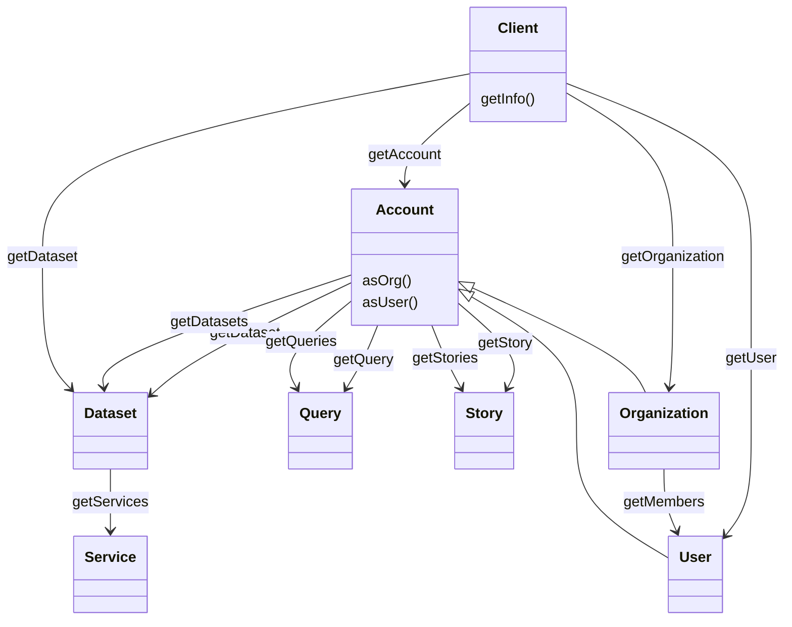
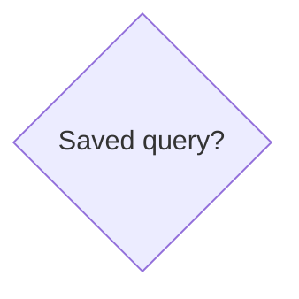

**TriplyDB.js** is the official programming library for interacting with [TriplyDB](https://triply.cc/docs/triply-db-getting-started).  TriplyDB.js allows you to automate operations that would otherwise be performed in the TriplyDB GUI.

TriplyDB.js is implemented in [TypeScript](https://www.typescriptlang.org).  TypeScript is a type-safe language that transpiles to JavaScript.

Please contact [support@triply.cc](mailto:support@triply.cc) for questions and suggestions.

# 1. Getting started

In this section we explain how to set up a project that uses TriplyDB.js.  Some of these steps are generic for setting up a modern TypeScript project, while others are specific to interacting with a TriplyDB catalog.

## 1.1 Read-only project

We start by setting up a read-only project.  This allows us to focus on setting up the TypeScript/JavaScript aspects of the project correctly.  We will use public data from the TriplyDB catalog located at <https://triplydb.com>.

1. Install [Node.js](https://nodejs.org) and [Yarn](https://yarnpkg.com) on your system:

   - Node.js is the runtime that allows your to run JavaScript (and thus TypeScript) code outside of a web browser.
   - Yarn is a modern package manager for handling JavaScript/TypeScript dependencies.

2. Create a directory for your project:

   ```sh
   mkdir my_project
   cd my_project
   ```

3. Inside your newly created directory, initialize a standard [Yarn project](https://classic.yarnpkg.com/en/docs/creating-a-project/):

   ```sh
   yarn init -y
   ```

   This will create a `package.json` file.  You can optionally edit this file to enter more specific metadata for your project.

4. Add TypeScript and TriplyDB.js as dependencies to your project:

   ```sh
   yarn add typescript @triply/triplydb
   ```

5. Initialize a default TypeScript project:

   ```sh
   ./node_modules/.bin/tsc --init
   ```

   This creates a [tsconfig.json](https://www.typescriptlang.org/docs/handbook/tsconfig-json.html) file.  You can optionally edit this file to tweak how TypeScript code is transpiled into JavaScript code.

6. Create a file called `main.ts` in a text editor.  Add the following content to the file:

   ```typescript
   import Client from "@triply/triplydb"
   const client = Client.get({url: "https://api.triplydb.com"})
   async function run() {
     console.log((await client.getApiInfo()).branding.name)
   }
   run().catch(e => {
     console.error(e)
     process.exit(1)
   })
   ```

   Notice the following details:

     - Line 1 (`import`) loads the TriplyDB.js library.
     - Line 2 creates a handle (`client`) to the TriplyDB catalog <https://triplydb.com>.  Every TriplyDB catalog has a specific API URL.  In this case the API URL is <https://api.triplydb.com>.
     - Line 3 defines the main function (`run()`).
     - Line 4 writes the name of the TriplyDB catalog that you connected to in line 2.
     - Line 6 runs the main function (`run()`) and performs basic error handling.

7. Transpile the TypeScript file (`main.ts`) into a JavaScript file (`main.js`):

   ```sh
   ./node_modules/.bin/tsc
   ```

8. Run the JavaScript file (`main.js`):

   ```sh
   node main.js
   ```

   This should print a JSON object describing the TriplyDB catalog at <https://triplydb.com>.

You can extend this script with TriplyDB.js functions that read public (meta)data.  There is a lot of public (meta)data out there in TriplyDB catalog on Internet.  The TriplyDB catalog at <https://triplydb.com> contains hundreds of open datasets.

## 1.2 Read/write project

In the previous section we set up a read-only project that uses TriplyDB.js and accesses public data at <https://triplydb.com>.  In this section we extend the project to configure read/write permissions that are tried to your user account in a TriplyDB catalog.

1. Go to the TriplyDB catalog that you have an account for that you want your project to interact with.  You may have a free account at <https://triplydb.com>.  You may also have accounts for other TriplyDB catalogs on the Internet or within your organization.

2. Log into the TriplyDB catalog that you want your application to interact with.  For example <https://triplydb.com>.

3. Go to your user settings page.  This page is reached by clicking on the user menu in the top-right corner and choosing “User settings”.

4. Go to the “API tokens” tab.

5. Click on “Create token”.

6. Enter a name that describes the purpose of the token.  For example, the name of your application (`my_project` in the above example) is a good name for the token.

7. Choose the permission level that is sufficient for what you want to do with your application:

   - Specify “Read permission” if your application must access non-public data in the TriplyDB catalog.  (For access to public data you do not need an API token.)

   - Specify “Write permission” if your application must change (meta)data in the TriplyDB catalog.

   - Specify “Management permission” if your application must be able to create one or more organizations within the TriplyDB catalog.

8. Click the “Create” button to create your token.  The token (a long sequence of characters) will now appear in a dialog.

9. Copy the token.  For security reasons, the token will only be shown to you this one time.

10. Change the contents of `main.ts` to the following, replacing `{api-token}` with the API token copied in the previous step.

    ```typescript
    import Client from "@triply/triplydb"
    const client = Client.get({token: "{api-token}"})
    async function run() {
      console.log((await (await client.getUser()).getInfo()).name)
    }
    run().catch(e => {
      console.error(e)
      process.exit(1)
    })
    ```

    Notice the following details:

    - Line 2 specifies the API token instead of the TriplyDB catalog URL.  The URL is part of the information included in the API token.
    - Line 4 prints the name of the user who created the API token that was configured in line 2.
    - Other lines are identical to the read-only script.

11. Transpile and run:

    ```sh
    ./node_modules/.bin/tsc
    node main.js
    ```

    This should print the name of the account for which the API token was created.

You can extend this script with TriplyDB.js functions that read/write (meta)data accessible through the API token.

## 1.3 Secure read/write project

In the previous section we set up a project that can read/write data in TriplyDB catalogs.  To keep the instructions minimal, we included the API token inside the script (step 10).  In this section we extend the project to configure the API token in a safer way.

TriplyDB.js is able to look for an externally specified API token.  This is achieved by changing line 2 in the script from the previous section:

```typescript
import Client from "@triply/triplydb"
const client = Client.get({token: process.env.TRIPLYDB_TOKEN})
async function run() {
  console.log((await (await client.getUser()).getInfo()).name)
}
run().catch(e => {
  console.error(e)
  process.exit(1)
})
```

The API token can be externally specfied through the environment variable `TRIPLYDB_TOKEN`.  Setting an envrionement variable is a robust approach for excluding sensitive token information from your script.  There are several ways in which environment variables can be set.  Which way is optimal for you depends on your development environement.

We explain several specific approaches for setting the API token through an environment variable.  Let us know via [support@triply.cc](mailto:support@triply.cc) if the here documented approaches do not work for you.

### 1.3.1 Windows

On Windows you can configure an API token by following these steps:

1. Go to the “View advanced system settings” dialog.

   One way to get to this dialog is by pressing the Windows-key; this opens up the Start menu.  Then type part of the string “View advanced system settings” in order to issue a Windows search.  This will bring up the dialog as one of the top search options.

2. Click on the “Environment Variables” button.  This opens the “Environment Variables” dialog.

3. Click on the “New…” button in the “User variables” section.  This opens the “New User Variable” dialog.

4. Enter “TRIPLYDB_TOKEN” in the variable name field.

5. Paste your API token in the variable value field.

6. Click “OK” three times to to save the environment variable and close the various dialogs.

### 1.3.2 macOS or Linux (preferred approach)

On macOS and Linux you can configure an API token with environment.  It is a best practice to specify such variables within a directory scope.  This means that these variables are only specified when you are within a your TriplyDB.js project directory.  This is the preferred approach for setting the API token and includes the follows steps:

1. Install the [direnv](https://direnv.net) extension.

2. Enter the directory of your project (`my_project` in the above example).

3. Run the following command:

   ```sh
   echo export TRIPLYDB_TOKEN={your-api-token} > .envrc
   ```

   This creates a file called `.direnv`.

    Make sure that no whitespace appears around the `=` character.  This is a common mistake.

4. Run the following command:

   ```sh
   direnv allow
   ```

### 1.3.3 macOS or Linux (alternative approach)

If you are using macOS or Linux and are unable to install the [direnv](https://direnv.net) extension, you can also configure the API token with a broader scope.

1. Look for a text file called `~/.profile` in your user directory and open it in a text editor.

2. Add the following content, replacing `{api-token}` with the token created in the previous section.

   ```sh
   export TRIPLYDB_TOKEN={api-token}
   ```

   Make sure that no whitespace appears around the `=` character.  This is a common mistake.

3. Restart your terminal session.  This is typically achieved by executing the `exit` command in your current terminal window, and opening a new terminal window afterwards.

## 1.4 Editor support

When editing the TypeScript files in your application (`main.ts` in the above example), it is useful to receive good feedback from your text editor.  This section explains how to configure text editors that provide assistance with editing applications that use TriplyDB.js.

### 1.4.1 Atom

The [Atom](https://atom.io) text editor provides advanced support for programming in TypeScript.  This will make it easier to use TriplyDB.js, since the editor will provide various forms of feedback.  You can set-up Atom in the following way:

1. Install the [Atom](https://atom.io) text editor on your system.

2. Open file `tsconfig.json`, and make sure the following settings are included:

   ```json
   "target": "es2020",
   "lib": ["es2020"],
   ```

   This will ensure that you use the latest version of TypeScript.

3. From within the Atom preferences page, install the [`atom-typescript`](https://atom.io/packages/atom-typescript) package.  You can use the `Crtl+,` key combination in order to open the preferences page.  Then navigate to “Install”.

4. Start Atom from your project directory:

   ```sh
   cd my_project
   atom .
   ```

5. You can also install package [Script](https://atom.io/packages/script) to run your script from within the editor environment.

## 1.5 Improved error handling

The example application that we wrote in the previous sections includes minimal error handling:

```typescript
run().catch(e => {
  console.error(e)
  process.exit(1)
})
```

This section explains how error handling can be improved.

### 1.5.1 Better error lines

By default, error messages emitted by Node.js refer to code lines that appear in the transpiled JavaScript files.  Since we write our code in TypeScript, it is better to see the corresponding code lines for the TypeScript files.  This is achieved by adding the following line at the beginning of the main script (`main.ts` in the above example):

```typescript
require("source-map-support/register")
```

### 1.5.2 Better error messages

The following code can be added to the end of your application file (`main.ts` in the above example) to use more advanced error handling:

```typescript
process.on("uncaughtException", function (err) {
  console.error("Uncaught exception", err)
  process.exit(1)
})
process.on("unhandledRejection", (reason, p) => {
  console.error("Unhandled Rejection at: Promise", p, "reason:", reason)
  process.exit(1)
})
```

# 2. Common use cases

This section introduces simple TriplyDB.js scripts that are used to accomplish common tasks when using TriplyDB catalogs.

## 2.1 Creating a new dataset

## 2.2 Updating an existing dataset

## 2.3 Starting a service

## 2.4 Running a query

## 2.5 Uploading query results

## 2.6 Creating an organization with members

# 3. Reference

This section documents all classes and methods supported by TriplyDB.js.

Every method in this reference section comes with at least one code example.  These code examples can be run by inserting them into the following code snippet.  See the [Getting started](#getting-started) section on how to get this script up and running on your system.

```typescript
require("source-map-support/register")
import Client from "@triply/triplydb"
const client = Client.get({token: process.env.TRIPLYDB_TOKEN})
async function run() {
  // This is where the code examples in this reference section should be placed.
}
run().catch(e => {
  console.error(e)
  process.exit(1)
})
process.on("uncaughtException", function (err) {
  console.error("Uncaught exception", err)
  process.exit(1)
})
process.on("unhandledRejection", (reason, p) => {
  console.error("Unhandled Rejection at: Promise", p, "reason:", reason)
  process.exit(1)
})
```

The following subsections document the various TriplyDB.js classes.  Each class comes with its own methods.  Classes are related through methods that connect them.  For example, calling the `getAccount` method on a `Client` object returns an `Account` object.


```mermaid
classDiagram
  class Account {
    asOrg()
    asUser()
  }
  Account --> Dataset: getDataset
  Account --> Dataset: getDatasets
  Account --> Query: getQuery
  Account --> Query: getQueries
  Account --> Story: getStory
  Account --> Story: getStories
  class Client {
    getInfo()
  }
  Client --> Account: getAccount
  Client --> Dataset: getDataset
  Client --> Organization: getOrganization
  Client --> User: getUser
  class Dataset {
  }
  Dataset --> Service: getServices
  class Organization {
  }
  Account <|-- Organization
  Organization --> User: getMembers
  class Query {
  }
  class Story {
  }
  class User {
  }
  Account <|-- User
```

## 3.1 Client

Instances of the `Client` class are specific client connections that are set-up with a TriplyDB catalog.  Client connections can be created with and without setting an API token.

When no API token is set, the `Client` object can be used to perform read-only operations over public data.  The following creates a `Client` object without setting an API token:

```typescript
import Client from "@triply/triplydb"
const client = Client.get({url: "https://api.triplydb.com"})
```

Notice that the URL must point to the API of the TriplyDB catalog that the `Client` object should connect to.  The API URL is typically created by prefixing the host name of the web-based GUI  with the `api.` subdomain.  For example, [1] is the web-based GUI of this TriplyDB catalog.  So [2] is the corresponding API.

```
[1] https://triplydb.com
[2] https://api.triplydb.com
```

When an API token is specified, the operations that can be performed through the `Client` object are determined by:

  1. the access level of the token, and
  2. the credentials of the user account for which the API token was created.

The allowed operations many include:

  1. Read operations over internal or private data
  2. Write operations over public, internal or private data
  3. Management operations such as creating organizations, adding/removing members to/from organizations.

The following creates a `Client` object with a specific API token:

```typescript
import Client from "@triply/triplydb"
const client = Client.get({token: process.env.TRIPLYDB_TOKEN})
```

It is typical for one TriplyDB.js script to have exactly one `Client` object.

### 3.1.1 Client.getAccount(name?: string)

Returns the TriplyDB account with the given `name` or returns the current account.

If `name` is omitted, the TriplyDB account that is associated with the current API token is returned.

#### Examples

The following example returns the account called `"Triply"`.

```typescript
const account = await client.getAccount("Triply")
```

The following example returns the current account.  This is the account for which the currently configured API token was created.

```typescript
const account = await client.getAccount()
```

#### Error conditions

🚧 If `name` is omitted and no API token is configured, the following error is shown:

```
Failed to fetch the current account, because no API token is configured.

If you want to fetch the current account, you must create an API token on <https://{host}/me>.
```

🚧 If the connected to TriplyDB catalog does not contain an account with the given `name`, then the following error message is shown:

```
Failed to fetch account {name}. This account does not exist.

Make sure that you have not mistyped the account name.
```

#### See also

This method returns an account object.  See section [`Account`](#account) for an overview of the methods that can be called on such objects.

Class [`Account`](#account) has two specializations: class [`Organization`](#organization) and class [`User`](#user).  In line with these class specializations, there are also two method specializations:

1. Method [`Client.getOrganization(name: string)`](#clientgetorganizationname-string) returns an organization object.

2. Method [`Client.getUser(name?: string)`](#clientgetusername-string) returns a user object.

### 3.1.2 Client.getApiInfo() 🚨

Returns a JSON object describing the TriplyDB catalog for which a client connection is established.

#### Examples

The following example prints the contact email for the TriplyDB catalog to which `client` is currently connected.

```typescript
console.log((await client.getApiInfo()).contactEmail)
```

### 3.1.3 Client.getDataset(accountName: string, datasetName: string)

Returns the TriplyDB dataset with name `datasetName` that is published by the account with name `accountName`.

#### Examples

The following example returns the Iris flower dataset by the Triply account:

```typescript
const iris = await client.getDataset("Triply", "iris")
```

#### Error conditions

🚧 If the connected to TriplyDB catalog does not contain an account called `accountName`, then the following error is shown:

```
Failed to fetch dataset {accountName}/{datasetName}. There is no account with the specified name.

Make sure that you did not mistype the account name.
```

🚧 If the connected to TriplyDB catalog contains an account called `accountName`, no API token is configured, and the account does not contain a public dataset called `datasetName`, then the following error is shown:

```
Failed to fetch dataset {accountName}/{datasetName}. The account called {accountName} does not contain a public dataset called {datasetName}.

Make sure that you have specified the correct account name.
Make sure that you have not mistyped the dataset name.
If you want to access a non-public dataset, you must create an API token on <https://{host}/me>.
```

🚧 If the connected to TriplyDB catalog contains an account called `accountName`, an API token is configured, and the account does not contain a dataset called `datasetName` that is accessible with the configured API token, then the following error message is shown:

```
Failed to fetch dataset {accountName}/{datasetName}. This dataset either does not exist or is not accessible with the configured API token.

Make sure that you have specified the correct account name.
Make sure that you have not mistyped the dataset name.
Make sure that you have configured a correct API token.
```

#### Alternatives

This method is a shorthand for calling the following two methods:

1. Call method [`Client.getAccount(name?: string)`](#clientgetaccountname-string) to retrieve an account object.

2. Then call method [`Account.getDataset(name: string)`](#accountgetdatasetname-string) to retrieve a dataset object.

The following example also returns the Iris flower dataset published by the Triply account.  This alternative example has the same result as the previous example, but uses two method calls instead of one:

```typescript
const triply = await client.getAccount("Triply")
const iris = triply.getDataset("iris")
```

#### See also

This method returns a dataset object.  See section [`Dataset`](#dataset) for an overview of the methods that can be called on such objects.

### 3.1.4 Client.getOrganization(name: string)

Returns the TriplyDB organization with the given `name`.

This method is similar to [`Client.getAccount(name?: string)`](#clientgetaccountname-string), but differs in the following ways:

- This method only works for accounts that represent TriplyDB organizations.

- This method returns an organization object.  Class `Organization` is a specialization of class `Account`.

#### Examples

The following example returns the organization called `"Triply"`:

```typescript
const org = await client.getOrganization("Triply")
```

#### Error conditions

🚧 If the connected to TriplyDB catalog does not contain an organization with the given `name`, then the following error message is shown:

```
Failed to fetch organization {name}. This organization does not exist.

Make sure that you have not mistyped the organization name.
```

#### Alternatives

This method is a shorthand for calling the following two methods:

1. Call method [`Client.getAccount(name?: string)`](#clientgetaccountname-string) to retrieve an account object.

2. Then call method [`Account.asOrganization()`](#accountasorganization) to cast the account object into an organization object.

The following example returns the same result as the previous example, but uses two methods instead of one:

```typescript
const account = await client.getAccount("Triply")
const organization = account.asOrganization()
```

#### See also

This method returns an organization object.  See section [`Organization`](#organization) for an overview of the methods that can be called on such objects.

### 3.1.5 Client.getUser(name?: string)

Returns the TriplyDB user with the given `name`.

If `name` is omitted, the TriplyDB user that is associated with the current API token is returned.  This only works if an API token is configured for the current `Client` object.

#### Examples

The following example returns the user with name `"somebody"`:

```typescript
const user = await client.getUser("somebody")
```

The following example returns the user for which the API token was created.  This only works if an API token was configured when creating the `Client` object `client`:

```typescript
const me = await client.getUser()
```

#### Error conditions

🚧 If `name` is omitted and no API token is configured, the following error is shown:

```
Failed to fetch the current user, because no API token is configured.

If you want to fetch the current user, you must create an API token on <https://{host}/me>.
```

🚧 If the connected to TriplyDB catalog does not contain a user with the given `name`, then the following error message is shown:

```
Failed to fetch user {name}. This user does not exist.

Make sure that you have not mistyped the user name.
```

#### Alternatives

This method is a shorthand for the following two methods:

1. Call method [`Client.getAccount()`](#clientgetaccountname-string) to retrieve an account object.

2. Then call method [`Account.asUser()`](#accountasuser) to cast the account object into a user object.

The following example code returns the same result as the previous examples, but uses two methods instead of one:

```typescript
const user = (await client.getAccount("somebody")).asUser()

const me = (await client.getAccount()).asUser()
```

#### See also

This method returns a user object.  See section [`User`](#user) for an overview of the methods that can be called on such objects.

### 3.1.6 `Client.toString()`

Emits a human-readable representation of this client object in the form of a string.

#### Examples

The following example writes a human-readable representation of the current client connection to the screen.

```typescript
console.log(client)
```

This is an example of the output of this call:

```
TriplyDB catalog ‘TriplyDB’:
  - Tagline: The Network Effect for Your Data
  - Description: Store, explore and share linked data with TriplyDB
  - Version: 21.05.1 (build date: May 20th, 2021)

  Locations:
    - GUI location: https://triplydb.com
    - API location: https://triplydb.com
    - Contact email: mailto:info@triply.cc

  Legal:
    - General terms: https://triply.cc/pdf/triplydb/general-terms-of-use.pdf
    - Privacy policy: https://triply.cc/pdf/triplydb/privacy-policy.pdf
```

## 3.2 Account

Instances of the `Account` class denote an account in TriplyDB.  Accounts are either organizations (see the [`Organization`](#organization) section) or users (see the [`User`](#user) section).

Account objects are obtained by calling the following method:

  - [`Client.getAccount(name?: string)`](#clientgetaccountname-string)

### 3.2.1 Account.addDataset(metadata: object)

Adds a new TriplyDB dataset to this account.

#### Access conditions

This only succeeds if an API token is configured that gives write access for this account.

#### Arguments

Argument `metadata` is a JSON object that specifies the dataset metadata.  It has the following keys:

<dl>
  <dt>🚧 <code>accessLevel</code> (optional)</dt>
  <dd>
    <p>The access level of the dataset. The following values are supported:</p>
    <dl>
      <dt><code>"private"</code> (default)</dt>
      <dd>The dataset can only be accessed by organization members.</dd>
      <dt><code>"internal"</code></dt>
      <dd>The dataset can only be accessed by users that are logged into the TriplyDB catalog.
      <dt><code>"public"</code></dt>
      <dd>The dataset can be accessed by everybody.</dd>
    </dl>
    <p>When no access level is specified, the most restrictive access level (<code>private</code>) is used.</p>
  </dd>
  <dt><code>description</code> (optional)</dt>
  <dd>The human-readable description of the dataset.  This description can make use of Markdown (see the <a href="/docs/triply-db-getting-started/#markdown-support">Markdown reference</a>) for details.</dd>
  <dt><code>displayName</code> (optional)</dt>
  <dd>The human-readable name of the dataset.  This name may contain spaces and other non-alphanumeric characters.</dd>
  <dt><code>license</code> (optional)</dt>
  <dd>
    <p>The license of the dataset.  The following license strings are currently supported:</p>
    <ul>
      <li><code>"CC-BY-SA"</code></li>
      <li><code>"CC0 1.0"</code></li>
      <li><code>"GFDL"</code></li>
      <li><code>"ODC-By"</code></li>
      <li><code>"ODC-ODbL"</code></li>
      <li><code>"PDDL"</code></li>
      <li><code>"None"</code> (default)</li>
    </ul>
  </dd>
  <dt><code>name</code> (required)</dt>
  <dd>The name of the dataset.  This name must only contain alphanumeric characters and hyphens (<code>[A-Za-z0-9-]</code>).</dd>
</dl>

#### Examples

The following example creates a new dataset called `"iris"` under the account called `"Triply"`:

  - The dataset has private access, because no other access level was specified.
  - The dataset has a description.
  - The dataset has a display name.
  - The dataset has the PDDL license.

```typescript
const triply = await client.getAccount("Triply")
const iris = await triply.addDataset({
  description: "A multivariate dataset that quantifies morphologic variation of Iris flowers.",
  displayName: "Iris",
  license: "PDDL",
  name: "iris"
})
```

#### See also

This method returns a dataset object.  See section [Dataset](#dataset) for an overview of the methods that can be called on such objects.

### 3.2.2 Account.addQuery(name: string, endpoint: Service, metadata?: object)

🚧 This method is present but has unknown behavior.

```typescript
export interface QueryMetaUpdate {
  name?: string;
  displayName?: string;
  description?: string;
  accessLevel?: AccessLevel;
  dataset?: string;
  preferredService?: string;
  autoselectService?: boolean;
}
export declare type QueryCreate = MarkRequired<QueryMetaUpdate, "name"> & Partial<QueryVersionUpdate> & {
  generateNewName?: boolean;
}
export interface QueryVersionUpdate {
  requestConfig: QueryRequestConfig;
  renderConfig?: QueryRenderConfig;
  variables?: VariableConfig[];
}
```

### 3.2.3 Account.addStory(name: string, metadata?: object)

🚧 This method is not yet present.

### 3.2.4 Account.asOrganization()

🚧 This method is currently called `asOrg`.

Casts the TriplyDB account object to its corresponding organization object.

Class [`Organization`](#organization) is a specialization of class [`Account`](#account).

Calling this method on an `Organization` object does nothing.

#### Examples

The following example retrieves the account named `"Triply"` and casts it to an organization:

```typescript
const triply = (await client.getAccount("Triply")).asOrganization()
```

#### Error conditions

🚧 Calling this method on an account that represents a TriplyDB user results in the following error:

```
Unable to cast account {name} to an organization. This account represents a TriplyDB user.
```

🚧 Calling this method on a `User` object results in the following error:

```
Unable to cast user {name} to an organization. A user cannot be cast to an organization.
```

#### Alternatives

This method is not needed if the organization is directly retrieved with the specialization method [`Client.getOrganization(name: string)`](#clientgetorganizationname-string).

The following example returns the same result as the above example, but in a more direct way:

```typescript
const triply = await client.getOrganization("Triply")
```

#### See also

This method returns an organization object.  See section [`Organization`](#organization) for an overview of the methods that can be called on such objects.

### 3.2.5 Account.asUser()

Casts the TriplyDB account object to its corresponding user object.

Class [`User`](#user) is a specialization of class [`Account`](#account).

Calling this method on a `User` object does nothing.

#### Examples

The following example retrieves the account that represents the current user, and casts it to a user object:

```typescript
const me = (await client.getAccount()).asUser()
```

#### Error conditions

🚧 Calling this method on an account that represents a TriplyDB organization results in the following error:

```
Unable to cast account {name} to a user. This account represents a TriplyDB organization.
```

🚧 Calling this method on an `Organization` object results in the following error:

```
Unable to cast organization {name} to a user. An organization cannot be cast to a user.
```

#### Alternatives

This method is not needed if the user is directly retrieved with the specialization method [`Client.getUser(name?: string)`](#clientgetusername-string).

The following example returns the same result as the above example, but in a more direct way:

```typescript
const me = await client.getUser()
```

#### See also

This method returns an organization object.  See section [`Organization`](#organization) for an overview of the methods that can be called on such objects.

### 3.2.6 Account.exists() 🚨

Returns `true` if this account still exists in the TriplyDB catalog, and returns `false` otherwise.

This method is used to verify that the account handle still refers to an existing account in the connected TriplyDB catalog.

#### Examples

The following example ensures that the Triply account still exists before its name is written to the console.

```typescript
const account = await client.getAccount("Triply")
if (await account.exists()) {
  console.log((await account.getInfo()).name)
}
```

#### 3.2.7 Account.getDataset(name: string) 🚧

🚧 Returns the TriplyDB dataset with the given `name` that is published under this account.

#### Examples

🚧 The following example retrieves an existing dataset and prints its name.

```typescript
const triply = await client.getAccount("Triply")
const iris = await triply.getDataset("iris")
console.log((await iris.getInfo()).name)
```

#### Error conditions

🚧 If no API token is configured and this account does not contain a public dataset called `name`, then the following error is shown:

```
Failed to fetch dataset {name}. The account does not contain a public dataset with that name.

Make sure that you have not mistyped the dataset name.
If you want to access a non-public dataset, you must create an API token on <https://{host}/me>.
```

🚧 If an API token is configured and this account does not contain a dataset called `name` that is accessible with that token, then the following error message is shown:

```
Failed to fetch dataset {name}. The dataset either does not exist or is not accessible with the configured API token.

Make sure that you have not mistyped the dataset name.
Make sure that you have configured a correct API token.
```

#### See also

🚧 This method returns a dataset object.  See section [`Dataset`](#dataset) for an overview of the methods that can be called on such objects.

#### 3.2.8 Account.getDatasets()

Returns an iterator with the accessible datasets that belong to this account.

#### Access considerations

The iterator only includes datasets that are accessible for the current connection with a TriplyDB catalog:

- If no API token is configured, the iterator will include all and only public datasets belonging to this account.

- If an API token is configured, the iterator will include all public and internal datasets belonging to this account, and will include all private datasets beloning to this account if the API token gives read access to the account.

#### Examples

The following example prints the names of all accessible dataset under the `"Triply"` account:

```typescript
const triply = await client.getOrganization("Triply")
for await (const dataset of triply.getDatasets()) {
  console.log((await dataset.getInfo()).name)
}
```

#### 3.2.9 Account.getInfo()

Returns an overview of the account in the form of a JSON object.

The following example code prints information for the Triply account:

```typescript
const account = await client.getAccount("Triply")
console.log(await account.getInfo())
```

The information object for accounts includes the following keys:

<dl>
  <dt><code>avatarUrl</code></dt>
  <dd>A URL to the account image.</dd>
  <dt><code>accountName</code></dt>
  <dd>The URL-friendly name of the account.</dd>
  <dt><code>name</code><dt>
  <dd>The human-readable display name of the account</dd>
  <dt><code>description</code></dt>
  <dd>The human-readable description of the account.</dd>
  <dt><code>createdAt</code></dt>
  <dd>The date and time on which the account was created.</dd>
  <dt><code>datasetCount</code></dt>
  <dd>The number of datasets for the account.</dd>
  <dt><code>queryCount</code></dt>
  <dd>The number of queries for the account.</dd>
  <dt><code>storyCount</code></dt>
  <dd>The number of stories for the account</dd>
  <dt><code>pinnedDatasets</code></dt>
  <dd>An array containing the pinned dataset for the account.</dd>
  <dt><code>pinnedItems</code></dt>
  <dd>An array containing the pinned items (datasets, stories and queries) for the account.</dd>
  <dt><code>type</code></dt>
  <dd>The account type: either <code>organization</code> or <code>user</code>.</dd>
  <dt><code>role</code></dt>
  <dd>The role of the account</dd>
</dl>

These keys can be accessed individually.  The following example code prints the name of theTriply account:

```typescript
const account = await client.getAccount("Triply")
console.log((await account.getInfo()).name)
```

### 3.2.9 Account.getPinnedItems()

Returns the datasets, stories and queries that are currently pinned to the account home page.  The items are returned in the order in which they appear on the account home page (from top-left to bottom-right).

#### Examples

The following example code prints the names of pinned items on the Triply account page:

```typescript
const account = await client.getAccount("Triply")
for await (const item of await account.getPinnedItems()) {
  console.log((await item.getInfo()).name)
}
```

### 3.2.10 Account.getQuery(name: string)

Returns the TriplyDB query with the given `name`.

The following example returns a query called `animal-gallery` for the Triply account:

```typescript
const account = await client.getAccount("Triply")
const query = await account.getQuery("animal-gallery")
```

See section [`Query`](#query) for an overview of the methods for query objects.

### 3.2.11 Account.getQueries()

Returns an iterator with the queries that belong to the account.

The following example prints the names of the queries that belong to the Triply account:

```typescript
const account = await client.getAccount("Triply")
for await (const query of account.getQueries()) {
  console.log((await query.getInfo()).name)
}
```

See section [`Query`](#query) for an overview of the methods for query objects.

### 3.2.12 Account.getStory(name: string)

See section [`Story`](#story) for an overview of the methods for story objects.

### 3.2.13 Account.getStories()

Returns an iterator with the queries that belong to the account.

The following example prints the names of the queries that belong to the Triply account:

```typescript
const account = await client.getAccount("Triply")
for await (const query of account.getQueries()) {
  console.log((await query.getInfo()).name)
}
```

See section [`Story`](#story) for an overview of the methods for story objects.

### 3.2.14 Account.pinItems

### 3.2.15 Account.setAvatar(file: string)

Sets a new image that characterizes the account.  A circular version of this image is displayed inside the TriplyDB GUI.  This image is also disclosed in account metadata.

The following example uploads the local image in file `logo.svg` and set it as the characterizing image for the Triply account:

```typescript
const account = client.getAccount("Triply")
await account.setAvatar("logo.svg")
```

### 3.2.16 Account.update

Updates the metadata for this account.

## 3.3 Organization

Instances of the [`Organization`](#organization) class denote an organization in TriplyDB.

Organizations can be obtained via the following methods:

  - [`Client.getOrganization()`](#clientgetorganization)
  - [`Client.getOrganization(name: string)`](#clientgetorganizationname-string)

Alternatively, organizations are obtained by obtaining an account, and then casting to to an organization:

```typescript
const account client.getAccount("acme")
const org = account.asOrg()
```

Every method that can be applied to an [`Account`](#account) can also be applied to an [`Organization`](#organization).  See section [`Account`](#account) for an overview of these methods.  The remainder of this section documents the methods that are specific for organizations.

### 3.3.1 Organization.addMembers([{user: string, role: string}]) 🚧

Adds one or more members to the given organization.

For each member a role must be specified:

DEFAULT?

<dl>
  <dt><code>"member"</code></dt>
  <dd>A regular member that is allowed to read and write the datasets that are published under the organization.</dd>
  <dt><code>"owner"</code></dt>
  <dd>An owner of the organization.  Owners have all the rights of regular users, plus the ability to add/remove users to/from the organization, the ability to change the roles of existing users, and the ability to delete the organization.</dd>
</dl>

The following example adds a user with name name `"bugs-bunny"` to the organization `"acme"`:

```typescript
const org = await client.getOrganization("acme")
await org.addMembers({user: "bugs-bunny",
                      role: "member"})
```

### 3.3.2 Organization.delete()

Deletes the given organization from the TriplyDB catalog.

Succeeds if the current API token includes ownership rights for the given organization.

The following example deletes the organization called `"acme"`:

```typescript
const org = await client.getOrganization("acme")
org.delete()
```

#### 3.3.6 Organization.getDatasets()

Returns the list of datasets for the `Organization`.  This only includes datasets that are accessible under the used API token.

The following example prints the list of datasets that belong to the organization named `acme`:

```typescript
const org = await client.getOrganization("acme")
for await (const dataset of org.getDatasets()) {
  console.log(dataset)
}
```

#### Organization.getMembers()

Returns the list of memberships for the given organization.

A membership contains the following components:

<dl>
  <dt><code>role</code><dt>
  <dd>The role of the membership (<code>OrgRole</code>): either <code>"owner"</code> for owners of the organization, or <code>"member"</code> for regular members.  The difference between owners and regular members is that owners can perform user management for the organization (add/remove/change memberships).</dd>
  <dt><code>user</code></dt>
  <dd>User</dd>
  <dt><code>createdAt</code></dt>
  <dd>A date/time string</dd>
  <dt>updatedAt</dt>
  <dd>todo</dd>
</dl>

Memberships of organization are TriplyDB [users](#user).

```typescript
const org = await client.getOrganization("acme")
for (const membership of await org.getMembers()) {
  console.log(user)
}
```

#### Organization.getPinnedDatasets()

Returns the list of datasets that are pinned by the given Organization.

A pinned dataset is a dataset that is displayed in a more prominent way than other datasets.

The order in which the pinned datasets are returned reflects the order in which they appear on the organization homepage.

The following example prints the list of pinned datasets for the organization named `"acme"`:

```typescript
const organization = await client.getOrganization("acme")
console.log(organization.getPinnedDatasets())
```

#### Organization.removeMembers([User | string])

Removes one or more users.

The array may include names of users (`string`) or user objects ([`User`](#user)).

The following example removes two users: one user is removed by name and another is removed by object:

```typescript
const acme = await client.getOrganization("acme")
const bunny = await acme.getMember("bugs-bunny")
await acme.removeMembers([bunny, "daffy-duck"])
```

### 3.4 User

The [`User`](#user) class represents a TriplyDB user.

Users can be obtained with the following methods:

  - [`Client.getUser()`](#clientgetuser)
  - [`Client.getUser(name: string)`](#clientgetusername-string)

Users cannot be created or deleted through the TriplyDB.js library.  See the [Triply Console documentation](/docs/triply-db-getting-started) for how to create and delete users through the web-based GUI.

#### User.addDataset(metadata: object)

Adds a new dataset to the user's account.

This method is inherited from the `Account` class.  See [`Account.addDataset(metadata: object)`](#accountadddatasetmetadata-object) for more information.

#### User.createOrganization(metadata: object)

Creates a new organization for which `User` will be the owner. This only works if the used API token includes write access for the `User`.

Argument `metadata` is a JSON object that specifies the organization metadata.  It has the following keys:

<dl>
  <dt><code>accountName</code> (required)</dt>
  <dd>The internal name of the organization.  This name can only contain alphanumeric characters and hyphens.</dd>
  <dt><code>description</code> (optional)</dt>
  <dd>The description of the organization.  This description can make use of Markdown layout (see the <a href="/docs/triply-db-getting-started/#markdown-support">Markdown reference</a>) for details.</dd>
  <dt><code>email</code> (optional)</dt>
  <dd>The email address at which the organization can be reached.</dd>
  <dt><code>name</code> (optional)</dt>
  <dd>The human-readable name of the organization.  This name may contain spaces and other non-alphanumeric characters.</dd>
</dl>

The following example creates an organization with name `acme` for which the user with name `john-doe` will be the owner.  Notice that in addition to the required internal name (`"accountName": "acme"`), an optional display name (`"name": "Acme Corporation"`) is specified as well.

```typescript
const user = await client.getUser("john-doe")
const organization = await user.createOrganization({accountName: "acme",
                                                    name: "Acme Corporation"})
```

#### User.exists()

Returns whether the `User` still exists.

While it is not possible to delete users with TriplyDB.js, they can be deleted ― possibly by somebody else ― through the Triply Console.

The following example code prints `true` in case the account (still) exists, and prints `false` otherwise:

```typescript
const user = await client.getUser("john-doe")
console.log(user.exists())
```

#### User.getDataset(name: string)

Returns the dataset with the given `name` that is published by the given `User`.

This method returns an object of type [`Dataset`](#dataset).  See that section for an overview of the methods that can be called on those dataset objects.

The following example prints a specific dataset object:

```typescript
const user = await client.getUser("john-doe")
console.log(user.getDataset("animals"))
```

#### User.getDatasets()

Returns an iterator to the accessible datasets for `User`.  This only includes datasets that are accessible under the API token.

The following example prints the list of datasets that belong to the user named
`john-doe`:

```typescript
const user = await client.getUser("john-doe")
for await (const dataset of user.getDatasets()) {
  console.log((await dataset.getInfo()).name)
}
```

#### User.getOrganizations()

Returns the list of organizations for which the `User` is a member.

The order in the list reflects the order in which the organizations appear on the user page in the Triply GUI.

The following example prints the list of organizationo for which the user named `"john-doe"` is a member:

```typescript
const user = await client.getuser("john-doe")
console.log(await user.getOrganizations())
```

#### User.getInfo()

Returns an overview of the account in the form of a JSON object.

The following example code prints an overview of account that is
associated with the used API token:

```typescript
const user = await client.getUser()
console.log(await user.getInfo())
```

The information object for users includes the following keys:

<dl>
  <dt><code>avatarUrl</code></dt>
  <dd>A URL to the user image.</dd>
  <dt><code>accountName</code></dt>
  <dd>The URL-friendly name of the user.</dd>
  <dt><code>name</code><dt>
  <dd>The human-readable display name of the user</dd>
  <dt><code>description</code></dt>
  <dd>The human-readable description of the user.</dd>
  <dt><code>createdAt</code></dt>
  <dd>The date and time on which the user was created.</dd>
  <dt><code>datasetCount</code></dt>
  <dd>The number of datasets for the user.</dd>
  <dt><code>queryCount</code></dt>
  <dd>The number of queries for the user.</dd>
  <dt><code>storyCount</code></dt>
  <dd>The number of stories for the user</dd>
  <dt><code>pinnedDatasets</code></dt>
  <dd>An array containing the pinned dataset for the user.</dd>
  <dt><code>pinnedItems</code></dt>
  <dd>An array containing the pinned items (datasets, stories and queries) for the user.</dd>
  <dt><code>role</code></dt>
  <dd>The role of the user. 🚨 POSSIBLE VALUES</dd>
  <dt>🚧 <code>organizations</code></dt>
  <dd>An array of the first 🚨 organization of which the user is a member.</dd>
</dl>

#### User.getPinnedDatasets()

Returns the list of datasets that are pinned for the given `User`.

The order in the list reflects the order in which the datasets appear on the user page in the Triply GUI.

The following example prints the list of pinned datasets for the user named `"john-doe"`:

```typescript
const user = await client.getUser("john-doe")
console.log(await user.getPinnedDatasets())
```

### 3.5 Dataset

The `Dataset` class represents a linked dataset in a TriplyDB catalog.

#### Dataset.addPrefixes(prefixes: {[key: string]: string})

```typescript

```

#### Dataset.addService(type: string, name: string)

Creates a new service for this dataset.

The service type is specified with the `type` parameter, which
supports the following values:

  - `"sparql"` :: Starts a SPARQL service.
  - `"sparql-jena"` :: Starts a SPARQL JENA service.
  - `"elasticsearch"` :: Starts an Elastic Search service.

The `name` argument can be used to distinguish between different endpoints over the same dataset that are used for different tasks.

See section [`Service`](#service) for an overview of the methods that can be used with service objects.

The following example code starts two SPARQL endpoints over a specific dataset.  One endpoint will be used in the acceptance environment while the other endpoint will be used in the production system.

```typescript
const account = await client.getAccount()
const dataset = await account.getDataset("cats")
const acceptance = dataset.addService("sparql", "acceptance")
const production = dataset.addService("sparql", "production")
```

#### Dataset.copy(account: string, dataset: string)

Creates a copy of the current dataset.  The owner (user or organization) of the copy is specified with parameter `account`.  The name of the copy is specified with parameter `dataset`.

```typescript
const account = await client.getAccount()
const dataset = account.getDataset("animals")
console.log(await dataset.copy("new-account", "new-dataset"))
```

This operation does not overwrite existing datasets: if the copied-to dataset already exists, a new dataset with suffix `-1` will be created.

#### Dataset.delete()

Deletes the dataset. This includes deleting the dataset metadata, all of its graphs, and all of its assets.

Use the following methods in order to delete graphs while retaining dataset metadata and assets:

- [Dataset.deleteGraph(graphName: string)](#datasetdeletegraphname-string)
- [Dataset.removeAllGraphs()](#datasetremoveallgraphs)

The following example code deletes a specific dataset that is part of
the account associated with the current API token:

```typescript
const account = await client.getAccount()
const dataset = await account.getDataset("some-dataset")
dataset.delete()
```

#### Dataset.deleteGraph(name: string)

Deletes the graph that has the given `name` and that belongs to this dataset.

In linked data, graph names (`name`) are IRIs.

The following example deletes the cats graph from the animals
dataset:

```typescript
const account = await client.getAccount()
const dataset = await account.getDataset("animals")
dataset.deleteGraph("https://example.org/cats")
```

#### Dataset.exists()

Returns whether or not the dataset exists in the TriplyDB catalog.

Datasets can still be considered to not exist when the [`Dataset.delete()`](#datasetdelete) method is called or when somebody deletes the dataset from the [Triply GUI](/docs/triply-db-getting-started).

#### Examples

The following example emits `false` because no dataset exists with the given randomly generated name.

```typescript
const me = await client.getUser()
const name = "x" + Math.random().toString(36).substring(7)
const dataset = me.getDataset(name)
console.log(await dataset.exists())
```

The following example emits `true` because the creation of the dataset is awaited.

```typescript
const me = await client.getUser()
const dataset = await me.addDataset({name: "test"})
console.log(await dataset.exists())
```

The following example emits `true` or `false`, depending on how long it takes to delete the dataset.  It is possible to receive `true` for the former existence check and receive `false` for the latter.  The behavior in inherently unpredictable because the delete option is not awaited.

```typescript
const me = await client.getUser()
const dataset = await me.addDataset({name: "test"})
dataset.delete()
console.log(await dataset.exists())
console.log(await dataset.exists())
```

#### Dataset.getAsset(name: string, version: number)

Returns the asset with the given `name` for this dataset.

Optionally allows the version number (`version`) of the asset to be specified.  If the version number is abscent, the latest version of the assert with the given `name` is returned.

The following example returns the original version of an image of a dog from the animals dataset:

```typescript
const user = await client.getUser()
const dataset = user.getDataset("animals")
console.log(dataset.getAsset("dog.png", 1))
```

#### Dataset.getAssets()

Returns zero or more assets that belong to this dataset.

Assets are binary files that can be stored along with the graph-based data.  Common examples include documents, images and videos.

The following example returns the assets for a specific dataset:

```typescript
const user = await client.getUser()
const dataset = user.getDataset("animals")
for await (const asset of dataset.getAssets()) {
  console.log(asset)
}
```

#### Dataset.getGraph(name: string)

Returns the graph with the given `name` that belongs to this dataset.

In linked data, graph names (`name`) are IRIs.

The following example returns the graph about cats from the dataset about animals:

```typescript
const user = await client.getUser()
const dataset = await user.getDataset("animals")
const graph = dataset.getGraph("https://example.com/cats")
console.log(graph)
```

#### Dataset.getGraphs()

Returns zero or more graphs that belong to the dataset.

The following example code returns the graphs for the `animals`
dataset:

```typescript
const user = await client.getUser()
const dataset = await user.getDataset("animals")
console.log(dataset.getGraphs())
```

#### Dataset.getInfo()

Returns an overview of the dataset in the form of a JSON object.

The following example prints the information from the `animals` dataset of the current user:

```typescript
const user = await client.getUser()
const dataset = await user.getDataset("animals")
console.log(dataset.getInfo())
```

#### Dataset.getPrefixes()

Returns zero or more prefix declarations that hold for this dataset.

This contains prefix declarations that are generic and configured for this TriplyDB catalog, and prefix declarations that are defined for this specific dataset.

The following example prints the prefix declarations that hold for the animals dataset:

```typescript
const user = await client.getUser()
const dataset = user.getDataset("animals")
for await (const prefix of dataset.getPrefixes()) {
  console.log(prefix)
}
```

#### Dataset.getService(name: string)

#### Dataset.getServices()

Returns zero or more objects that represent TriplyDB services.

See section [`Service`](#service) for an overview of the methods for service objects.

The following example code returns the services for the `animals` dataset of the current user:

```typescript
const user = await client.getUser()
const dataset = await user.getDataset("animals")
for await (const service of dataset.getServices()) {
  console.log(service)
}
```

#### Dataset.importFromDataset(from: Dataset, graphs: mapping)

`graphs:mapping` is a JSON object taking existing graph names (graphs) in the `from` dataset, and mapping them into a new named graph in the Dateset into which they are imported.

The following code example creates a new dataset “d2” and imports one graph from the existing dataset “d1”. Notice that the graph can be renamed as part of the import.

```typescript
const account = await client.getAccount()
const dataset1 = await account.getDataset("some-dataset")
const dataset2 = await account.addDataset({accessLevel: "private",
                                           name: "other-dataset"})
await dataset1.importFromDataset(dataset2,
                                 {"https://example.org/dataset2/graph":
                                  "https://example.org/dataset1/graph"})
```

#### Dataset.importFromUrls(urls: list(string))

Note that you can also import from URLs with:

```typescript
dataset1.importFromUrls(["url", "url", "url"])
```

#### Dataset.importFromFiles(files: list(string))

And you can also import from files with:
(The files must contain RDF data and must be encoded in one of the
following standardized RDF serialization formats: N-Quads, N-Triples,
TriG, Turtle.)

```typescript
dataset1.importFromFiles(["direction to file", "direction to file"])
```

```
const client = App.get({token: token})
const account = await client.getAccount("laurensrietveld")
await account.getDataset("test").importFromFiles("./test.nt")
```

#### Dataset.query()

Returns the query object for this dataset.

See section [Query](#query) for an overview of the methods that can be
used with query objects.

The following code example returns the query object of a specific
dataset:

```typescript
const account = await client.getAccount("acme")
const query = account.query()
```

#### Dataset.removeAllGraphs()

Removes all graphs from the dataset.

The following code example removes all graphs from the `animals` dataset:

```typescript
const user = await client.getUser()
const dataset = await user.getDataset("animals")
dataset.removeAllGraphs();
```

#### Dataset.renameGraph(from: string, to: string)

Renames a graph of this dataset, where `from` is the current graph
name and `to` is the new graph name.  The string arguments for `from`
and `to` must be valid IRIs.

The following example code renames a specific graph of a specific
dataset:

```typescript
const account = await client.getAccount()
const dataset = await account.getDataset("some-dataset")
await dataset.renameGraph("https://example.org/old-graph",
                          "https://example.org/new-graph")
```

#### Dataset.update(metadata: object)

Updates the `metadata` for a specific dataset.

The following keys are supported:

<dl>
  <dt><code>accessLevel</code> (required)</dt>
  <dd>
    The access level of the dataset. The following values are supported:
    <dl>
      <dt><code>"private"</code></dt>
      <dd>The dataset can only be accessed by the <a href="#account"><code>Account</code></a> object for which it is created.</dd>
      <dt><code>"internal"</code></dt>
      <dd>The dataset can only be accessed by people who are logged into the TriplyDB catalog (denoted by the value of environment variable <code>TRIPLY_API_URL</code>).
      <dt><code>"public"</code></dt>
      <dd>The dataset can be accessed by everybody.</dd>
    </dl>
  </dd>
  <dt><code>description</code> (optional)</dt>
  <dd>The description of the dataset.  This description can make use of Markdown layout (see the <a href="/docs/triply-db-getting-started/#markdown-support">Markdown reference</a>) for details.</dd>
  <dt><code>displayName</code> (optional)</dt>
  <dd>The human-readable name of the dataset.  This name may contain spaces and other non-alphanumeric characters.</dd>
  <dd></dd>
  <dt><code>license</code> (optional)</dt>
  <dd>
    The license of the dataset. The following license strings are currently supported:
    <ul>
      <li><code>"CC-BY-SA"</code></li>
      <li><code>"CC0 1.0"</code></li>
      <li><code>"GFDL"</code></li>
      <li><code>"ODC-By"</code></li>
      <li><code>"ODC-ODbL"</code></li>
      <li><code>"PDDL"</code></li>
    </ul>
  </dd>
  <dt><code>name</code> (required)</dt>
  <dd>The internal name of the dataset.  This name is restricted to alphanumeric characters and hyphens.</dd>
  <dd></dd>
</dl>

Example: updating the dataset's access level, description, display name, license, and name.

```typescript
const account = await client.getAccount()
const dataset = account.getDataset("original dataset name")
dataset.update({accessLevel: "private",
                description: "desc",
                displayName: "disp",
                license: "PDDL",
                name: "updated name"})
```

#### Dataset.uploadAsset(name: string, file: string)

Uploads a binary file (asset). that does not contain RDF data as an asset.

If you want to upload RDF data into one or more graphs, use [Dataset.upload]

Assets can be source data files prior to running an ETL process,
documentation files describing the dataset, or media files
(audio/image/video) that are referenced by the RDF graph.

The following example code uploads a compressed CSV file with source data and a PDF file with documentation information about a specific dataset:

```typescript
const account = await client.getAccount()
const dataset = await account.getDataset("some-dataset")
dataset.uploadAsset("source.csv.gz", "documentation.pdf")
```

### 3.6 Query

The query object allows Quad Queries to be performed.  Quad Queries
allow statements to be matched by setting a combination of a subject,
predicate, object, and/or graph term.

Quad Queries are an extension of the Triple Pattern queries that are
defined in the [SPARQL 1.1
Query](https://www.w3.org/TR/sparql11-query/#QSynTriples)
specification.

The following example code returns (at most) 100 triples that have
term `rdfs:subClassOf` in the predicate position:

```typescript
const account = await client.getAccount()
const dataset = await account.getDataset("some-dataset")
dataset
  .query()
  .subject("sub")
  .predicate("http://www.w3.org/2000/01/rdf-schema#subClassOf")
  .object("obj")
  .limit(100)
  .exec()
```

#### Query.getInfo()

The returned JSON object includes the following keys:

<dl>
  <dt><code>accessLevel</code></dt>
  <dd>
    <p>The access level of the query.  The following values are possible:</p>
    <dl>
      <dt><code>"private"</code> (default)</dt>
      <dd>The dataset can only be accessed by organization members.</dd>
      <dt><code>"internal"</code></dt>
      <dd>The dataset can only be accessed by users that are logged into the TriplyDB catalog.
      <dt><code>"public"</code></dt>
      <dd>The dataset can be accessed by everybody.</dd>
    </dl>
  </dd>
  <dt><code>autoselectService</code><dt>
  <dd>Whether the SPARQL service is automatically chosen (<code>true</code>), or whether a specific SPARQL service is configured (<code>false</code>).</dd>
  <dt><code>createdAt</code></dt>
  <dd>The date/time at which the query was created.</dd>
  <dt><code>dataset</code></dt>
  <dd>A JSON object representing the dataset against which the query is evaluated.</dd>
  <dt><code>description</code></dt>
  <dd>The human-readable description of the query.  This typically explains what the query does in natural language.</dd>
  <dt><code>displayName</code></dt>
  <dd>The human-readable or display name of the query.  This can include spaces and most visible characters.</dd>
  <dt><code>name</code></dt>
  <dd>The URL-friendly name of the query that is used in URL paths.  This name can only include ASCII letters and hyphens.</dd>
  <dt><code>numberOfVersions</code></dt>
  <dd>The number of currently stored versions of this query.</dd>
  <dt><code>owner</code><dt>
  <dd>A JSON object representing the account (organization or user) to which the query belongs.</dd>
  <dt>🚧 <code>runLink</code></dt>
  <dd>The URL that can be used to run the query.</dd>
  <dt><code>service</code></dt>
  <dd>The location of the SPARQL endpoint that is used to run the query.</dd>
  <dt><code>updatedAt</code></dt>
  <dd>The date/time at which the query was last modified.</dd>
</dl>

#### Query.object(name: string)

Sets the object term for this query.  If the object term is set, then
only triples with that object term are returned by the query.

#### Query.predicate(iri: string)

Sets the predicate term for this query.  If the predicate term is set,
then only triples with that predicate term are returned by the query.

#### Query.subject(iri: string)

Sets the subject term for this query.  If the subject term is set,
then only triples with that subject term are returned by the query.

#### Query.count()

Returns the number of results for the current query. Example:
```typescript
const account = await client.getAccount()
const dataset = await account.getDataset("some-dataset")
const numberOfResults = dataset.query().count()
```

#### Query.graph(graph iri: string)

Sets the graph term for this query.  If the graph term is set, then
only triples in that graph are returned by the query. Example:

```typescript
const account = await client.getAccount()
const dataset = account.getDataset("some-dataset")
dataset.query().graph("https://example.com/graph").exec()
```

### 3.7 Service

Service objects describe specific methodalities that can be started,
stopped, and restarted over datasets in TriplyDB.

Service objects are obtained through the
[`Dataset.addService`](datasetaddserviceservicetype-string-name-string)
and [`Dataset.getServices`](#datasetgetservices) methods.

The following code example starts a specific service:

```typescript
const account = await client.getAccount("some-account")
const dataset = account.getDataset("some-dataset")
dataset.addService("sparql", "new-service")
```

The following service statuses are defined:

- removing
- running
- starting
- stopped
- stopping

#### Service.delete()

Deletes a service. Example:

```typescript
const user = await client.getAccount("some-account")
const dataset = await user.getDataset("some-dataset")
const service = dataset.addService("sparql", "new-service")
service.delete()
```

#### Service.getInfo()

Returns an overview of the service in the form of a JSON object.

The following example code prints information about the newly created
service (named `new-service`):

```typescript
const account = await client.getAccount("some-account")
const dataset = await account.getDataset("some-dataset")
const service = dataset.addService("sparql", "new-service")
console.log(service.getInfo())
```

Another way to get information about existing services:

```typescript
const account = await client.getAccount()
const dataset = await account.getDataset("dataset")
console.log(dataset.getServices())
```

#### Service.isUpToDate()

Returns whether this service is synchronized with the dataset
contents.

Because services must be explicitly synchonized in TriplyDB, it is
possible to have services that expose an older version of the dataset
and services that expose a newer version of the dataset running next
to one another. There are two very common use cases for this:

- The production version of an application or website runs on an
  older service. The data does not change, so the application keeps
  working. The acceptance version of the same application or
  website runs on a newer service. Once the acceptance version is
  finished, it becomes the production version and a new services for
  the new acceptance version is created, etc.

- An old service is used by legacy software. New users are using
  the newer endpoint over the current version of the data, but a
  limited number of older users wants to use the legacy version.

The following example code checks whether a specific service is
synchonized:

```typescript
const account = await client.getAccount("some-account")
const dataset = await account.getDataset("some-dataset")
const service = await dataset.addService("sparql", "new-service")
console.log(service.isUpToDate())
```

## 4. FAQ

This section includes answers to frequently asked questions. Please
contact [info@triply.cc](mailto:info@triply.cc) if you have a question
that does not appear in this list.

### 4.1 How to perform a SPARQL query?

The SPARQL 1.1 Protocol standard specifies a native HTTP API for
perfoming SPARQL requests. Such requests can be performed with
regular HTTP libraries. Here we give an example using such an HTTP
library:


```mermaid
graph TB
  id1{Saved query?}
```

```typescript
// R, TS, Python
import * as SuperAgent from "superagent"
// loop over increating offset
const reply =
  await SuperAgent.post("URL-OF-SOME-SPARQL-ENDPOINT")
    .set("Accept", "application/sparql-results+json")
    .set("Authorization", "Bearer " + process.env.TRIPLYDB_TOKEN)
    .buffer(true)
    .send({query: "select * { ?s ?p ?o } limit 1"})
  // break condition when the result set is empty.

// downsides: caching, string manipulation
```

Which setting overrides?

```sparql
#?pageSize=10&page=2 (offset 10 & limit 10)
select * {
  {
    select * {
      # matching the graph
    }
  }
  # perform additional bindings and filter
}
offset 20
limit 20
```

Should we support `page` and `pageSize` for non-saved queries?

### 4.2 What is the latest version of TriplyDB.js?

The latest version of TriplyDB.js can be found in [the NPM
repository](https://www.npmjs.com/package/@triply/triplydb).

### 4.3 What to do when the “Error: Unauthorized” appears?

This error appears whenever an operation is performed for which the
user denoted by the current API token is not authorized.

One common appearance of this error is when the environment variable
`TRIPLYDB_TOKEN` is not set to an API token.

The current value of the environment variable can be tested by running
the following command in the terminal:

```sh
echo $TRIPLYDB_TOKEN
```

### How do I get the results of a saved query using TriplyDB-js?

To reliably retrieve a large number of results as the output of a ```construct``` or ```select``` query, follow these steps:

1. Import the triplydb library.
   ```typescript
   import Client from '@triply/triplydb';
   ```

2. Set your parameters, regarding the TriplyDB catalog and the account in which you have saved the query as well as the name of the query.

	```typescript
	const client= Client.get({url: ".."})
	const account = await client.getAccount("account-name");
	const query = await account.getQuery("name-of-some-query")
	```
	If the query is not public, you should set your API token rather than the URL.
	```typescript

	const client = Client.get({token: process.env['TRIPLYDB_TOKEN']})
	```

3. Do not forget that we perform TriplyDB-js requests within an [async context](#create-your-first-script). That is:

	```typescript

	async function run() {
    // your code goes here
	}
  run()
	```

4. Get the results of a query by setting a ```results``` variable.
   More specifically, for construct queries:

	```typescript
	const results = query.results().statements()
	```
	For select queries:
	```typescript
	const results = query.results().bindings()
	```
	Note that for ```construct``` queries, we use ```.statements()```, while for ```select``` queries, we use ```.bindings()```.

	Additionally, saved queries can have "API variables" that allow you to specify variables that are used in the query. Thus, if you have query parameters, pass their values as the first argument to `results` as follows:
	```typescript
	// For construct queries
	const results = query.results({someVariable: "value of someVariable", anotherVariable: "value of anotherVariable"}).statements()
	// For select queries:
	const results = query.results({someVariable: "value of someVariable", anotherVariable: "value of anotherVariable"}).bindings()
	```
5. To read the results you have three options:
  1. You can iterate through the results per quad in a ```for``` loop.
   ```typescript
   // Iterating over the results per quad
   for await (const row of results) {
     // execute something
   }
   ```
  2. Save the results to a file. Note that results can be saved in a file using `.toFile` only in the case of `construct` queries.
   ```typescript
   // Saving the results of a construct query to file
   await results.toFile("path/to/some/file")
   ```
  3. Load the results into memory. Note that this is often not necessary and that large amounts of data can cause your program to run out of memory.

   ```typescript
   // Loading results of a construct or select query into memory
   const array = await results.toArray()
   ```
