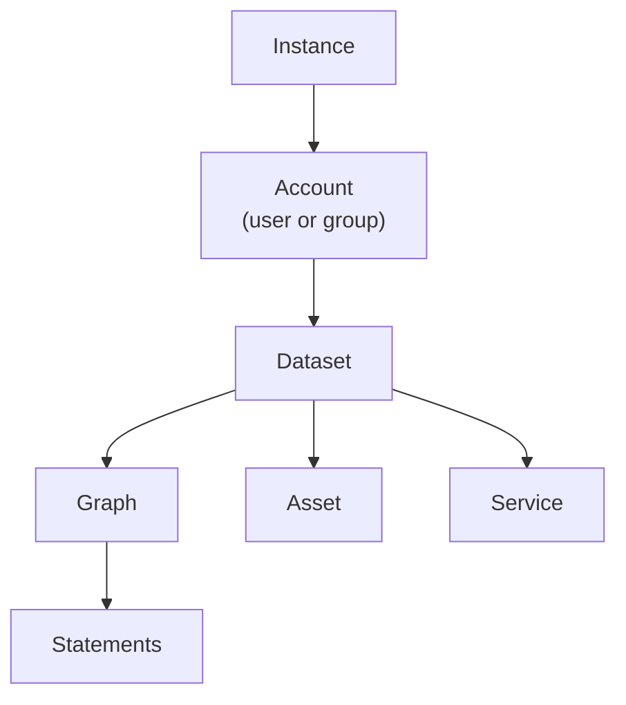

[TOC]

<!-- PROVENANCE KEY (delete this block before publishing)
     <!- - SOURCE: x - ->     definition assembled from an existing page, path given
     <!- - NEW: x - ->        written for this page, with the reason
     <!- - LINK-TODO - ->     link target does not exist yet

     ORIGIN: no single source. Every definition here is assembled from how the
     term is used across the existing pages — uploading-data, exporting-data,
     publishing-data, admin-settings-pages and reference — rather than from a
     definition anywhere, because the documentation defines almost none of these
     terms. Each section names where its definition came from. -->

# Concepts

This page defines the words TriplyDB uses for its own parts. It is worth ten
minutes before you start, because several of these terms mean something narrower
here than they do in general use.

The ideas underneath — triples, IRIs, graphs as a data model, SPARQL — are not
product-specific and are covered in the
[Triply Academy](../../academy/index.md).

## How the parts fit together

<!-- NEW: this diagram. Nothing in the documentation shows the containment
     relationships, and most confusion about TriplyDB is confusion about which
     thing lives inside which. -->

Read it as containment: an instance holds accounts, an account owns datasets, and
a dataset holds graphs, assets and services.

## Instance

<!-- SOURCE: admin-settings-pages/index.md#general-overview — the console and API
     split, and that each is a separate Docker image with its own version. -->

An **instance** is one installation of TriplyDB. `triplydb.com` is an instance;
so is a customer's own deployment.

An instance has two parts. The **console** is the web interface. The **API** sits
between the console and the data. They are separate components with their own
version numbers, which is why an administrator sees two versions rather than one.

Instance-wide settings — branding, example datasets, site-wide prefixes,
authentication — are configured by administrators. See
[Administrator settings](../how-to/admin-settings.md).

## Account

<!-- SOURCE: admin-settings-pages/index.md#accounts-overview (an instance has
     users and groups) and triplydb-js/group/index.md (groups have members, roles
     and subgroups). -->

Everything on an instance is owned by an **account**, of which there are two
kinds:

- A **user** account, belonging to a person.
- A **group**, belonging to several people, with members who hold roles.

Groups can contain subgroups. A subgroup can never be more accessible than its
parent.

<!-- TO CONFIRM: the interface, TriplyDB.js and the older documentation variously
     say "group" and "organisation" for what appears to be the same thing — the
     screenshots in the admin accounts table are named organization.png and
     user.png. If both words are in use, this page should say so; if one is
     obsolete, this page should use only the other. -->

## Dataset

<!-- SOURCE: exporting-data/index.md (datasets and graphs as the two containers)
     and publishing-data/index.md (a dataset has an access level, metadata and
     services). -->

A **dataset** is the unit you manage: it has an owner, an access level, metadata,
and any services you start on it. It is also the unit that gets published, shared
and exported.

A dataset contains graphs, and may also contain assets.

"Dataset" and "knowledge graph" describe the same thing from two angles —
*dataset* emphasises the manageable unit, *knowledge graph* the connected data
inside it. See [Knowledge graphs](../../academy/knowledge-graph.md).

## Graph

<!-- SOURCE: exporting-data/index.md — every triple belongs to exactly one graph,
     a graph belongs to one dataset, and dataset totals are the sum of their
     graphs. -->

A **graph** is a named group of statements inside a dataset. Every statement
belongs to **exactly one** graph, and every graph belongs to one dataset.

That makes the arithmetic simple: a dataset's statement count is the sum of its
graphs' statement counts.

Graphs are the unit of import and export. You add data one graph at a time, you
can export a single graph, and when a graph changes, services holding that data
fall out of step.

## Statement

<!-- NEW: this section. TriplyDB says "statement" everywhere it counts things,
     while the Academy and the standards say "triple". Nothing connects the two
     words, which is a small but constant source of confusion. -->

A **statement** is a triple: a subject, a predicate and an object. TriplyDB uses
"statement" when counting — statement counts on datasets, graphs and services —
and the two words mean the same thing.

See [Linked data](../../academy/linked-data.md).

## Asset

<!-- SOURCE: uploading-data/index.md#assets-binary-data — assets are binary files
     stored in a dataset and integrated into the knowledge graph. -->

An **asset** is a file that is not RDF — an image, a video, a PDF — stored inside
a dataset alongside its graphs, so that the knowledge graph can refer to it.

Assets are counted separately from statements, and administrators see an asset
count per dataset.

## Service

<!-- SOURCE: publishing-data/index.md#starting-services and
     admin-settings-pages/index.md#services-page. -->

A **service** makes a dataset queryable in a particular way. Without one, a
dataset can still be reached through TriplyDB.js and the Linked Data Fragments
API — but SPARQL, text search and GraphQL each require a running service.

Three properties are worth knowing:

- A dataset can have several services at once.
- A service holds a copy of the data, so it falls out of step when a graph
  changes and has to be synchronised.
- A service has a type, and the types available depend on how the instance is
  configured.

See [Manage services](../How-to/manage-services.md) and
[Service types](../Reference/service-types.md).
<!-- LINK-TODO: service-types.md is a skeleton awaiting a developer. -->

## Access level

<!-- SOURCE: publishing-data/index.md and admin-settings-pages/index.md — the
     three levels appear in both. The full definitions are parked. -->

Every dataset has an **access level**: Public, Internal or Private. New datasets
are Private.

The level governs who can find and open the dataset — and, because services
follow the dataset, who can query it.

See [Access and security](../../access-security/index.md) for what each level
means and how levels interact with groups.

## Site-wide prefix

<!-- SOURCE: admin-settings-pages/index.md#setting-site-wide-prefixes -->

A **site-wide prefix** is a prefix defined once by an administrator and applied
across every dataset on the instance whose IRIs match it. It saves each dataset
declaring the same abbreviations.

See [Linked data](../../academy/linked-data.md#namespaces-and-prefixes) for what a
prefix is.

## Saved query and story

A **saved query** is a query given a persistent URL, metadata and version history,
which also turns it into a REST API. A **story** presents queries and their
results as a readable narrative.

Both are documented with the data apps rather than here.
<!-- LINK-TODO: repoint to data-apps/saved-queries/ and data-apps/stories/ once
     those chapters exist. -->

## Related

- [Getting started](../Getting-started/index.md) — these concepts in practice
  <!-- LINK-TODO: page not written yet. -->
- [How to](../How-to/index.md) — the tasks that use them
- [Triply Academy](../../academy/index.md) — the standards underneath

